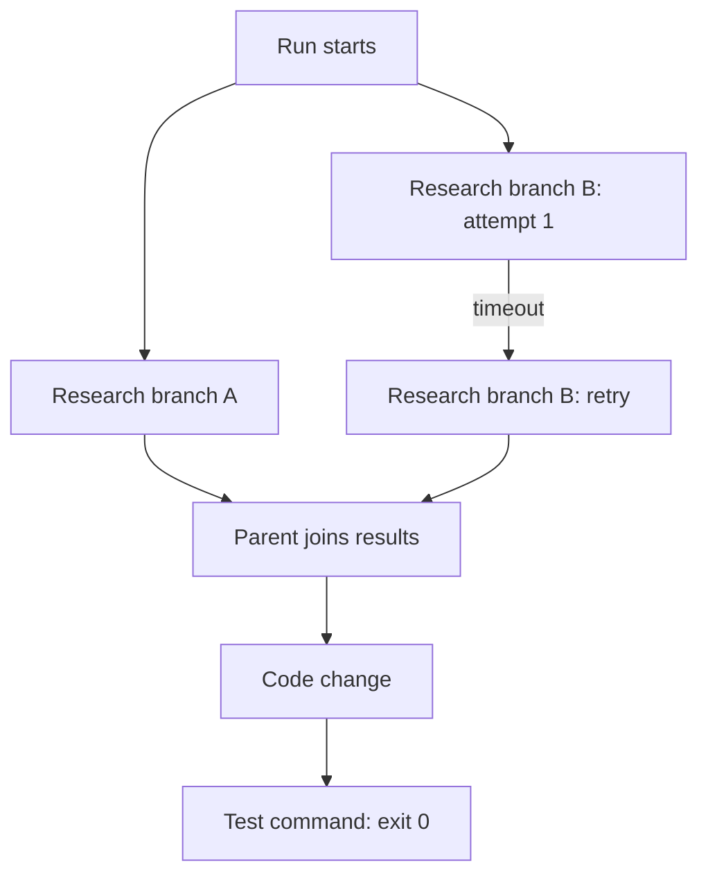

# Start here: Forecost in ten minutes

## The problem in everyday language

An AI agent can branch into subagents, retry failed calls, wait for tools, and
combine several results. Afterward, different systems may report different
numbers:

- the local runtime saw one token total;
- a gateway calculated a dollar estimate;
- a public pricing table produces another value;
- an authenticated provider export later reports a billed amount.

Adding all of those dollars together would be wrong: some may be competing
valuations of the same work. Trusting only one number can also be wrong: it may
miss a branch, retry, adjustment, or call that bypassed that observer.

Forecost is intended to record these as separate pieces of evidence and build a receipt that
explains what happened, what each source claims, and what evidence is absent.

## A concrete example

Imagine a coding agent that starts two research subagents. One succeeds; the
other times out and retries. The parent then writes code and runs tests.



A useful receipt should preserve the two branches and the retry, connect token
usage to the right operations, keep a gateway estimate separate from an
authenticated provider-billed export, record that the test exited successfully, and say if
some branch was never observed. It must **not** store the research prompts, code,
tool arguments, or tool output.

## What Forecost is

- A Python 3.10+ local CLI and library.
- A content-minimizing evidence ledger stored primarily in SQLite, with keyed
  cursor/error identities and a stricter field-exclusion contract for current
  paths. The exported legacy SDK/`costs.db` is a documented exception.
- A graph-aware receipt generator for agent runs.
- A reconciliation tool for independent quantity and valuation evidence.
- A deterministic synthetic lab for demonstrating behavior without private data.
- An experimental set of local integrations and resource controls.

## What Forecost is not

- It is not a hosted dashboard or SaaS control plane.
- It is not an agent runner or orchestration framework.
- It is not a provider invoice.
- It does not prove that an agent completed its task correctly.
- It does not currently predict the cost of a future task.
- Its local hooks cannot guarantee provider-side or distributed enforcement.
- The old calendar-spend forecaster is not the current product.

## The most important design rule

**Observations are not conclusions.** A token count is a meter fact. A dollar
amount derived from a public price table is one valuation. A gateway's numeric
estimate is another. Only an authenticated provider source/profile may have
billing authority; an arbitrary local file does not. Forecost preserves these
meanings instead of flattening them into an impressive but
misleading total.

## The safest first experience

From an installed checkout:

```bash
forecost lab demo
forecost lab chaos
forecost --help
```

The lab uses deterministic synthetic data and does not read your normal
Forecost home. See [the hands-on guide](11-HANDS-ON.md) for a complete tour.

## The current state in one paragraph

The source tree declares version 0.3.0, but its changelog still labels that
version **Unreleased**. The canonical graph receipt, local journal, deterministic
lab, offline reconciliation/import paths, integrity checks, and portable output
are implemented and covered with synthetic tests. Claude Code and LiteLLM
observation, framework mappings, and resource envelopes remain experimental or
offline-only as specified in `docs/capabilities.json`. Publication and broad
real-world claims remain intentionally gated. A 2026-08-13 red team found P0
gaps in raw-path persistence, trace identity, timing, valuation serialization,
evidence scoring, deletion, durability, source authority, CI failure behavior,
and plugin trust. The current worktree repairs those current-ledger code paths
with schema v10/v11 and receipt v2, but this is not an independent external
audit. Legacy arbitrary metadata, out-of-root state, authenticated/live provider
evidence, public distribution, same-UID integrity, and real-user validation
remain blockers. A strict matched-cohort comparison prototype now exists, but
it has not passed the blinded 30-run differentiation or demand gate. Read
[Current state](13-CURRENT-STATE.md) before relying on the current output for a
real decision.

The comparison prototype is intentionally hard to misuse: comparing two valid existing run IDs
always abstains, while the full mode requires digest-bound arm manifests, a
predeclared policy, at least 30 exact pairs, complete USD list-rate valuation of
final `delta` meters, predeclared deterministic test/build outcome evidence, and
confidence bounds. Even a pass
is an observed paired difference, not causal savings or a provider bill.

## Continue reading

Read [What is Forecost?](01-WHAT.md) next, or jump to
[Developer setup](10-DEVELOPER-SETUP.md) if you need to run the code immediately.
