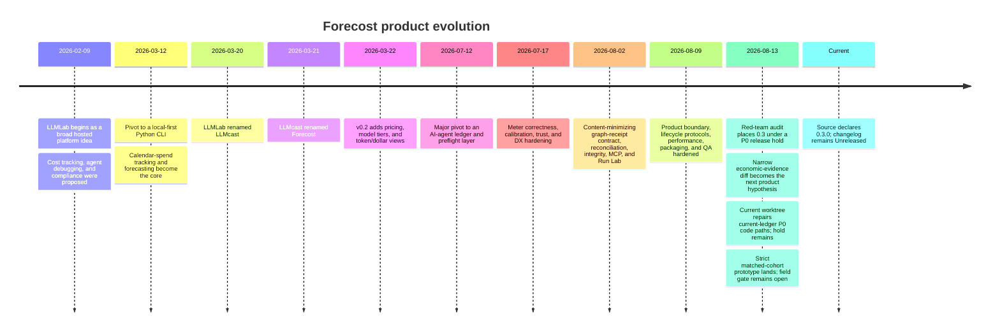

# When: how the project got here

This history is reconstructed from the Git commit history, changelog, current
status documents, and older READMEs. Dates describe repository milestones, not
necessarily public releases.

## Timeline



## Phase 1: the broad LLMLab concept

The first commits on 2026-02-09 described a much larger hosted system: a web UI,
FastAPI services, PostgreSQL, Redis, multi-tenancy, provider credentials, agent
debugging, compliance automation, recommendations, and alerts. Those early docs
were ambitious product specifications, not the architecture that exists now.

This distinction matters. A new engineer reading old commits might otherwise
assume the current repository is an incomplete SaaS. It is not. The hosted,
multi-service direction was deliberately abandoned.

## Phase 2: local calendar forecasting

On 2026-03-12 the project pivoted to a zero-maintenance local Python CLI. It
tracked API usage in `costs.db`, priced models, and forecast calendar spend.
During March it was renamed from LLMLab to LLMcast and then Forecost. Versions
0.1.x and 0.2.0 belong to this product era.

The old modules still exist for compatibility, but their CLI commands are now
available only under `forecost legacy`. Backward-compatible Python exports can
still call legacy project/tracker paths directly, which is a current release
blocker. The legacy database is separate from the current ledger and must never
be used silently by a current command.

## Phase 3: ledger and preflight research

The 2026-07-12 repositioning changed the central question from “what will this
calendar cost?” to “what did this agent run consume, what evidence supports the
numbers, and can local evidence support a useful preflight decision?”

Calibration then forced a second honest narrowing. The estimator's coverage was
near its target, but intervals were far too wide; an error-dense-turn signal also
lacked independent failure labels. Those outputs remain shadow-only. The ledger
and reconciliation became the defensible product core.

## Phase 4: the graph-aware economic receipt

In August the project added and hardened:

- a content-minimizing causal receipt kernel with an intended field allowlist;
- distinct meter facts and charge authorities;
- deterministic Run Lab scenarios;
- offline user-claim/gateway/OTel-style imports and reconciliation;
- integrity chains and receipt digests;
- experimental single-host resource envelopes;
- Claude lifecycle diagnostics and plugin packaging;
- a minimal, read-only optional MCP interface;
- explicit isolation of legacy surfaces;
- packaged-product QA and performance evidence.

## Current interpretation

The current product is an experimental local economic-receipt system. Version
0.3.0 is present in package metadata, but the repository explicitly says it is
unreleased and under a 2026-08-13 P0 hold. The current branch is not on the
public remote. Trace-scoped identity, explicit timing, receipt-v2 valuation
groups, named claim profiles, import authority, durability, current cursor/log
privacy, purge coverage, CI failure mode, and source-plugin launcher trust have
been repaired in the worktree. The hold remains for legacy SDK privacy,
out-of-root state, authenticated/live validation, external review, same-UID
limits, public distribution, and product demand. A narrow matched-cohort
economic/outcome diff prototype now exists, but its 30-run blinded field gate
has not happened; the broader Lab/live-MCP/CI surface is conditional on that
proof.

## How to research history safely

Useful commands:

```bash
git log --reverse --date=short --pretty=format:'%h %ad %s'
git show <commit>:README.md
git show <commit>:CHANGELOG.md
```

Treat old documentation as historical evidence, not current requirements. The
current contract and capability manifest take precedence.
