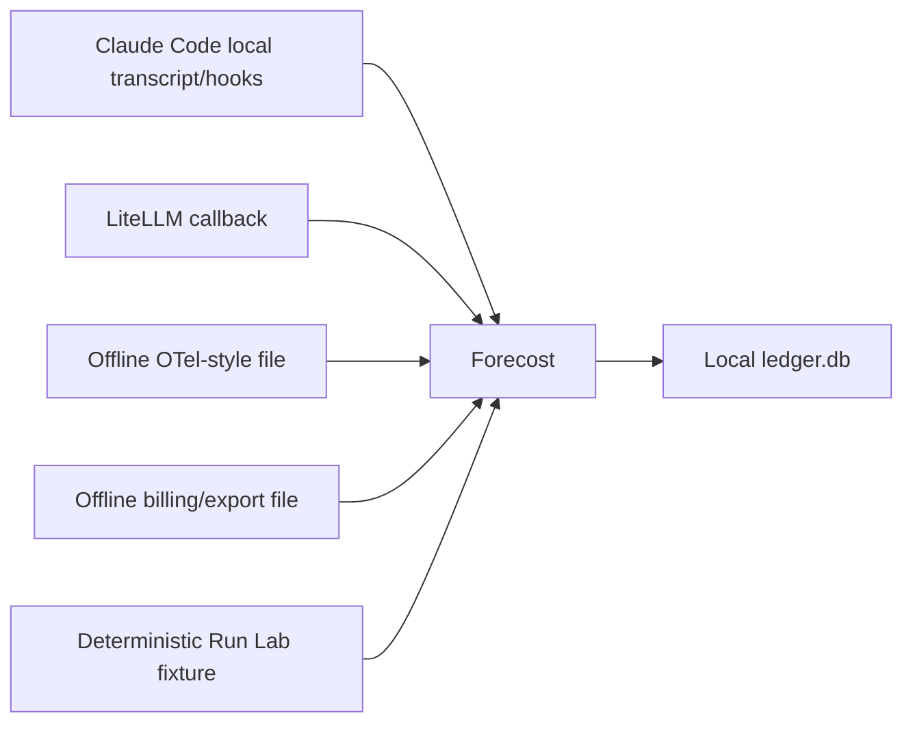

# Where does Forecost run?

“Where” has four answers: where the program executes, where data comes from,
where data is stored, and where the trust boundary ends.

## Execution location

Forecost is a local Python application. The normal CLI runs on the user's
machine, with no required hosted Forecost account or cloud service. The current
supported ingestion paths do not use network-backed provider ingestion.

Optional integrations also run locally:

- Claude Code invokes local hook commands.
- A LiteLLM process can invoke the local callback.
- Offline files can be imported by the CLI.
- The optional MCP server communicates over standard input/output and is
  read-only. Its comparison tool is a diagnostic that always abstains without
  the CLI's matched-cohort manifests.

## Data sources

The current repository does **not** claim live provider HTTP ingestion.
OpenAI Agents and LangGraph are represented by offline mappings tested against
local fakes; their presence in adapter code does not mean live SDK integration
is supported.

## Storage locations

The default data root is the user's Forecost home, normally `~/.forecost`.
`FORECOST_HOME` can select another root for isolated testing or operation.

| Location | Meaning |
| --- | --- |
| `~/.forecost/ledger.db` | Canonical current-product ledger |
| `~/.forecost/costs.db` | Retired v0.2 forecasting store |
| Forecost home operational files | Recovery spool, queue, hook health, and policy-related state |
| `~/.forecost/installation-hmac.key{,.id}` | Owner-only cursor/error identity key and registered ID |
| Explicit Run Lab database | Isolated synthetic ledger; must not read normal home data |
| `~/.forecost/policy.toml` | User-owned local policy rules |
| Repository `.forecost.toml` | Untrusted for enforcement unless explicitly opted in |

Never mix the two SQLite products. Current commands use `ledger.db`; legacy
commands use `costs.db`. `forecost migrate` is an explicit copy path and must
preserve the weak authority of legacy evidence.

## Code locations

- `forecost/ledger/`: canonical contracts, schema, journal, writers, queries,
  receipts, and integrity.
- `forecost/adapters/`: conversion from source-specific observations into the
  bounded internal contract.
- `forecost/commands/`: Click command implementations.
- `forecost/comparison.py`: strict read-only diagnostic and matched-cohort
  comparison engine.
- `forecost/hooks/` and `forecost/policy/`: local hook behavior and policy.
- `forecost/estimate/`: shadow-only estimation and calibration.
- `forecost/mcp/`: optional read-only MCP surface.
- `plugin/`: Claude Code plugin manifest, hooks, and launch scripts.
- `tests/`: synthetic behavioral, security, integration, and performance tests.
- `docs/`: product contracts, ADRs, QA evidence, and release gates.
- `experiments/calib/`: reproducible calibration extractor and backtest.

See [Architecture and file map](07-ARCHITECTURE-AND-FILES.md) for detail.

## Trust boundary

Forecost's typed ingestion contracts reject prompt/tool/source content from its
canonical evidence records. Current Claude cursors and diagnostic details use
installation-keyed identities/fingerprints, and same-path cursor replacement is
checkpointed. This protection is scoped: the exported legacy SDK can still
persist raw project names/paths/metadata to `costs.db`, and explicitly custom
state paths outside `FORECOST_HOME` cannot be exhaustively discovered or purged.
Read [Privacy and trust](09-PRIVACY-AND-TRUST.md).
It does not defend the ledger from the same local operating-system user who can
edit or replace the database. Integrity digests detect certain mutation states;
they are not cryptographic signatures or remote attestation. Causal metadata
can still reveal work patterns, so the Forecost home should remain owner-only.
