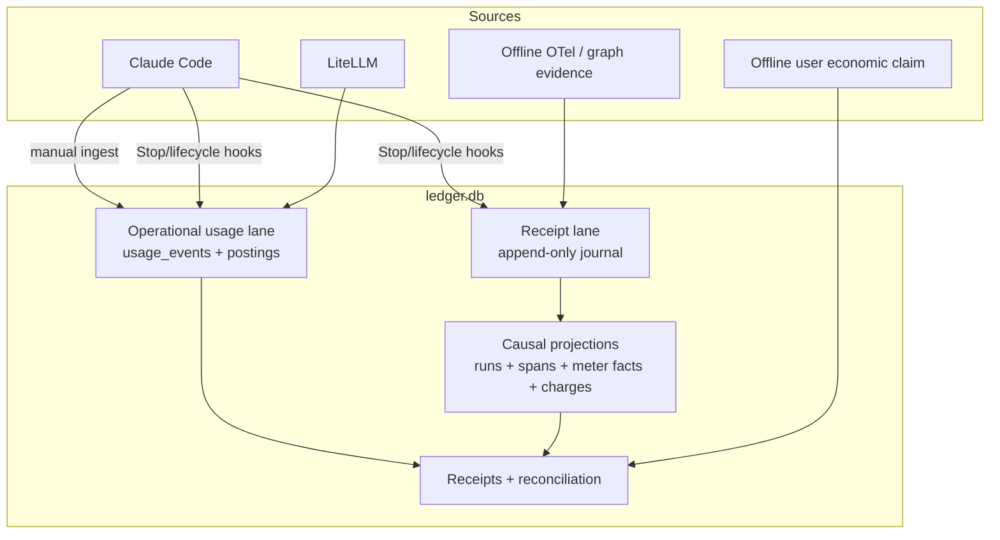

# How Forecost works

Forecost has a shared local database but, in v0.3, two related evidence lanes.
Understanding that fact prevents a common architectural mistake.

## The two evidence lanes

The lanes coexist inside the canonical `ledger.db`, but they are not yet one
unified model:

- the **operational usage lane** stores workspaces, sessions, usage events,
  postings, budgets, estimates, policy decisions, and operational
  reconciliation;
- the **receipt lane** stores immutable journal observations and deterministic
  projections into runs, spans, links, meter facts, charges, outcome evidence,
  receipt snapshots, and graph reconciliation.

Claude's Stop hook can feed both lanes. Manual Claude `ingest` and LiteLLM feed
the operational lane. Offline OTel-style import feeds the receipt lane. Do not
assume every adapter produces a causal receipt or that every usage posting
automatically appears as a receipt charge.

## Step 1: an adapter observes source-specific data

Every source speaks a different language. Claude has transcript lines and hook
events. LiteLLM has callback records. OTel-style files have trace/span fields.
An adapter selects only approved bounded fields and maps source identity into
Forecost's internal contracts.

The adapter must answer:

- What makes an event unique across replay?
- How are retry attempts distinguished?
- What source and sequence produced it?
- Which quantities are final or provisional?
- Which valuation authority, if any, does the source provide?
- What happens after partial input or a failed write?
- Which content-shaped fields are discarded?

## Step 2: identity and content boundaries

Raw workspace, session, or nonconforming IDs are replaced with normalized labels
or hashes according to the path's contract. Claude transcript cursor identities
and error fingerprints use an owner-only installation HMAC key, making exported
values harder to dictionary-recover than an unkeyed path hash. Cursor state also
binds a keyed file identity and complete consumed-prefix checkpoint; detected
same-path rewriting causes a safe restart instead of silent skipping. Accidental
loss, corruption, or mismatch of one key/ID file fails when dependent keyed
state is visible in the canonical home. Coordinated same-UID replacement of both
matching files is not locally detectable.

This reduces direct disclosure but is not anonymity: stable identifiers remain
linkable, other canonical/legacy SHA-256 pseudonyms have their documented
guessability, and the same UID can read the key. Valid trace/span identifiers
may be retained for portability. Prompts, completions, tool arguments/output,
file contents, credentials, arbitrary baggage, and unbounded error strings are
rejected from current typed paths. The exported legacy SDK/`costs.db` still
accepts arbitrary raw project names, paths, and metadata, so no end-to-end
content-free claim is made.

## Step 3A: operational usage is posted

A `UsageEvent` records bounded usage. The sink may calculate a bundled
`pricing_table` posting and preserve a separate `source_reported` posting. When
an operational total is requested, the query selects one canonical valuation
per event and currency instead of adding competing postings.

This lane powers ledger summaries, pricing audits, burn views, calibration, and
parts of local policy evaluation.

## Step 3B: causal observations are journaled and projected

Receipt observations are appended to an immutable journal with producer,
sequence, and idempotency identity. The write and projection occur
transactionally. Replaying the same material is safe; reusing an idempotency key
for different material is an error.

Runtime span IDs are trace-scoped. Schema v10 therefore projects every span,
link, meter, and charge through a deterministic internal `span_key` derived from
`trace_id || span_id`; migration rebuilds projections from the journal and
fails closed if legacy ownership is ambiguous.

Deterministic projection builds:

- causal runs and spans;
- parent/child and fan-in links;
- meter facts;
- authority-labelled charges;
- bounded outcome evidence.

The projection can be rebuilt from the journal in a stable order.
Reconciliation batches and resource-envelope state live in related tables but
are not part of this journal-derived rebuild inventory.

## Step 4: a receipt is assembled

For one `run_id`, the receipt builder gathers topology, quantities, valuations,
outcomes, and integrity state. Receipt schema v2 calculates graph shape and
canonical totals while preserving all active alternatives in valuation groups.
Each group records the selected, non-additive canonical view and why it won.

Timing is evidence, not an inference from event arrival. A span may provide an
explicit start/end interval or a source-reported duration with its producer and
semantic. Observation time is never a span endpoint. When every span has an
explicit interval, wall-service is the union of all non-wait intervals and
wall-wait is the union of all queue-wait intervals. Nested and parallel spans
therefore count once inside each category. The two categories can overlap, so
do not add them. Elapsed is the envelope from the earliest start to latest end
and includes idle gaps. Current parent and fan-in links do not say enough about
scheduling dependencies to calculate a non-trivial critical path honestly, so
that field is withheld except for a one-span graph. A causal cycle invalidates
the path claim but not the directly observed interval unions.

There is no global evidence-complete flag in receipt v2. Versioned named
profiles—structural, economic estimate, provider billed, outcome, and CI—declare
their obligations first, then report completeness, freshness, contradiction,
denominator, satisfied count, unmet obligations, reason codes, and `as_of`
independently. The old projection state is retained only under an explicitly
legacy field.

Freshness needs a declared clock rule. All current built-in obligations have no
maximum-age SLA, so satisfied evidence can be completeness `complete` while
freshness and the combined state remain `unknown`; absence of an SLA never
means “fresh.” Structural profile signals carry their journal observation time,
and receipt `as_of` is never earlier than a signal it assesses. Forecost also
checks the raw lifecycle sequence: a span reported terminal and later reported
running is contradictory even if a projection tie-break happens to display the
terminal row. A parent/fan-in cycle also contradicts structural closure rather
than appearing as a complete, clear graph. If a parent or fan-in target is
missing, closure is incomplete rather than contradictory: Forecost reports the
topology blind spot and leaves the closure obligation unmet.
The same rule applies when `sources_expected` names a source that is absent:
present spans alone cannot close the declared structural evidence scope.

Outcome marks are append-only too. Active `good` and `bad` evidence conflict
even when one comes from a test and the other from a human; `partial` alone does
not oppose a decisive result. A later row can resolve an active-set conflict
only by explicitly superseding an existing earlier outcome from the same role
in the same run; both rows remain in historical evidence. A human mark cannot
retire test or CI evidence. A forward, missing, cross-run, cross-role, or
self-reference is invalid, stays active, and is contradictory. Test/build
progressions still need case-attempt identity. Charges apply an
earlier-same-economic-line rule so a precomputed future ID cannot hide money.

Authority selection is explicit. A provider-billed charge can outrank a
provider estimate, gateway estimate, or list-rate equivalent for the same
economic fact and line item. Competing values are evidence to compare, not
extra consumption to sum.

## Step 5: independent evidence is reconciled

An arbitrary offline JSON/CSV export adds `user_imported_claim` evidence; a local
file path, provider name, or CLI flag cannot authenticate billing origin. Schema
v11 adds provenance-linked corrections that append-supersede proven historical
local-import rows previously labelled `billed`; it does not rewrite the old
journal observation. Reconciliation records expected and observed sources,
match kind, windows, unmatched counts, residual, tolerance, finality, and
supersession. Aggregate evidence is never mislabeled as an exact event match.

That reconciliation state is not yet journal-derived. Comparison v1 therefore
does not inherit the journal-validated label for it: any reconciliation batch on
a compared run forces `RECONCILIATION_EVIDENCE_UNVERIFIED` abstention, even when
the batch says its sources match.

## Step 6: comparison remains conditional

The comparison engine reads receipts; it does not infer that two similarly
shaped runs are the same experiment. With two valid existing run IDs it may display a scoped
observed delta, but it always returns `abstain`. A potentially qualifying v1
comparison needs digest-bound baseline and candidate arm manifests plus a
predeclared policy that freezes the exact case/source/configuration roster,
requires at least 30 distinct pairs, binds active predeclared deterministic test/build
outcomes, and selects only compatible USD list-rate groups that completely
cover final `delta` meter facts one-to-one.

Before reading a decision, Forecost takes a WAL-consistent SQLite Backup API
copy in memory, verifies the journal chain, and deterministically rebuilds and
hash-compares the journal-derived projections. A broken chain, projection
mismatch, or recognized rebuild failure is invalid; more than 1,000,000 global
journal rows is a bounded-work abstention. The source ledger is not rebuilt or
migrated.

Forecost then computes deterministic paired-bootstrap confidence bounds. Its
seed uses a fixed protocol label plus sorted quantitative paired observations,
not case/run/manifest labels, so opaque identifier renaming cannot grind the
decision. A `pass` means only that this observational cohort met its predeclared
bounds.
Manifest declarations are not authenticated, receipt/result SHA-256 digests are
not signatures, and the result does not establish causal savings or provider
billing. See the [comparison contract](../docs/comparison.md).

## Step 7: output remains portable

The same canonical evidence is rendered as terminal text, JSON, or Markdown.
The optional MCP server calls the same receipt/comparison code and exposes three
read-only tools: run listing, receipt retrieval, and the always-abstaining
two-run diagnostic. Full manifest evaluation and live budget mutations are not
MCP capabilities.

Here “read-only” means no Forecost row/schema creation, migration, insertion,
update, or deletion. SQLite opens the existing database with `mode=ro` and
`query_only`, but may create or update WAL/SHM coordination sidecars. Forecost
does not use `immutable=1`, because doing so can miss committed pages still in a
live WAL.

## Failure and recovery model

- Canonical SQLite commits are transactional, use `synchronous=FULL`, and are
  protected by a process-level lock.
- Schema migration snapshots use SQLite's Backup API, include committed WAL
  pages, are integrity-checked before migration, and are deleted if incomplete.
- Claude transcript cursors advance only past complete, accepted lines and
  restart safely when their keyed file-identity/complete-prefix checkpoint changes.
- Failed durable batches can enter bounded recovery spools.
- `forecost recover` replays recoverable writes.
- Journal chains and receipt digests classify mutation, but are not signatures.
- Interactive local hooks fail open: Forecost failure must not break the host
  agent. An explicit protected CI policy/adapter boundary may instead fail
  closed; this remains local, not provider-side enforcement.
