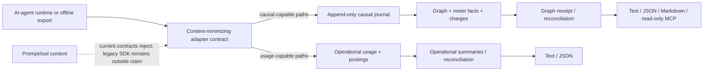

# Forecost 101

This folder is the beginner-to-contributor guide for Forecost. It assumes you
have never seen the project, do not know its vocabulary, and may not know how
AI-agent usage accounting works.

If you read the guides in order, you should understand the problem, the
product's history, the current architecture, the safety boundaries, how to run
it, and where new work belongs.

## The one-sentence explanation

Forecost is intended to create a local, content-minimizing **economic receipt** for an AI-agent run:
it records the run's shape and resource observations, keeps competing cost
claims separate, and shows what the available evidence can and cannot prove.

That sentence is the intended product contract. The current worktree implements
receipt schema v2 plus the current-ledger identity, timing, evidence-profile,
import-authority, durability, cursor/log, purge, CI-mode, and launcher repairs
identified by the red team. It remains **content-minimizing and experimental**,
not release-ready: exported legacy SDK paths can still store raw project
name/path/metadata in `costs.db`; out-of-root custom state is not exhaustively
discoverable; authenticated-provider/live validation and external review are
absent; and the product/demand gates are incomplete. See
[Privacy and trust](09-PRIVACY-AND-TRUST.md) and
[Current state](13-CURRENT-STATE.md).

## Reading path

| Order | Guide | Question answered |
| --- | --- | --- |
| 0 | [Start here](00-START-HERE.md) | What should I know in ten minutes? |
| 1 | [What is Forecost?](01-WHAT.md) | What does the software actually do? |
| 2 | [Why does it exist?](02-WHY.md) | What problem is worth solving? |
| 3 | [Who is it for?](03-WHO.md) | Who uses, operates, and contributes to it? |
| 4 | [When: project history](04-WHEN-HISTORY.md) | How did the idea evolve into this repo? |
| 5 | [Where does it run?](05-WHERE.md) | Where are the code, data, and trust boundaries? |
| 6 | [How it works](06-HOW-IT-WORKS.md) | How does evidence become a receipt? |
| 7 | [Architecture and file map](07-ARCHITECTURE-AND-FILES.md) | Which package owns what? |
| 8 | [Data model and vocabulary](08-DATA-MODEL.md) | What are runs, spans, facts, charges, and authorities? |
| 9 | [Privacy, security, and trust](09-PRIVACY-AND-TRUST.md) | What is stored, rejected, and not guaranteed? |
| 10 | [Developer setup](10-DEVELOPER-SETUP.md) | How do I install and validate a checkout? |
| 11 | [Hands-on walkthrough](11-HANDS-ON.md) | How do I experience the product safely? |
| 12 | [Testing and contribution workflow](12-TESTING-AND-CONTRIBUTING.md) | How do I change it without weakening its laws? |
| 13 | [Current state and next work](13-CURRENT-STATE.md) | What is done, experimental, retired, and blocked? |
| 14 | [Glossary and FAQ](14-GLOSSARY-AND-FAQ.md) | What do all the terms mean? |

For the exact experimental matched-cohort input, decision, exit, and trust
semantics, read the normative [comparison contract](../docs/comparison.md).

## Visual overview

Not every source feeds both lanes in 0.3. The detailed routing is explained in
[How Forecost works](06-HOW-IT-WORKS.md).

## Source-of-truth order

When documents disagree, use this order:

1. executable code and tests;
2. [`docs/status.md`](../docs/status.md) and
   [`docs/capabilities.json`](../docs/capabilities.json), the current audited and
   machine-readable release boundaries;
3. [`docs/product-contract.md`](../docs/product-contract.md) and architecture
   decision records in [`docs/adr/`](../docs/adr/);
4. this `101/` explanation and the root [`README.md`](../README.md).

The distinction matters because the repository still contains v0.2 forecasting
code. Its CLI is quarantined under `forecost legacy`, but compatible SDK exports
still reach `costs.db`; neither fact makes forecasting a current product feature.
