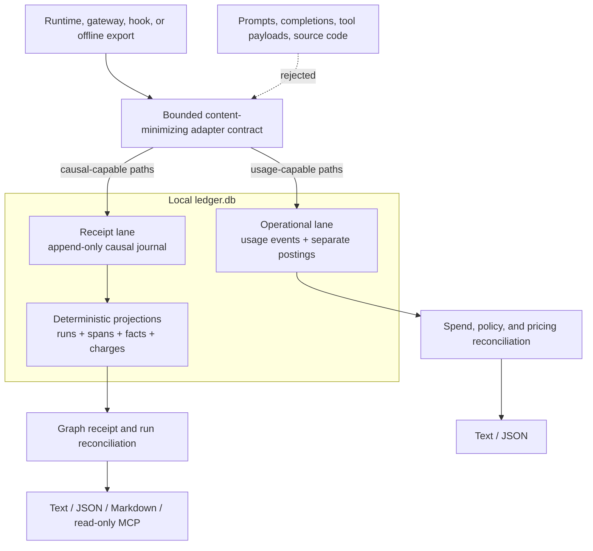

# forecost

**The independent economic receipt for AI-agent runs.** Forecost is designed to record a
content-minimized causal account of a run, keep measured usage separate from the
different ways it can be valued, and show where local runtimes, gateways,
pricing tables, and imported provider evidence agree or disagree.

Local-first. No signup. No hosted Forecost service.

[License: MIT](LICENSE) · Local branch test matrix: Python 3.10–3.13


*Conceptual architecture illustration—not a UI screenshot, security boundary,
or claim that every adapter supplies every source shown.*

> The public repository's `main` branch and badges still describe the legacy
> product. This unreleased 0.3 checkout exists only on the local
> `codex/forecost-product-core` branch at the audited baseline. Do not use a
> public clone, PyPI, or a marketplace command as though it installs this code.

> **Historical packaged-product audit (2026-08-09).** The source declares
> 0.3.0, but the changelog remains **Unreleased**. Graph receipts, the local
> evidence journal, deterministic Run Lab, offline reconciliation, and
> single-host resource envelopes are experimental local features. Claude Code
> and LiteLLM integrations are best-effort; OpenAI Agents and LangGraph are
> offline mapping contracts only. Live provider HTTP ingestion, complete graph
> coverage, distributed enforcement, verified task correctness, and future
> task-cost forecasting are not claimed.

> **Red-team hold (2026-08-13; still in force).** The current worktree repairs
> the code-level defects found in trace identity, timing, receipt serialization,
> evidence scoring, import authority, canonical-ledger durability, owned-state
> privacy, CI failure mode, and plugin launch trust. Specifically, schema v10
> introduced trace-scoped `span_key`; receipt schema v2 requires explicit timing,
> retains every valuation group, and reports named evidence profiles; schema v11
> corrects proven historical arbitrary-file billing labels by append-supersession.
> These are implementation remediations, not an independent audit or release
> approval. The exported legacy SDK can still persist arbitrary raw name/path/
> metadata in `costs.db`; custom state paths outside `FORECOST_HOME` cannot be
> exhaustively discovered or purged; no authenticated provider profile has been
> validated live; and same-UID code remains outside the local integrity boundary.
> Public `main` and PyPI are still legacy, external privacy/security review is
> absent, and the new matched-cohort comparison prototype has not passed its
> 30-run field/demand gate. Read the
> [startup-grade red team](docs/research/2026-08-13-startup-grade-red-team-v2.md).
> **The 2026-08-13 NO-GO remains: do not publish this checkout.**

### Narrow product proof (prototype only; field gate not passed)

The latest multi-agent audit does **not** recommend launching the current CLI or
blindly building a broad agent-evaluation platform. The worktree now contains a
strict prototype intended for one operation on matched real/sanitized runs:

> Test whether this agent-workflow change has lower list-rate-equivalent cost
> without observed regression in predeclared deterministic test/build outcome
> evidence, reject invalid comparisons, and show exactly what is missing.

`forecost compare` has two deliberately different modes. Giving it two valid
existing run IDs produces a descriptive diagnostic and always abstains because two totals do not
establish workload or outcome identity. A potentially qualifying result requires
digest-bound baseline/candidate arm manifests and a strict predeclared policy;
comparison v1 is observational, USD list-rate-equivalent only, uses at least 30
pairs, binds predeclared deterministic test/build outcome evidence, and reports
confidence bounds. Evaluator/source declarations are attested by the manifest, not
authenticated by Forecost, and the result's SHA-256 digest is local consistency
evidence, not a signature.

Before reading decision evidence, both modes copy one WAL-consistent ledger state
into memory, verify the journal chain, and deterministically rebuild/hash-check
the journal-derived projections. Matched v1 qualifies only complete one-to-one
valuations of final `delta` meter facts. Any reconciliation batch forces
`RECONCILIATION_EVIDENCE_UNVERIFIED` abstention because that table is not yet
journal-derived. Broken journal/projection/rebuild evidence is invalid; a ledger
with more than 1,000,000 global journal rows is a bounded-work abstention. The
paired bootstrap seed uses only sorted quantitative observations plus a fixed
protocol label, so opaque identifier renaming cannot change the resampling
decision.

Only a blinded ≥30% Forecost-only actionable-result gate earns the larger Agent
Run Lab/static viewer/live MCP/assertion build. That field gate has not run.
Failure triggers a protocol or merge evaluation, not more surface area. See the
[comparison contract](docs/comparison.md),
[startup-grade red team](docs/research/2026-08-13-startup-grade-red-team-v2.md)
and [master checklist](docs/research/2026-08-13-master-product-launch-checklist.md).

## New to the repository?

Start with **[Forecost 101](101/README.md)**. It explains the what, why, who,
when, where, architecture, data model, privacy boundary, developer setup,
hands-on workflows, current state, and project history from the original
LLMLab concept to today.

## Why Forecost exists

Everyone can count tokens. The hard part is preserving what each number means.

- A local runtime may report token usage.
- A bundled public rate table can calculate a list-rate equivalent.
- A gateway may provide its own estimate.
- An authenticated provider source/profile may contain billed evidence.

Those can describe the same work. Summing them double-counts; flattening them
into one unlabeled “cost” loses authority and provenance. Forecost's underlying
lanes keep valuations separate and reconcile supported inputs explicitly.
Receipt schema v2 serializes every active valuation group and identifies the
non-additive canonical selection and reason.
Branches, retries, waits, fan-in, lifecycle, outcomes, and known blind spots are
retained only when that source/adapter supplies them.

Forecost is most useful when at least two independent sources—or a graph-shaped
run—make disagreement, missing evidence, retry identity, or provenance matter.
If one trustworthy provider total or atomic counter answers your question, use
the simpler tool.

## How it works



Version 0.3 currently has two related models inside `ledger.db`:

- the **operational lane** powers usage/postings, pricing summaries, policy,
  burn, and calibration;
- the **receipt lane** projects an immutable journal into causal runs, spans,
  meter facts, authority-labelled charges, outcomes, and receipts.

They are not fully unified. Claude Stop/lifecycle hooks can feed both; manual
Claude ingestion and LiteLLM feed operational usage/postings, while offline
OTel-style import feeds the receipt journal. See
[How Forecost works](101/06-HOW-IT-WORKS.md) before changing an adapter.

## Privacy is a structural requirement

The intended ledger contract stores approved bounded metadata: pseudonymous identities,
trace/span topology, token or call quantities, models, timestamps, valuations,
authority, finality, lifecycle codes, and bounded outcome evidence.

It must not persist prompts, completions, tool arguments/output, file contents,
source code, credentials, raw workspace paths, arbitrary baggage, or unbounded
external errors. [`tests/test_privacy_canary.py`](tests/test_privacy_canary.py)
plants a sentinel in synthetic prompt and tool content and fails if it reaches
Forecost-owned state.

The current worktree replaces newly written or lazily migrated Claude cursor/path
identities and new diagnostic details with installation-keyed HMAC identifiers/
fingerprints. Cursors also bind file identity and a keyed complete-prefix
checkpoint so detected same-path rewriting resets safely. Accidental loss,
corruption, or mismatch of one key/ID file fails when dependent keyed state is
visible in the canonical home; coordinated same-UID replacement of both files is
not locally detectable. Privacy verification now streams every readable regular file
in the selected home (including chunk boundaries and large files), and reports
an inconclusive result for unreadable, symlinked, or non-regular skipped state.
Successful recovery durably replaces a raw queue with a finite replay summary;
if that publication fails, the raw queue is retained for idempotent retry. Purge
recognizes current DB sidecars, spools, hook/outbox state, identity keys, schema
backups, and recovery temps.

That is still not an end-to-end “content-free” proof. The exported legacy SDK
and `costs.db` may retain arbitrary raw project names, paths, and metadata.
Explicit custom ledger/outbox paths outside `FORECOST_HOME`, user-selected
exports, and integration state cannot be exhaustively discovered by `purge`.
Treat the current product as **content-minimizing within its documented current
ledger and owned-home paths**, with the exceptions above blocking publication.

When fully implemented, that contract reduces content retained at rest; the
current defects prevent a stronger guarantee. It does not make local metadata
harmless or protect the database from the same operating-system user. Receipt digests and
journal chains detect certain mutations but are not signatures or remote
attestation. Keep the Forecost data root owner-only and never submit real
transcripts or ledger files in bug reports.

## Quickstart from this reviewed checkout

Use a fresh virtual environment. The local CI definition targets Python
3.10–3.13; current publication/OS-matrix validation remains held.

The public PyPI project and public `main` branch currently serve legacy
forecasting behavior; neither installs this unreleased 0.3 checkout. Start in a
reviewed copy of this workspace for isolated testing only. The clone command can
be restored after the current branch is deliberately merged or published.

```bash
cd "<path-to-reviewed-0.3-checkout>"
git rev-parse HEAD                     # audited baseline: 05482e41b958...
python3 -m venv .venv-review           # existing ignored .venv is stale here
source .venv-review/bin/activate       # Windows: .venv-review\Scripts\Activate.ps1
python -m pip install --upgrade pip
python -m pip install -e .

forecost lab demo                    # isolated deterministic graph receipt
forecost lab chaos                   # fan-out/cancellation fixture
forecost --help
```

Run Lab accepts an explicit ledger and does not read the normal Forecost home.
Use a user-owned temporary directory; a bare `/tmp/forecost-demo.db` may be
rejected on systems where `/tmp` resolves to a root-owned directory:

```bash
DEMO_DIR="$(mktemp -d)"
forecost lab demo --ledger-path "$DEMO_DIR/ledger.db"
```

For development, install the test/tooling extras and follow
[`101/10-DEVELOPER-SETUP.md`](101/10-DEVELOPER-SETUP.md):

```bash
python -m pip install -e ".[dev,forecast,llm]"
pytest tests/ -v --tb=short
ruff check forecost/ tests/
ruff format --check forecost/ tests/
pyright
mypy forecost/
```

## What a receipt can claim

| Term | Meaning |
| --- | --- |
| Meter fact | A measured quantity such as tokens or calls; not money |
| List-rate equivalent | Valuation from a bundled public rate snapshot |
| Gateway estimate | A gateway-reported valuation, when supplied |
| Provider-billed claim | Reserved for an authenticated provider source/profile; current arbitrary offline files are only user-imported claims |
| Finality | How settled evidence is; separate from authority |
| Outcome evidence | A recorded mark or test/build exit; not proof of correctness |
| Reconciled | Sources were compared under an explicit scope and coverage statement |
| Contained | Only a stated healthy local boundary; never a distributed/provider guarantee |

Late evidence is appended and can supersede a previous conclusion. Historical
observations are not silently rewritten.

## Current integrations

### Claude Code hooks (unreleased source integration)

The source under [`plugin/`](plugin/) describes local hooks for lifecycle
observation, threshold-gated preflight notes, fail-open local policy, and
background settlement. Its launcher now permits only the exact owner-controlled
`$CLAUDE_PLUGIN_DATA/venv/bin/forecost-hook`, rejects symlink/writable path
components, and never falls back to `PATH`. Runtime bootstrap/package
installation is intentionally disabled. Consequently there is no supported
PyPI/marketplace installation path yet; inspect only a dry run or use the fake
configuration directory in the hands-on guide:

```bash
forecost setup claude --dry-run
forecost setup claude --check
```

A healthy interactive hook may return `ask` or `deny` within the local process
boundary. Interactive failures remain fail-open. An explicit protected CI
boundary can opt into fail-closed behavior (`mode = "ci"` plus
`on_internal_error = "deny"`, or the LiteLLM constructor boundary); this is not
a provider-side or distributed guarantee and does not bound external overrun.

Home policy governs by default:

```toml
# ~/.forecost/policy.toml
[[policy.rules]]
id = "session-cap"
scope = "session"
currency = "USD"
soft_limit = 5.0
hard_limit = 10.0
action = "deny"
```

A cloned repository's `.forecost.toml` is ignored for enforcement unless the
user explicitly sets `FORECOST_TRUST_PROJECT_POLICY=1`.

### LiteLLM callback (experimental)

[`examples/litellm/`](examples/litellm/) contains callback wiring. LiteLLM's
numeric `response_cost` remains a gateway estimate separate from Forecost's
list-rate valuation. The callback feeds the operational usage lane and does not
claim a complete causal graph or distributed containment.

### Offline causal and declared economic evidence

`forecost import otel` maps reviewed JSON/JSONL fields into the causal journal;
it is not a network collector. `forecost reconcile import` accepts offline
economic evidence, but every arbitrary local JSON/CSV row is stored as
`user_imported_claim`, never provider-billed merely because of a filename or
source flag. Schema v11 append-supersedes proven historical local-import rows
that were mislabeled `billed` while preserving the journal history. There is no
authenticated provider profile or live validation yet.
See the fully isolated
[hands-on walkthrough](101/11-HANDS-ON.md).

### Optional read-only MCP

```bash
python -m pip install -e ".[mcp]"
python -m forecost.mcp_launcher
```

The optional MCP server uses stdio and exposes exactly three canonical read-only
tools: `forecost_list_runs`, `forecost_get_receipt`, and
`forecost_compare_runs`. The comparison tool is diagnostic only and always
abstains without the CLI's predeclared cohort manifests; it is not a live budget,
loop-control, reservation, or recording surface. The base wheel does not
advertise an entry point that requires an uninstalled optional dependency.

Here, read-only means the tools do not create, migrate, insert, update, or delete
Forecost ledger rows/schema. They open the existing WAL database with SQLite
`mode=ro`/`query_only`. SQLite may still create or update WAL/SHM coordination
sidecars while forming a consistent read view. Forecost does not use
`immutable=1`, because that mode can ignore committed WAL pages and read stale
evidence from a live database.

## Command reference

Run `forecost COMMAND --help` for options and its precise store boundary.

| Command | Purpose |
| --- | --- |
| `forecost adapters` | Inspect offline adapter protocol conformance |
| `forecost burn` | Show trailing observed spend and runway |
| `forecost calibration` | Inspect shadow-estimator calibration |
| `forecost capture` | Run a test/build command and record bounded exit evidence |
| `forecost compare` | Diagnose two runs, or evaluate strict matched-cohort manifests under the observational v1 policy |
| `forecost doctor` | Inspect setup, stores, and evidence boundaries |
| `forecost envelope` | Manage experimental local resource envelopes |
| `forecost ingest` | Ingest local runtime usage observations |
| `forecost import` | Import offline causal runtime evidence |
| `forecost ledger` | Inspect or migrate the canonical ledger |
| `forecost lab` | Run isolated deterministic receipt scenarios |
| `forecost mark` | Record explicit bounded outcome evidence |
| `forecost migrate` | Copy legacy evidence without elevating authority |
| `forecost pricing-audit` | Find guessed or stale pricing |
| `forecost privacy` | Inspect and verify local privacy boundaries |
| `forecost purge` | Remove allow-listed state under one Forecost home; report unknown/out-of-root limits |
| `forecost reconcile` | Compare independent valuations or import evidence |
| `forecost receipt` | Render graph-aware receipts |
| `forecost recover` | Replay durable failed-write records |
| `forecost runs` | List and inspect graph-aware runs |
| `forecost self-test` | Run deterministic local integration checks |
| `forecost setup` | Prepare/check/remove integrations |
| `forecost statusline` | Render bounded Claude observation health |
| `forecost verify` | Recompute local snapshot consistency; same-user rewrite is not excluded |
| `forecost legacy` | Enter unsupported v0.2 compatibility commands |

`doctor` is non-destructive, but opening a fresh custom home can initialize its
canonical SQLite database. Use a temporary `FORECOST_HOME` for strict isolation.

## Local data and configuration

| Item | Purpose |
| --- | --- |
| `~/.forecost/ledger.db` | Unreleased experimental v0.3 evidence store |
| `~/.forecost/costs.db` | Retired v0.2 forecast store |
| `~/.forecost/policy.toml` | User-owned local policy |
| `FORECOST_HOME` | Absolute alternate Forecost data root |
| `FORECOST_TRUST_PROJECT_POLICY=1` | Explicitly trust repository policy |
| `FORECOST_DISABLED=1` | Disable legacy automatic interception/tracking |

Do not point current receipt code at `costs.db`. Migration is an explicit copy,
and weak legacy observations must remain weakly labelled.

## Calibration: why forecasting stays hidden

The published 601-turn backtest met approximate P90 coverage targets but missed
usefulness targets badly: cost intervals were 8.5× wide, duration 10.7×, and
files touched 9.6×. The mid-run error-dense flag was evaluated against labels
that shared its error signal and had no independently confirmed failures.

Therefore estimates and the guard remain shadow-only. See
[`experiments/calib/VERDICT.md`](experiments/calib/VERDICT.md). Forecost will not
present wide or circularly validated signals as trustworthy advice.

## History and legacy boundary

The repository has three product eras:

1. **February 2026:** LLMLab began as a broad hosted cost/debugging/compliance
   platform concept.
2. **March–April:** it pivoted to a local calendar-spend forecaster, was renamed
   LLMLab → LLMcast → Forecost, and shipped the v0.1/v0.2 code line.
3. **July–August:** research found no demonstrated demand for the calendar
   forecast thesis and exposed a stronger need for independent agent-run
   evidence. The product narrowed into today's intended content-minimizing graph
   receipt contract. The initial red-team code defects have been remediated in
   this worktree, but legacy privacy, external review, live-source, publication,
   and field-demand gates remain release blockers.

The earlier forecaster's CLI is quarantined under `forecost legacy` and uses the
separate `costs.db`, but backward-compatible SDK exports can still reach that
store directly and are a publication blocker. The legacy surface is targeted
for removal before 1.0. Old hosted designs
and forecast-era documentation are history, not current architecture. Read the
evidence-backed [full timeline](101/04-WHEN-HISTORY.md).

## Documentation map

- [Forecost 101](101/README.md) — beginner-to-contributor explanation.
- [Product contract](docs/product-contract.md) — normative intent; status records current violations.
- [Architecture](docs/architecture.md) — concise technical model.
- [Comparison contract](docs/comparison.md) — strict diagnostic and matched-cohort semantics.
- [Capabilities](docs/capabilities.json) — machine-readable feature boundary.
- [Status](docs/status.md) — latest audited release state.
- [Architecture decisions](docs/adr/) — identity, authority, versioning,
  privacy, resources, and legacy decisions.
- [QA final report](docs/qa/final-report.md) — historical 2026-08-09 packaged
  evidence; superseded for release decisions by the 2026-08-13 hold.
- [Golden journeys](docs/golden-journeys.md) — isolated tested workflows.
- [Deep research and 90-day roadmap](docs/research/2026-08-13-deep-research-roadmap.md)
  — the first evidence-backed product/MCP/security/CI proposal; superseded where
  the startup-grade red team below differs.
- [Startup-grade red team and narrow-product proof](docs/research/2026-08-13-startup-grade-red-team-v2.md)
  — re-audit, current P0 blockers, narrow diff and conditional Agent Run Lab proposal,
  updated eight deliverables, future bets, and improve/pivot/merge decision tree.
- [Master product and launch checklist](docs/research/2026-08-13-master-product-launch-checklist.md)
  — P0/P1/P2 execution contract, dependencies, Gantt, evidence gates, identity
  migration, upstream-use register, and explicit no-release rule.
- [50-repository landscape](docs/research/2026-08-13-github-landscape.md) —
  dated competitor, integration, DX, and distribution screen.
- [Contributing](CONTRIBUTING.md) — development and adapter requirements.
- [Security policy](SECURITY.md) — private reporting and safe reproductions.

When docs disagree, executable tests/code come first, followed by current
status and the capability manifest. The product contract/ADRs are normative
intent and may describe a law that a red-team defect currently violates; the
explanatory guides come after them.

## Contributing

Start with [`101/12-TESTING-AND-CONTRIBUTING.md`](101/12-TESTING-AND-CONTRIBUTING.md)
and [`CONTRIBUTING.md`](CONTRIBUTING.md). The highest-value contribution is a
trustworthy adapter or evidence source proven with synthetic fixtures—never a
private transcript.

## License

MIT
