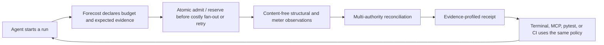
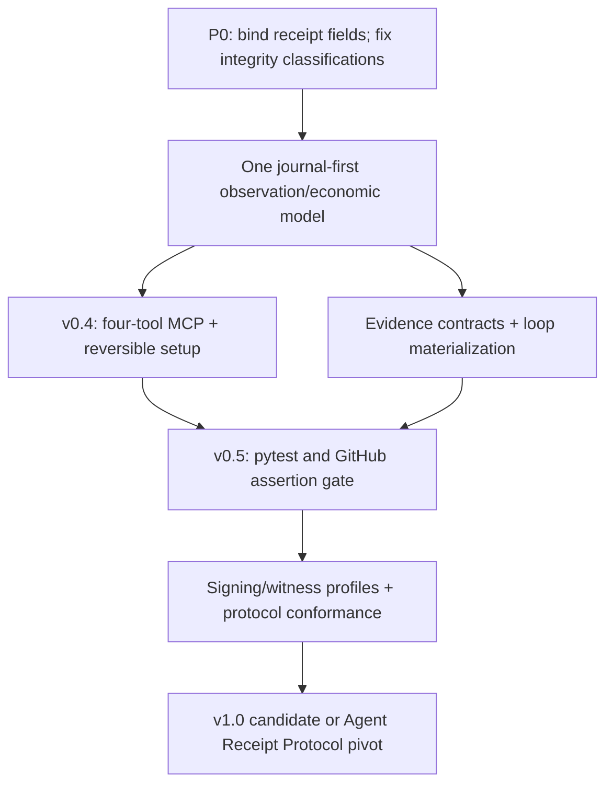

# Forecost deep research, audit, and 90-day roadmap

> **Superseded strategically and as a current-worktree status source on
> 2026-08-13.** This report remains the detailed
> source for the original MCP schemas, security analysis, and CI sketches. The
> later [startup-grade red team](2026-08-13-startup-grade-red-team-v2.md)
> changes the proposed product surface, ICP, launch strategy, probability, and
> critical P0 findings. Use the
> [master checklist](2026-08-13-master-product-launch-checklist.md) for execution.

**Evidence date:** 2026-08-13  
**Repository baseline:** Forecost 0.3.0, unreleased  
**Decision:** improve and narrow now; run a measured protocol-pivot gate at day 90

Labels used below:

- **Observed** — verified in the repository or a cited first-party source.
- **Proposal** — a product or engineering design, not a shipped capability.
- **Measure** — a claim that must be settled with live users, real traces, or a technical spike.

## 1. Executive Verdict

Forecost is a good kernel, but not yet a differentiated daily product. **Improve; do not pivot now.** The repository already has a substantive causal receipt model, append-only observations, authority-separated meter and charge evidence, deterministic graph reconstruction, reconciliation, privacy allowlists, and single-host resource reservations. Those foundations are harder and more valuable than another token counter.

The core product loop is not done. **Observed at the start of this audit:** the
MCP exposed only two read-only tools and the registered pytest plugin was a
one-line placeholder. **Current-worktree update:** a third read-only MCP tool
now exposes an always-abstaining two-run comparison diagnostic, while full
digest-bound matched-cohort evaluation remains CLI-only; this is not the
proposed live four-tool surface. Current comparison evaluates a WAL-consistent
in-memory journal/projection rebuild, admits only fully valued final `delta`
meters, abstains on reconciliation state outside that derived boundary, and
uses a quantitative-only bootstrap seed. Named claim profiles now have
exact denominators, but no built-in declares an operational freshness SLA, so
freshness honestly remains `unknown`; see
[Appendix A](#appendix-a-implementation-truth-table-updated-after-the-v2-red-team).
Operational usage/postings and causal receipt projections also remain parallel
data lanes. A coordinated same-user rewrite can recompute the receipt's
self-declared digest and pass the current receipt check. Close competitor
`agentacct` already documents local Claude/Codex reconciliation, evidence
matrices, OTLP, outcomes, and eleven MCP tools. “Local receipts plus MCP” is
therefore not a moat.

Spend 90 days on one repeatable loop: **an agent gets an atomic local budget decision, sees a factual structural-loop warning, records bounded evidence, and leaves a claim-profiled receipt that the same policy can assert in CI.** Make the causal-economic invariants, explicit evidence contract, and cross-surface conformance the product. Keep terminal use delightful; keep enterprise compliance, broad dashboards, and cryptographic theater out of the critical path.

Best-path 12-month judgment—not a measured forecast: **10–15%** chance of reaching 10,000 GitHub stars, **5–10%** chance of regular organic MCP use at meaningful scale, and **3–5%** chance of achieving both. The biggest uncertainty is whether warnings change decisions often enough to justify persistent instrumentation.

At day 90, pivot the core artifact to a lightweight Agent Receipt Protocol plus conformance suite/skills if 8–10 design partners and at least 200 real runs do not produce repeat use, tolerable false-positive rates, and several cost/loop/merge decisions changed by Forecost.

## 2. Competitive Positioning One-Pager

### The README sentence

> **Forecost gives AI coding agents a local budget, catches structural retry loops, and produces an evidence-scored receipt explaining where the run's money went.**

This is the target promise, not the 0.3.0 feature boundary.

### Primary customer and job

| Priority | Persona | Recurring job | Why this persona first |
|---|---|---|---|
| 1 | AI platform/FinOps/developer-infrastructure engineer operating API-billed multi-agent DAGs with at least two evidence sources | “Apply one cost, retry, and evidence policy across live runs and CI, then reconcile it to the bill.” | Has the economic pain and independent sources needed for Forecost's strongest differentiation. |
| 2 | Claude Code/Codex power user running long or multi-agent tasks | “Keep this run under my limit, tell me when retries stop making progress, and explain the result afterward.” | Best acquisition and UX cohort; subscription users may not have a marginal-dollar problem. |
| 3 | FinOps/governance reviewer | “Show what was observed, by whom, with what finality, and what is missing.” | Valuable later, but billed-source coverage and integrity assurances must mature first. |

Do not lead with generic cost tracking, a universal compliance claim, or “tamper-proof receipts.” A single-provider user with a trustworthy native total and no graph-shaped runs may not need Forecost.

### Moat statement

Forecost's intended moat is **a conformance-tested causal-economic contract**: it joins branches, retries, waits, meters, valuations, outcomes, and source closure without double-counting authorities; declares what evidence was expected before the claim; and produces the same decision in terminal, MCP, pytest, and CI while keeping content local.

The algorithms alone are copyable. Durability must come from four compounding assets:

1. A public receipt and evidence-contract specification with golden fixtures and adversarial conformance tests.
2. High-fidelity adapters and identity joins across agent runtime, gateway, OTel, and billing artifacts.
3. A corpus of real discrepancy and loop patterns with calibrated, low-noise policies.
4. Distribution through Claude Code/Codex setup, pytest, GitHub Actions, and independently adopted skills/plugins.

The dated [50-repository landscape and supplied-DOCX triage](2026-08-13-github-landscape.md) records the wider screen, star snapshot, ten deep comparisons, and interpretation boundaries.

### Landscape: where Forecost can and cannot win

| Category | Representative alternatives | Their natural advantage | Forecost's credible wedge |
|---|---|---|---|
| Native vendor usage | Claude `/cost`/usage and enterprise controls; provider usage APIs | Authoritative within one vendor and already installed | Cross-source causal explanation, declared blind spots, and one local policy across runtimes. Native totals remain an authority Forecost imports, not a competitor number to overwrite. |
| Local usage viewers | [`ccusage`](https://github.com/ccusage/ccusage) and similar CLIs/status lines | Near-zero friction and exceptionally legible daily totals | Explain branch/retry/wait causality and evidence quality; do not try to beat them at simple totals. |
| Close local evidence tools | [`agentacct`](https://github.com/mikehasa/agentacct), AgentTrace-style tools | Existing local task/cost views, evidence joins, OTLP, and MCP claims | Publish stricter economic invariants, predeclared completeness profiles, fail-closed assertions, and cross-surface conformance. This differentiation must be demonstrated, not asserted. |
| Cloud/self-host observability | [Langfuse](https://github.com/langfuse/langfuse), [LangSmith](https://www.langchain.com/langsmith), [Phoenix](https://github.com/Arize-ai/phoenix), [Helicone](https://github.com/Helicone/helicone) | Rich traces, teams, evals, dashboards, and large integration ecosystems | Content-minimized local decision path, offline operation, portable receipt, and independence from the observed runtime/vendor. Do not build another generic trace UI. |
| Gateway/OTel foundations | [LiteLLM](https://github.com/BerriAI/litellm), [OpenTelemetry GenAI conventions](https://opentelemetry.io/docs/specs/semconv/) | Broad instrumentation and transport standards | Treat them as evidence sources; add causal economics, authority/finality, source closure, and policy decisions above them. |
| Cryptographic receipts | [Agent Receipts](https://agentreceipts.ai/specification/overview/), [`obsigna`](https://github.com/agent-receipts/obsigna), [`signet`](https://github.com/Prismer-AI/signet) | Portable signed artifacts and disclosure/provenance work | Make receipt generation operationally useful before signing: live budget, loop facts, reconciliation, and CI. Adopt compatible envelope/canonicalization ideas instead of inventing vague cryptographic claims. |

### The sharp category

Call Forecost a **local causal cost control and evidence receipt**, not an “AI observability platform.” The **proposed target loop**—not current 0.3.0 behavior—is:



### Must, should, and never

| Must now | Should after real evidence | Never in this product cycle |
|---|---|---|
| One journal-first economic model; live status/admission MCP; completeness profiles; receipt assertions; excellent demo/setup; truthful assurance mechanisms | Local OTLP receiver; provider billing import depth; signed/witnessed bundles; redacted share cards; more runtimes selected by demand | Hosted generic trace dashboard; content capture by default; summed competing authorities; unsupported “audit-grade” or “tamper-proof” claims; future task-cost prediction as the wedge |

## 3. `forecost-mcp` Full Spec

### 3.1 Decision and present-state gap

**Proposal:** expose exactly four typed tools:

| Tool | One job | Safety annotation |
|---|---|---|
| `forecost_check` | Read current budget, structural-loop facts, and claim-profile evidence state. | read-only, non-destructive, idempotent, closed-world |
| `forecost_reserve` | Create/fund a local run scope if necessary and atomically reserve capacity before costly work. | write, non-destructive, idempotent, closed-world |
| `forecost_record` | Append a bounded structural observation and optionally settle/release a reservation. | write, non-destructive, idempotent, closed-world |
| `forecost_receipt` | Return a compact receipt plus a resource link to the complete local artifact. | read-only, non-destructive, idempotent, closed-world |

Historical discovery belongs in MCP resources, not more model-facing tools:

- `forecost://runs?limit=20`
- `forecost://runs/{run_handle}/receipt.json?profile=structural`
- `forecost://runs/{run_handle}/receipt.md?profile=billed`
- `forecost://receipts/sha256/{digest}.json`

**Observed at the start of the 0.3.0 audit:** the server pinned MCP `<2`, used
`FastMCP`, returned JSON encoded inside strings, embedded most business errors in
successful results, and offered only `forecost_list_runs` and
`forecost_get_receipt`. **Current-worktree update:** it retains those protocol
constraints and adds `forecost_compare_runs`, a read-only two-run diagnostic
that always abstains without matched manifests. There is deliberately no
`forecost-mcp` executable. The target below still requires an SDK/protocol
migration, a real console entry point, and client conformance tests. The current
[MCP tool specification](https://modelcontextprotocol.io/specification/2026-07-28/server/tools)
supports input/output JSON Schema and structured content; tool annotations
remain hints, not security controls.

Four tools balance approval semantics and schema tax. A single `action` union would blur read/write approval; ten small tools would inflate discovery and make agent selection noisier. This choice still needs a golden-prompt precision/recall test in Claude Code and Codex. OpenAI's [MCP server guidance](https://developers.openai.com/plugins/build/mcp-server) likewise recommends focused actions, explicit schemas, accurate annotations, structured output, and concise instructions.

### 3.2 Wire contract

- Use JSON Schema draft 2020-12, `additionalProperties: false`, integer micro-units, and basis points. Never use floating-point money.
- Every stateful request carries an explicit opaque `run_handle`; the protocol connection is not run identity.
- Every write carries an `idempotency_key`. Reservation settlement also carries a fencing token.
- Handles are server-issued, bearer-like values with at least 128 random bits, a type prefix, run/install scope, and bounded lifetime. Their public form matches `^[A-Za-z0-9][A-Za-z0-9._:-]{7,159}$`. The server never treats “latest run” as identity.
- Cap public integer amounts at `1_000_000_000_000_000`, below JavaScript's exact-integer ceiling; reject rather than round larger values.
- Never accept arbitrary metadata maps. Public MCP input does not accept prompts, code, messages, paths, tool arguments/results, environment values, raw operation signatures, or secrets.
- Deterministic adapters HMAC-scope raw runtime identifiers and operation signatures **before** MCP/logging boundaries. Every public model-invoked `forecost_record` is `agent_assertion`; no caller field can upgrade it to `deterministic_runtime` or `provider_export`.
- Return typed `structuredContent` and one short text block for older clients.
- `allow`, `warn`, `ask`, `deny`, and `unknown` are successful policy results. Invalid input, unknown handles, idempotency conflicts, stale fences, ledger contention, or integrity failures set MCP `isError: true`.
- Default transport is client-spawned stdio. Reserve stdout for JSON-RPC and diagnostics for stderr. Streamable HTTP is a later authenticated, loopback-by-default/team mode.
- A local reservation means `single_host_reserved`, never provider enforcement. The same-user agent may ignore or bypass an advisory MCP result.
- Return tools in the fixed order `check`, `reserve`, `record`, `receipt`; definitions change only with a schema-version change so clients can cache them safely.

### 3.3 Normative tool schemas

The following compact schemas are the proposed v2 public surface. Descriptions should remain short because clients may include them in model context.

#### `forecost_check`

```json
{
  "name": "forecost_check",
  "description": "Check local budget, structural loop risk, and evidence completeness.",
  "annotations": {
    "readOnlyHint": true,
    "destructiveHint": false,
    "idempotentHint": true,
    "openWorldHint": false
  },
  "inputSchema": {
    "$schema": "https://json-schema.org/draft/2020-12/schema",
    "type": "object",
    "additionalProperties": false,
    "properties": {
      "run_handle": {
        "type": "string",
        "pattern": "^[A-Za-z0-9][A-Za-z0-9._:-]{7,159}$"
      },
      "scope": {"enum": ["run", "session"], "default": "run"},
      "dimension": {
        "enum": [
          "money_usd",
          "tokens",
          "calls",
          "tool_units",
          "wall",
          "steps",
          "retries",
          "branches",
          "concurrency"
        ],
        "default": "money_usd"
      },
      "evidence_profile": {
        "enum": ["structural", "billed", "ci"],
        "default": "structural"
      },
      "authority": {
        "enum": [
          "billed",
          "provider_estimate",
          "gateway_estimate",
          "list_rate",
          "contract_allocation",
          "subscription_quota"
        ]
      }
    },
    "required": ["run_handle"]
  },
  "outputSchema": {
    "$schema": "https://json-schema.org/draft/2020-12/schema",
    "type": "object",
    "additionalProperties": false,
    "properties": {
      "schema_version": {"type": "integer", "const": 2},
      "as_of": {"type": "string", "format": "date-time"},
      "run_handle": {"type": "string"},
      "decision": {"enum": ["allow", "warn", "ask", "deny", "unknown"]},
      "reason_codes": {
        "type": "array",
        "items": {"type": "string"},
        "maxItems": 16
      },
      "budget": {
        "type": "object",
        "additionalProperties": false,
        "properties": {
          "state": {"enum": ["configured", "unconfigured", "stale", "unknown"]},
          "dimension": {"type": "string"},
          "authority": {"type": ["string", "null"]},
          "capacity_micros": {
            "type": ["integer", "null"],
            "minimum": 0,
            "maximum": 1000000000000000
          },
          "settled_micros": {
            "type": ["integer", "null"],
            "minimum": 0,
            "maximum": 1000000000000000
          },
          "reserved_micros": {
            "type": ["integer", "null"],
            "minimum": 0,
            "maximum": 1000000000000000
          },
          "available_micros": {
            "type": ["integer", "null"],
            "minimum": 0,
            "maximum": 1000000000000000
          },
          "containment": {
            "enum": ["advisory", "single_host_reserved", "provider_enforced"]
          }
        },
        "required": [
          "state",
          "dimension",
          "authority",
          "capacity_micros",
          "settled_micros",
          "reserved_micros",
          "available_micros",
          "containment"
        ]
      },
      "loop": {
        "type": "object",
        "additionalProperties": false,
        "properties": {
          "state": {"enum": ["clear", "watch", "likely", "unknown"]},
          "repeated_operation_max": {"type": ["integer", "null"], "minimum": 0},
          "error_streak": {"type": ["integer", "null"], "minimum": 0},
          "no_progress_streak": {"type": ["integer", "null"], "minimum": 0},
          "retry_count": {"type": ["integer", "null"], "minimum": 0},
          "branch_count": {"type": ["integer", "null"], "minimum": 0},
          "causal_cycle": {"type": ["boolean", "null"]}
        },
        "required": [
          "state",
          "repeated_operation_max",
          "error_streak",
          "no_progress_streak",
          "retry_count",
          "branch_count",
          "causal_cycle"
        ]
      },
      "evidence": {
        "type": "object",
        "additionalProperties": false,
        "properties": {
          "profile": {"enum": ["structural", "billed", "ci"]},
          "completeness": {
            "enum": ["complete", "partial", "conflicted", "unknown"]
          },
          "freshness": {"enum": ["fresh", "stale", "unknown"]},
          "coverage_bps": {
            "type": ["integer", "null"],
            "minimum": 0,
            "maximum": 10000
          },
          "present_weight": {"type": ["integer", "null"], "minimum": 0},
          "expected_weight": {"type": ["integer", "null"], "minimum": 0},
          "missing_codes": {
            "type": "array",
            "items": {"type": "string"},
            "maxItems": 32
          },
          "conflict_codes": {
            "type": "array",
            "items": {"type": "string"},
            "maxItems": 32
          }
        },
        "required": [
          "profile",
          "completeness",
          "freshness",
          "coverage_bps",
          "present_weight",
          "expected_weight",
          "missing_codes",
          "conflict_codes"
        ]
      },
      "next_check": {
        "type": "object",
        "additionalProperties": false,
        "properties": {
          "after_calls": {"type": "integer", "minimum": 1, "maximum": 100},
          "before": {
            "type": "array",
            "items": {"enum": ["spawn_branch", "retry", "expensive_tool", "finalize"]},
            "maxItems": 4
          }
        },
        "required": ["after_calls", "before"]
      },
      "integrity": {
        "type": "object",
        "additionalProperties": false,
        "properties": {
          "assurance_profile": {
            "enum": [
              "local_consistency",
              "software_origin",
              "hardware_origin",
              "external_checkpoint",
              "ci_provenance",
              "custom"
            ]
          },
          "mechanisms": {
            "type": "array",
            "uniqueItems": true,
            "items": {
              "enum": [
                "hash_chain",
                "software_signature",
                "hardware_key_signature",
                "external_checkpoint",
                "ci_attestation"
              ]
            },
            "maxItems": 5
          },
          "journal_state": {"enum": ["verified", "failed", "unknown"]},
          "head_digest": {"type": ["string", "null"]}
        },
        "required": ["assurance_profile", "mechanisms", "journal_state", "head_digest"]
      }
    },
    "required": [
      "schema_version",
      "as_of",
      "run_handle",
      "decision",
      "reason_codes",
      "budget",
      "loop",
      "evidence",
      "next_check",
      "integrity"
    ]
  }
}
```

If no deterministic adapter supplied scoped operation identity and lifecycle facts, `loop.state` is `unknown` and its fact fields are `null`, never zero. Likewise, an unknown evidence denominator yields null coverage and weights. A model's own `progress` or `retry` assertion may be shown separately but cannot upgrade deterministic loop evidence.

#### `forecost_reserve`

```json
{
  "name": "forecost_reserve",
  "description": "Atomically reserve local run capacity before costly work.",
  "annotations": {
    "readOnlyHint": false,
    "destructiveHint": false,
    "idempotentHint": true,
    "openWorldHint": false
  },
  "inputSchema": {
    "$schema": "https://json-schema.org/draft/2020-12/schema",
    "type": "object",
    "additionalProperties": false,
    "properties": {
      "run_handle": {
        "type": "string",
        "pattern": "^[A-Za-z0-9][A-Za-z0-9._:-]{7,159}$"
      },
      "idempotency_key": {
        "type": "string",
        "pattern": "^[A-Za-z0-9][A-Za-z0-9._:-]{7,159}$"
      },
      "policy_handle": {
        "type": "string",
        "pattern": "^[A-Za-z0-9][A-Za-z0-9._:-]{7,159}$"
      },
      "dimension": {
        "enum": [
          "money_usd",
          "tokens",
          "calls",
          "tool_units",
          "wall",
          "steps",
          "retries",
          "branches",
          "concurrency"
        ]
      },
      "authority": {
        "enum": [
          "provider_estimate",
          "gateway_estimate",
          "list_rate",
          "contract_allocation",
          "subscription_quota"
        ]
      },
      "quantity_micros": {
        "type": "integer",
        "minimum": 0,
        "maximum": 1000000000000000
      },
      "run_limit_micros": {
        "type": "integer",
        "minimum": 0,
        "maximum": 1000000000000000
      },
      "ttl_seconds": {"type": "integer", "minimum": 1, "maximum": 3600},
      "purpose": {"enum": ["normal", "retry", "branch", "finalization"]},
      "mode": {"enum": ["shadow", "warn", "ask", "deny"]},
      "policy": {
        "type": "object",
        "additionalProperties": false,
        "properties": {
          "ask_at_bps": {"type": "integer", "minimum": 1, "maximum": 10000},
          "max_no_progress": {"type": "integer", "minimum": 0, "maximum": 100},
          "max_repeated_operation": {
            "type": "integer",
            "minimum": 1,
            "maximum": 100
          },
          "loop_action": {"enum": ["warn", "ask", "deny_retry"]}
        }
      }
    },
    "required": [
      "idempotency_key",
      "dimension",
      "quantity_micros",
      "ttl_seconds",
      "purpose",
      "mode"
    ]
  },
  "outputSchema": {
    "$schema": "https://json-schema.org/draft/2020-12/schema",
    "type": "object",
    "additionalProperties": false,
    "properties": {
      "schema_version": {"type": "integer", "const": 2},
      "as_of": {"type": "string", "format": "date-time"},
      "run_handle": {"type": "string"},
      "decision": {"enum": ["granted", "warn", "ask", "denied", "unknown"]},
      "reason_codes": {
        "type": "array",
        "items": {"type": "string"},
        "maxItems": 16
      },
      "budget_state": {"enum": ["configured", "unconfigured", "stale", "unknown"]},
      "reservation_handle": {"type": ["string", "null"]},
      "fence": {
        "type": ["integer", "null"],
        "minimum": 0,
        "maximum": 1000000000000000
      },
      "expires_at": {"type": ["string", "null"], "format": "date-time"},
      "reserved_micros": {
        "type": ["integer", "null"],
        "minimum": 0,
        "maximum": 1000000000000000
      },
      "available_micros": {
        "type": ["integer", "null"],
        "minimum": 0,
        "maximum": 1000000000000000
      },
      "containment": {
        "enum": ["advisory", "single_host_reserved", "provider_enforced"]
      },
      "integrity": {
        "type": "object",
        "additionalProperties": false,
        "properties": {
          "journal_state": {"enum": ["verified", "failed", "unknown"]},
          "mechanisms": {
            "type": "array",
            "uniqueItems": true,
            "items": {
              "enum": [
                "hash_chain",
                "software_signature",
                "hardware_key_signature",
                "external_checkpoint",
                "ci_attestation"
              ]
            },
            "maxItems": 5
          }
        },
        "required": ["journal_state", "mechanisms"]
      }
    },
    "required": [
      "schema_version",
      "as_of",
      "run_handle",
      "decision",
      "reason_codes",
      "budget_state",
      "reservation_handle",
      "fence",
      "expires_at",
      "reserved_micros",
      "available_micros",
      "containment",
      "integrity"
    ]
  }
}
```

If `run_handle` is absent, the server creates an opaque run only when one of these is true: a limit is supplied, a valid installed `policy_handle` is supplied, or the request is a zero-quantity `shadow` reservation that explicitly creates an unconfigured advisory run. Deterministic hooks should normally create/inject the handle before the model needs it. Run creation, evidence-contract declaration, journal append, and first reservation share one SQLite transaction and one idempotency owner. A limit can never increase implicitly. `ask_at_bps` applies to projected `(settled + reserved + requested) / capacity`; `deny_retry` denies only a retry reservation, not a changed operation or finalization reserve.

Cross-field validation requires `authority` when `dimension` is `money_usd`, rejects it for non-money dimensions, and checks that the installed policy/limit uses the same dimension and authority. Only a trusted provider-side adapter may return `provider_enforced`; an ordinary local MCP reservation returns `advisory` or `single_host_reserved`.

#### `forecost_record`

```json
{
  "name": "forecost_record",
  "description": "Append bounded structural evidence and settle a reservation.",
  "annotations": {
    "readOnlyHint": false,
    "destructiveHint": false,
    "idempotentHint": true,
    "openWorldHint": false
  },
  "inputSchema": {
    "$schema": "https://json-schema.org/draft/2020-12/schema",
    "type": "object",
    "additionalProperties": false,
    "properties": {
      "run_handle": {
        "type": "string",
        "pattern": "^[A-Za-z0-9][A-Za-z0-9._:-]{7,159}$"
      },
      "idempotency_key": {
        "type": "string",
        "pattern": "^[A-Za-z0-9][A-Za-z0-9._:-]{7,159}$"
      },
      "source_sequence": {
        "type": "integer",
        "minimum": 0,
        "maximum": 1000000000000000
      },
      "occurred_at": {"type": "string", "format": "date-time"},
      "kind": {
        "enum": ["span_start", "span_end", "meter", "progress", "outcome", "settlement"]
      },
      "span_handle": {
        "type": "string",
        "pattern": "^[A-Za-z0-9][A-Za-z0-9._:-]{7,159}$"
      },
      "parent_span_handle": {
        "type": "string",
        "pattern": "^[A-Za-z0-9][A-Za-z0-9._:-]{7,159}$"
      },
      "linked_span_handles": {
        "type": "array",
        "items": {
          "type": "string",
          "pattern": "^[A-Za-z0-9][A-Za-z0-9._:-]{7,159}$"
        },
        "maxItems": 32
      },
      "operation_kind": {
        "enum": [
          "agent",
          "model",
          "tool",
          "handoff",
          "guardrail",
          "checkpoint",
          "human_approval",
          "queue_wait",
          "custom"
        ]
      },
      "lifecycle": {
        "enum": ["started", "completed", "failed", "cancelled", "unknown"]
      },
      "branch_handle": {
        "type": "string",
        "pattern": "^[A-Za-z0-9][A-Za-z0-9._:-]{7,159}$"
      },
      "attempt_of_span_handle": {
        "type": "string",
        "pattern": "^[A-Za-z0-9][A-Za-z0-9._:-]{7,159}$"
      },
      "checkpoint_handle": {
        "type": "string",
        "pattern": "^[A-Za-z0-9][A-Za-z0-9._:-]{7,159}$"
      },
      "meter_name": {
        "enum": [
          "tokens.input_uncached",
          "tokens.cache_read",
          "tokens.cache_write",
          "tokens.output",
          "tokens.reasoning_subset",
          "tool.calls",
          "tool.units"
        ]
      },
      "quantity_micros": {
        "type": "integer",
        "minimum": 0,
        "maximum": 1000000000000000
      },
      "unit": {"enum": ["token", "call", "unit"]},
      "aggregation": {"enum": ["delta", "subset", "checkpoint", "gauge"]},
      "finality": {"enum": ["provisional", "final", "unknown"]},
      "error": {"type": "boolean"},
      "progress": {"type": "boolean"},
      "retry": {"type": "boolean"},
      "outcome_status": {"enum": ["good", "bad", "partial", "unknown"]},
      "outcome_evidence": {"const": "agent_assertion"},
      "reservation_handle": {
        "type": "string",
        "pattern": "^[A-Za-z0-9][A-Za-z0-9._:-]{7,159}$"
      },
      "fence": {
        "type": "integer",
        "minimum": 0,
        "maximum": 1000000000000000
      },
      "used_micros": {
        "type": "integer",
        "minimum": 0,
        "maximum": 1000000000000000
      }
    },
    "required": [
      "run_handle",
      "idempotency_key",
      "source_sequence",
      "occurred_at",
      "kind"
    ]
  },
  "outputSchema": {
    "$schema": "https://json-schema.org/draft/2020-12/schema",
    "type": "object",
    "additionalProperties": false,
    "properties": {
      "schema_version": {"type": "integer", "const": 2},
      "as_of": {"type": "string", "format": "date-time"},
      "run_handle": {"type": "string"},
      "observation_handle": {"type": "string"},
      "result": {"enum": ["appended", "duplicate"]},
      "source_role": {"const": "agent_assertion"},
      "decision": {"enum": ["allow", "warn", "ask", "deny", "unknown"]},
      "reason_codes": {
        "type": "array",
        "items": {"type": "string"},
        "maxItems": 16
      },
      "journal_head_digest": {"type": ["string", "null"]}
    },
    "required": [
      "schema_version",
      "as_of",
      "run_handle",
      "observation_handle",
      "result",
      "source_role",
      "decision",
      "reason_codes",
      "journal_head_digest"
    ]
  }
}
```

The server applies per-`kind` requirements after schema validation. `settlement` requires reservation, fence, and usage; `meter` requires meter/unit/aggregation/finality; lifecycle observations require span and lifecycle. This avoids a root-level `oneOf`, which must be tested across Claude client revisions. The public MCP cannot submit money/charges or a raw operation signature and always records `agent_assertion`; those observations remain soft evidence. Deterministic hooks/callbacks and authenticated provider imports bypass this public tool and call the internal observation service, which derives `source_role` from the trusted adapter registration—not caller input.

#### `forecost_receipt`

```json
{
  "name": "forecost_receipt",
  "description": "Return a compact receipt and a link to the full local artifact.",
  "annotations": {
    "readOnlyHint": true,
    "destructiveHint": false,
    "idempotentHint": true,
    "openWorldHint": false
  },
  "inputSchema": {
    "$schema": "https://json-schema.org/draft/2020-12/schema",
    "type": "object",
    "additionalProperties": false,
    "properties": {
      "run_handle": {
        "type": "string",
        "pattern": "^[A-Za-z0-9][A-Za-z0-9._:-]{7,159}$"
      },
      "profile": {"enum": ["structural", "billed", "ci"], "default": "structural"},
      "format": {"enum": ["json", "markdown"], "default": "markdown"},
      "detail": {"enum": ["compact", "full"], "default": "compact"}
    },
    "required": ["run_handle"]
  },
  "outputSchema": {
    "$schema": "https://json-schema.org/draft/2020-12/schema",
    "type": "object",
    "additionalProperties": false,
    "properties": {
      "schema_version": {"type": "integer", "const": 2},
      "as_of": {"type": "string", "format": "date-time"},
      "run_handle": {"type": "string"},
      "receipt_digest": {"type": "string"},
      "resource_uri": {"type": "string"},
      "completeness": {"enum": ["complete", "partial", "conflicted", "unknown"]},
      "freshness": {"enum": ["fresh", "stale", "unknown"]},
      "coverage_bps": {
        "type": ["integer", "null"],
        "minimum": 0,
        "maximum": 10000
      },
      "totals_micros": {
        "type": "object",
        "additionalProperties": {
          "type": "integer",
          "minimum": -1000000000000000,
          "maximum": 1000000000000000
        }
      },
      "billed_state": {"enum": ["present", "absent", "partial", "conflicted"]},
      "assurance_profile": {
        "enum": [
          "local_consistency",
          "software_origin",
          "hardware_origin",
          "external_checkpoint",
          "ci_provenance",
          "custom"
        ]
      },
      "integrity_mechanisms": {
        "type": "array",
        "uniqueItems": true,
        "items": {
          "enum": [
            "hash_chain",
            "software_signature",
            "hardware_key_signature",
            "external_checkpoint",
            "ci_attestation"
          ]
        },
        "maxItems": 5
      },
      "integrity_state": {"enum": ["verified", "failed", "unknown"]}
    },
    "required": [
      "schema_version",
      "as_of",
      "run_handle",
      "receipt_digest",
      "resource_uri",
      "completeness",
      "freshness",
      "coverage_bps",
      "totals_micros",
      "billed_state",
      "assurance_profile",
      "integrity_mechanisms",
      "integrity_state"
    ]
  }
}
```

On success, `structuredContent` conforms to that output schema **and** the MCP `content` array contains a real resource link, for example:

```json
{
  "type": "resource_link",
  "uri": "forecost://runs/run_opaque_7f/receipt.md?profile=billed",
  "name": "Forecost billed receipt",
  "mimeType": "text/markdown"
}
```

The server declares MCP resources capability and templates for the four URI forms listed above. A URI string inside structured output is not itself a resource link.

### 3.4 Error model

Stable business error codes:

- `invalid_argument`
- `unknown_run`
- `unknown_scope`
- `unknown_reservation`
- `idempotency_conflict`
- `stale_fence`
- `ledger_busy`
- `integrity_failure`
- `unsupported_authority`
- `unsupported_meter_semantics`
- `internal_error`

Example tool-result body for an execution error. Because `structuredContent`, when present, must satisfy the tool's success `outputSchema`, error results omit it and place the stable code at the start of bounded text:

```json
{
  "content": [
    {
      "type": "text",
      "text": "unknown_run: no local run matches this opaque handle"
    }
  ],
  "isError": true
}
```

Messages are bounded public strings; raw exception text never crosses the boundary. Retryability is a documented property of each stable code (`ledger_busy` is retryable; argument, identity, fence, integrity, and idempotency-conflict errors are not). Any retry uses the same idempotency key.

The JSON blocks above are tool descriptors/result bodies. A complete current-protocol call remains ordinary JSON-RPC and carries the protocol-required request metadata:

```json
{
  "jsonrpc": "2.0",
  "id": 7,
  "method": "tools/call",
  "params": {
    "name": "forecost_check",
    "arguments": {
      "run_handle": "run_opaque_7f",
      "dimension": "money_usd",
      "evidence_profile": "structural"
    },
    "_meta": {
      "io.modelcontextprotocol/protocolVersion": "2026-07-28",
      "io.modelcontextprotocol/clientInfo": {"name": "host", "version": "tested"},
      "io.modelcontextprotocol/clientCapabilities": {}
    }
  }
}
```

The response wraps the tool body under JSON-RPC `result` with `resultType: "complete"`. Protocol/version negotiation must be generated and compatibility-tested with the pinned SDK rather than handwritten in application logic.

### 3.5 Server instructions and agent behavior

Keep the first 512 characters self-contained because Codex gives the beginning of server instructions special practical importance. Both tool descriptions and instructions should be evaluated with direct, indirect, and negative golden prompts, measuring selection precision and recall as described in OpenAI's [metadata optimization guide](https://developers.openai.com/plugins/guides/optimize-metadata).

> Forecost is local structural budgeting, not provider enforcement. Use the run handle injected by a deterministic integration. If none exists, call `forecost_reserve`: provide the user's limit/policy, or create only a zero-quantity shadow run. Before a branch, retry, or expensive batch, reserve with a stable idempotency key. Never send prompts, code, paths, arguments/results, secrets, PII, or raw operation names. Honor ask/deny/unknown. At finish call `forecost_receipt`; follow `next_check`, not every turn.

Deterministic hooks/callbacks are the primary evidence path. MCP is the query/control path and a supplementary observation path. Claude lifecycle hooks should create/settle spans even if MCP is unavailable. A Codex skill should teach self-regulation, but Forecost must call Codex capture “advisory” until a deterministic lifecycle/export surface is proven. OpenAI Agents should use run hooks plus a tracing processor with sensitive data disabled. LangGraph should transform lifecycle/task/checkpoint/subgraph events and drop state/messages/tool arguments. LiteLLM should emit gateway estimates, retry/fallback identity, and cache categories while retaining the durable outbox. OTel should use a versioned semantics translator because GenAI token-category meaning differs by source.

### 3.6 Local OTel receiver contract

“Zero-config collector” should mean one local wrapper/setup command, not an unauthenticated receiver on every interface.

```text
forecost capture --otel -- python run_agent.py
```

The wrapper starts a bounded local OTLP receiver, sets child-only `OTEL_EXPORTER_OTLP_ENDPOINT` and a random bearer header, captures the child exit, waits for the final watermark, and stops. A standing mode may use `forecost otel serve --local`; it binds an owner-only Unix socket when the exporter supports it or random loopback port otherwise. It never binds `0.0.0.0` by default.

Collector requirements:

- accept only the tested OTLP/HTTP or gRPC signal/version; advertise an explicit `otel_genai_vN` source profile;
- allowlist and normalize fields **before** queue/spool persistence; reject prompt/completion/tool arguments/results and arbitrary attributes;
- cap request bytes, spans/request, attribute count/length, queue depth, and disk use below broad protocol maxima;
- deduplicate retries by source identity/sequence and report accepted, duplicate, rejected, and dropped counts with reason codes;
- maintain per-source high-watermarks, last-seen/final timestamps, schema/semantics version, and partial-success state;
- preserve source-specific token semantics: OTel input totals may include cache subsets, so normalization cannot add them twice;
- use bounded WAL batches and backpressure; expose disk-full/ledger-busy as `completeness=partial` and/or `freshness=stale`, never silent completeness;
- require TLS/mTLS and explicit authentication for any non-loopback mode; retain the honest same-UID spoofing caveat locally;
- performance-test burst ingestion, restart/replay, contention with MCP reads, and large-history projection.

The [OTLP specification](https://opentelemetry.io/docs/specs/otlp/) defines retry/partial-success behavior, while OpenTelemetry's [security guidance](https://opentelemetry.io/docs/security/) warns that telemetry can contain sensitive data and be tampered with. Current Forecost only imports offline OTel-shaped files; this receiver is roadmap work.

### 3.7 Install and transport

**Proposal target journey:**

```text
forecost setup agent --auto --dry-run
forecost setup agent --auto --apply
forecost setup agent --check
forecost setup agent --auto --uninstall
```

The installer must detect supported clients, show the exact diff, back up touched files, perform a real MCP `tools/list` plus read-only check, and print the uninstall command. For Codex, the direct equivalent is `codex mcp add forecost -- forecost-mcp`; Codex clients share MCP configuration and support stdio/Streamable HTTP according to the [official Codex MCP documentation](https://developers.openai.com/codex/mcp). A Codex plugin can bundle the MCP definition plus a small skill using the [official plugin structure](https://developers.openai.com/plugins/concepts/plugins). Claude should receive `.mcp.json` inside the existing plugin while retaining deterministic hooks; its [MCP documentation](https://code.claude.com/docs/en/mcp) describes Tool Search/schema deferral, reducing but not eliminating schema tax.

“Zero-config” means one reversible, verified installer after package installation—not zero software, zero permissions, or universal capture.

### 3.8 Python and TypeScript sketches

Python remains the accounting authority. This is an implementation sketch that must compile against the selected MCP v2 SDK release:

```python
from typing import Annotated

from mcp.server import MCPServer
from mcp.types import ToolAnnotations
from pydantic import BaseModel, ConfigDict, Field

mcp = MCPServer("forecost", instructions=INSTRUCTIONS)

READ = ToolAnnotations(
    read_only_hint=True,
    destructive_hint=False,
    idempotent_hint=True,
    open_world_hint=False,
)


class CheckResult(BaseModel):
    model_config = ConfigDict(extra="forbid")
    schema_version: int = 2
    run_handle: str
    decision: str
    budget: dict[str, object]
    loop: dict[str, object]
    evidence: dict[str, object]
    integrity: dict[str, object]


@mcp.tool(annotations=READ)
def forecost_check(
    run_handle: Annotated[
        str,
        Field(pattern=r"^[A-Za-z0-9][A-Za-z0-9._:-]{7,159}$"),
    ],
    evidence_profile: str = "structural",
) -> CheckResult:
    return services.check(run_handle, evidence_profile)


if __name__ == "__main__":
    mcp.run(transport="stdio")
```

The production server registers a low-level call adapter that converts `PublicToolError` to an `isError: true` text-only result. It must not expose a `CheckResult | ErrorResult` return union that changes the advertised success output schema. The v2 Python names above are snake case; wire annotations remain camel case. Compile the exact API against the pinned SDK version before merging.

Do not reimplement pricing/reconciliation in TypeScript. Generate bindings from the JSON schemas and let a host integration call the Python server:

```typescript
// Compile-test API names against the pinned host SDK version.
const forecost = new MCPServerStdio({
  name: "forecost",
  command: "forecost-mcp",
  cacheToolsList: true,
  requireApproval: {
    always: { toolNames: ["forecost_reserve", "forecost_record"] },
  },
});

await forecost.connect();
const check = await forecost.callTool("forecost_check", {
  run_handle: runHandle,
  evidence_profile: "structural",
});
```

The [official Python SDK](https://github.com/modelcontextprotocol/python-sdk) and [official TypeScript SDK](https://github.com/modelcontextprotocol/typescript-sdk) are the implementation authorities; pin and compatibility-test one release rather than coding against moving `main` branches.

### 3.9 Graph-aware reconciliation and evidence math

The MCP must query one journal-first economic plane. Migrate adapters so `journal_observations` is canonical and operational usage/postings become deterministic projections. Do not continue two independent adapter write lanes. One `ObservationService` owns idempotency and the transaction: it validates one envelope, appends the journal row, advances the head, projects span/meter/charge facts, and settles/releases the referenced reservation atomically—or rolls everything back. Replay rebuilds projections without re-settling resources.

Normalize disjoint request meters:

```text
Uu  = uncached input
Ucr = cache-read input
Ucw = cache-write input
Uo  = output, with reasoning represented as a subset when the source does so
Tk  = direct billable tool units
```

For request `r` and authority `a`:

```text
Ca(r) = (Uu*Rin + Ucr*Rcr + Ucw*Rcw + Uo*Rout) / 1_000_000
        + Σ(Tk*Rk) + fixed_fees
```

A tariff identity includes provider, model snapshot, effective date, region, service tier, batch mode, cache TTL, context band, currency, and account/contract. Remove the current universal 0.1× cache-read/1.25× cache-write fallback: those multipliers are not universal. Unknown tariff evidence remains provisional and cannot drive fail-closed denial. OpenAI usage exposes cached-input and service-tier dimensions in its [usage API](https://platform.openai.com/docs/api-reference/usage); Anthropic's [pricing](https://platform.claude.com/docs/en/about-claude/pricing) distinguishes cache-write/read categories. Current rates must be refreshed at implementation time.

Hidden-cost rollups must be factual and separately labeled:

```text
run_cost             = sum(cost of every observed attempt)
branch_subtree_cost  = sum(unique facts owned by spans in that branch subtree)
retry_associated     = sum(cost of attempts linked by attempt_of_span_id)
long_context_resend  = sum(per-request input categories across turns)
```

Call retry cost `waste` only when lifecycle/outcome evidence identifies an accepted attempt and proves the other attempt was discarded. Otherwise use `retry-associated cost`. Parallel branch costs add. Wall-service and wall-wait use separate interval unions and are not additive; elapsed is the earliest-start/latest-end envelope. Current parent/fan-in edges are not typed scheduling dependencies, so the current receipt withholds non-trivial critical path instead of undercounting serial siblings or adding parallel overlap. Fan-in links must never duplicate facts. Report coordinator turns separately from child-subtree cost. Claude's [cost documentation](https://code.claude.com/docs/en/costs) notes that agent-team members carry separate contexts and local attribution can be approximate, so any “subagents cost N×” headline requires a measured run rather than a universal multiplier.

For base input rate `R`, cache-write multiplier `w`, cache-read multiplier `r`, and `H` later hits:

```text
cache_savings = R * (H*(1-r) - (w-1))
break_even when H > (w-1)/(1-r)
```

Evaluate that equation with the actual tariff row. For tool-definition tax, run matched tasks with the full and minimal tool sets while holding model, cache state, task order, and quality threshold fixed:

```text
tool_schema_delta = cost(matched tasks, full tool set)
                  - cost(matched tasks, minimal tool set)
```

Schema bytes do not automatically equal billed tokens because clients may defer or cache definitions. This requires live measurement in each host/version.

Preserve competing authorities per fact:

```text
billed > provider_estimate > gateway_estimate > list_rate
       > contract_allocation > subscription_quota > unknown
```

The ordering is a profile eligibility order, never a sum. Exact matching uses provider request/line identity first; then scoped account/project/model/tier/cache/time identity; then explicitly labeled aggregate constraints. Otherwise evidence stays unmatched. Every aggregate group is homogeneous in provider, account/project, currency, closed billing window, usage line-item class, model, service tier, batch mode, and cache class; a missing group key prevents a billed-completeness claim.

For aggregate group `G`:

```text
local_G    = sum(selected local usage charges)
billed_G   = sum(provider billed usage charges)
residual_G = billed_G - local_G
denom_G    = max(abs(billed_G), abs(local_G), 1 micro-unit)
reconciled iff abs(residual_G) <= max(abs_tolerance, rel_tolerance * denom_G)
relative_residual_bps = 10_000 * abs(residual_G) / denom_G

exact_local_coverage_bps =
    10_000 * sum(abs(exact-matched local usage))
             / sum(abs(selected local usage))

exact_billed_coverage_bps =
    10_000 * sum(abs(exact-matched billed usage))
             / sum(abs(billed usage))
```

Credits, refunds, taxes, support, rounding, and contract adjustments remain separate line items. Aggregate-only residual becomes an `unallocated_residual` graph node; allocating it requires a named policy and yields `contract_allocation`, not `billed`, authority. A zero denominator is `not_applicable`, never 100%. Receipts separately expose exact value coverage, identity-count coverage, unmatched counts/value, window closure, finality, and adjustment coverage; aggregate total equality alone cannot make a billed profile complete.

Evidence completeness is claim-relative and predeclared:

| Profile | Required evidence |
|---|---|
| `structural` | graph identity/closure, lifecycle, normalized meters, source watermarks, integrity |
| `billed` | structural plus billed authority, billing-window closure, matching/adjustment coverage |
| `ci` | structural plus deterministic test/build outcome, evaluated policy, CI integrity requirement |

For versioned obligations with integer weights `wi` and final-present indicator `Ii`:

```text
dimension_coverage_bps = floor(10_000 * Σ(wi*Ii) / Σ(wi))
overall_coverage_bps   = minimum(required dimension coverage)
```

Expose every numerator, denominator, missing code, and not-applicable dimension. The minimum prevents a perfect graph from averaging away missing billing. Completeness and freshness are independent axes: completeness is `complete|partial|conflicted|unknown`; freshness is `fresh|stale|unknown`. A stale partial receipt stays both stale and partial. Contradiction, hash failure, or a cycle in an edge class explicitly declared causal/acyclic makes completeness `conflicted`; known absence/provisional evidence makes it `partial`; no trustworthy denominator makes it `unknown`; completeness `complete` means every obligation for that profile is satisfied. Exceeding a declared source SLA changes freshness to `stale`; an obligation with no SLA has freshness `unknown`, never “fresh forever.” The current built-ins retain profile version 1 because the evaluator correction changes neither obligations nor denominators; adding an SLA requires a version bump. Structural signals use actual journal observation timestamps, receipt `as_of` covers every assessed signal, and either a terminal-to-active lifecycle regression or a parent/fan-in causal cycle contradicts structural closure. Missing parent/fan-in targets or predeclared sources instead leave closure partial with contradiction unknown. Active `good` and `bad` outcome evidence contradicts across roles; `partial` alone is not decisive. Outcome supersession requires an existing earlier same-role/same-run target, so a human cannot retire test/CI evidence. Charge supersession additionally requires the same fact/currency/line item. Invalid forward, missing, cross-run, cross-role, self, or cross-economic-line references remain active and contradictory while preserving history. Test/build progressions still need case-attempt identity.

### 3.10 Example interaction

User:

> Use Forecost. Keep this task under $2, ask before 80%, and stop repeating an operation after two no-progress attempts.

Agent starts atomically:

```json
{
  "name": "forecost_reserve",
  "arguments": {
    "idempotency_key": "plan-v01",
    "dimension": "money_usd",
    "authority": "list_rate",
    "quantity_micros": 250000,
    "run_limit_micros": 2000000,
    "ttl_seconds": 600,
    "purpose": "normal",
    "mode": "ask",
    "policy": {
      "ask_at_bps": 8000,
      "max_no_progress": 2,
      "max_repeated_operation": 4,
      "loop_action": "deny_retry"
    }
  }
}
```

Synthetic result:

```json
{
  "schema_version": 2,
  "as_of": "2026-08-13T18:00:00Z",
  "run_handle": "run_opaque_7f",
  "decision": "granted",
  "reason_codes": ["local_list_rate_not_provider_enforced"],
  "budget_state": "configured",
  "reservation_handle": "res_opaque_a81",
  "fence": 1,
  "expires_at": "2026-08-13T18:10:00Z",
  "reserved_micros": 250000,
  "available_micros": 1750000,
  "containment": "single_host_reserved",
  "integrity": {
    "journal_state": "verified",
    "mechanisms": ["hash_chain"]
  }
}
```

Before a fan-out the agent calls `forecost_check`. After two no-progress attempts and reaching the 80% projected threshold it receives this schema-conforming synthetic result:

```json
{
  "schema_version": 2,
  "as_of": "2026-08-13T18:08:00Z",
  "run_handle": "run_opaque_7f",
  "decision": "ask",
  "reason_codes": ["ask_threshold", "no_progress_limit"],
  "budget": {
    "state": "configured",
    "dimension": "money_usd",
    "authority": "list_rate",
    "capacity_micros": 2000000,
    "settled_micros": 1350000,
    "reserved_micros": 250000,
    "available_micros": 400000,
    "containment": "single_host_reserved"
  },
  "loop": {
    "state": "likely",
    "repeated_operation_max": 4,
    "error_streak": 2,
    "no_progress_streak": 2,
    "retry_count": 2,
    "branch_count": 1,
    "causal_cycle": false
  },
  "evidence": {
    "profile": "structural",
    "completeness": "complete",
    "freshness": "fresh",
    "coverage_bps": 10000,
    "present_weight": 12,
    "expected_weight": 12,
    "missing_codes": [],
    "conflict_codes": []
  },
  "next_check": {
    "after_calls": 1,
    "before": ["retry", "spawn_branch", "finalize"]
  },
  "integrity": {
    "assurance_profile": "local_consistency",
    "mechanisms": ["hash_chain"],
    "journal_state": "verified",
    "head_digest": "sha256:illustrative"
  }
}
```

If the agent nevertheless asks to reserve another retry, the policy returns a schema-conforming denial:

```json
{
  "schema_version": 2,
  "as_of": "2026-08-13T18:08:01Z",
  "run_handle": "run_opaque_7f",
  "decision": "denied",
  "reason_codes": ["no_progress_limit", "retry_only_denial"],
  "budget_state": "configured",
  "reservation_handle": null,
  "fence": null,
  "expires_at": null,
  "reserved_micros": 250000,
  "available_micros": 400000,
  "containment": "single_host_reserved",
  "integrity": {
    "journal_state": "verified",
    "mechanisms": ["hash_chain"]
  }
}
```

This does not block a different operation or the finalization reserve. The agent changes strategy. It finishes:

> Forecost's local list-rate estimate is $1.41. Structural evidence is complete. Billed evidence is partial because no provider export was reconciled. The $2 limit was a single-host reservation, not provider-side enforcement.

All values and thresholds in this interaction are illustrative. Loop-warning precision, invocation behavior, latency, and schema overhead require live measurement.

## 4. Security & Cryptographic Threat Model

### 4.1 Central claim

Forecost can provide strong evidence handling; **no local-only design can make a run truthful against an agent or compromised tool with the same OS-user privileges**. Such an actor can suppress observations, rewrite the database and local anchor together, invoke an unattended same-user signing key, replace policy, or delete the recorder. Cryptography can bind bytes to a key or external identity. It cannot prove that missing events occurred or that a source told the truth.

Expose precise **assurance profiles** plus the underlying mechanisms. These profiles are not a total order: hardware signing, external checkpointing, and CI attestation prove different things and can coexist.

- `local_consistency` — one selected local anchor matches; useful for accidental or unsophisticated mutation detection.
- `software_origin` — exact bytes were signed by a named software key; same-user use or theft remains possible.
- `hardware_origin` — exact bytes were signed by a non-exportable key under its device policy; signing-oracle and root risks remain.
- `external_checkpoint` — a digest existed no later than a verified external checkpoint; pre-checkpoint omission remains possible.
- `ci_provenance` — an identified CI workflow identity attested a subject digest; this proves a provenance statement, not semantic truth.
- `custom` — only for a versioned predicate set whose mechanisms and verifier are named explicitly.

Never use “tamper-proof,” “truth proof,” “audit-grade,” or “compliant” without a much narrower, externally reviewed definition.

### 4.2 Current security assessment

| Area | Present in 0.3.0 | Honest limitation |
|---|---|---|
| Filesystem | owner-only directory/files, type/symlink/ownership checks, WAL, process lock | Same UID and root can still alter or delete state. |
| Privacy ingress | bounded allowlisted contracts, normalized identifiers, content canary tests | Stable unkeyed identifiers can permit low-entropy guessing and cross-run correlation; graph shape/timing remain side channels. |
| Journal | SHA-256 chain and a local head; mutation classes for deletion/rewrite/reorder/fork/truncation | Head and observations share the same trust boundary; coordinated rewrite can pass. |
| Receipt | deterministic payload digest | No signature, external anchor, trusted time, or complete binding among database row, receipt ID, run ID, and payload. |
| Evidence | named claim profiles with exact obligations/denominators, independent completeness/freshness/contradiction, actual structural observation times, lifecycle-regression/causal-cycle and active good/bad cross-role contradiction, plus missing-topology/source closure blocking | Expectations remain mutable local state; no current built-in declares a freshness SLA, so freshness is `unknown`; deterministic outcomes lack case-attempt identity; authenticated provider and release-corpus validation remain absent. |
| Controls | reservations, leases, fencing, fail modes | Single host only; same-user agent can bypass hooks/MCP; provider overrun is not bounded. |
| OTel | privacy-selecting offline file importer | No authenticated receiver, source closure, reject count, or watermark protocol. |
| CI/release | pinned Actions and PyPI trusted publishing workflow | No Forecost assertion gate; packaged QA provenance is explicitly unsigned. |

**P0 observed audit result:** in a disposable ledger, a receipt payload was changed, its self-declared digest recomputed, and the stored receipt ID retained; the current receipt verifier still returned `intact`. Before any stronger integrity claim, verification must bind all indexed columns and the receipt identifier to immutable payload bytes, reject coordinated mismatches, and gain a trust anchor outside the database.

### 4.3 Attacker-capability matrix

| Attacker | Representative attack | Recommended mitigation | Residual risk and permitted claim |
|---|---|---|---|
| Other unprivileged local user | Read permissive files or replace unsafe links | Keep `0700`/`0600`, owner/type/link checks, private temp files | Admin/root bypasses; claim normal same-host user separation only. |
| Same UID before run | Replace policy, expectations, DB, or hook config | Predeclare and sign evidence-contract/policy digest before observations; show installer/config drift | Can create a parallel forged run or prevent capture. |
| Same UID during run | Kill recorder, omit events, spoof input, invoke accessible key | Deterministic hooks; a recorder under a separately constrained UID/container when justified; bounded socket; periodic external checkpoints | A separate process or bearer token under the same UID is not a security boundary. Cannot prove an event that never arrived. |
| Same UID after run | Rewrite journal/head/receipt/time | User-presence hardware signing or externalized checkpoint; bind all receipt fields and previous head | Unattended same-user software key can be reused. |
| Root/kernel compromise | Read memory, invoke device services, replace recorder | Remote witness/CI transparency can preserve already-published checkpoints | Host can forge or suppress new events while compromised. |
| Untrusted PR code | Monkeypatch in-process plugin, mutate same-job artifact/policy, steal secrets | No secrets/OIDC in untrusted job; isolated verifier job; pinned Action SHA; protected policy digest | Same-job receipt is weak unless recorder/verifier boundary is isolated. |
| Compromised CI identity/workflow | Sign false receipt | Constrain issuer/repo/workflow/ref; transparency monitoring; protected workflow review | Valid identity can still produce false bytes during compromise. |
| Replay/rollback/fork | Restore an old valid DB or present one branch of history | Monotonic signed sequence, previous-receipt digest, source watermarks, external checkpoint | Offline-only verifier cannot know the newest head without another anchor. |
| Metadata observer | Infer project/team/tool behavior from timing, identifiers, graph shape | Scoped HMACs, bucketing, relative time, share-redaction profiles, retention controls | Content-free is not anonymous and does not remove linkage. |
| Availability attacker | Fill disk, lock DB, crash witness, delete state | Bounded queues, quotas, health/watermark state, durable spool, explicit fail-open vs fail-closed policy | Integrity controls do not provide availability. |

### 4.4 What each mechanism proves

| Mechanism | Proves | Does not prove |
|---|---|---|
| Local hash chain | Rows still match one selected local anchor | Original anchor, source truth, non-omission, or resistance to coordinated same-user rewrite |
| Ed25519 signature | Holder of a private key signed exact domain-separated bytes | Truth, completeness, trusted time, or exclusive key control |
| OS keychain | Better at-rest secret handling than a plain key file | Non-exportability or resistance once same-user access is authorized |
| Secure Enclave/TPM/PIV | Key material is non-exportable and operations follow device policy | Truthfulness or prevention of an already-authorized signing oracle |
| Sigstore/GitHub attestation | An OIDC-authenticated workflow identity attested a subject digest | That the workflow or receipt semantics deserve trust; private GitHub attestations are not public-log entries |
| Transparency log | An externally visible signing event and detectable later removal/forking with monitors | Quality or completeness of the artifact |
| Remote witness | A chain head existed no later than a witnessed time | Events omitted before checkpointing |
| Sanitization | Reduced stored/exported disclosure | Anonymity or elimination of timing/graph/model side channels |

[Sigstore's threat model](https://docs.sigstore.dev/about/threat-model/) explicitly limits what signing identities imply. GitHub's [artifact attestations](https://docs.github.com/en/actions/how-tos/secure-your-work/use-artifact-attestations/use-artifact-attestations) bind subjects to workflow provenance; they do not independently validate the subject's assertions.

### 4.5 Receipt v2 cryptographic architecture

Use an algorithm-agile DSSE envelope so the payload type and bytes are signed together; [DSSE](https://github.com/secure-systems-lab/dsse) avoids ambiguous “signature over an untyped digest” designs. If JSON is canonicalized independently, use [RFC 8785 JSON Canonicalization Scheme](https://www.rfc-editor.org/rfc/rfc8785.html), not Python-specific `json.dumps` behavior.

```json
{
  "payloadType": "application/vnd.forecost.agent-receipt.v2+json",
  "payload": "<base64 exact receipt bytes>",
  "signatures": [
    {
      "keyid": "sha256:...",
      "sig": "<base64>"
    }
  ]
}
```

The signed payload includes:

```json
{
  "schema_version": 2,
  "receipt_id": "rcpt_opaque_91c",
  "run_handle": "opaque...",
  "evidence_contract": {
    "profile": "ci-run-v1",
    "contract_digest": "sha256:...",
    "bound_at_journal_sequence": 0,
    "external_checkpoint": null
  },
  "evidence": {
    "completeness": "complete",
    "freshness": "fresh",
    "coverage_bps": 10000,
    "obligation_digest": "sha256:..."
  },
  "journal": {
    "chain_id": "causal-observations-v1",
    "first_sequence": 1,
    "head_sequence": 421,
    "head_digest": "sha256:...",
    "previous_receipt_digest": "sha256:..."
  },
  "source_watermarks": [],
  "policy_digest": "sha256:..."
}
```

Required rules:

1. Sign immutable, domain-separated typed bytes, not an untyped hash string.
2. After decoding the exact DSSE payload bytes, verify that their receipt ID, run ID, schema, evidence state, policy digest, and journal head match every stored/indexed value. Separately verify that any external manifest subject digest names the exact artifact file being asserted. Do not place a self-referential payload digest inside the signed bytes.
3. Sign journal checkpoints/final receipts, not every observation.
4. Rotate keys with signed rotation statements; expose key ID, validity, revocation, and signer class. Bind the algorithm to trusted key metadata, not a caller-controlled/nonstandard DSSE signature field.
5. Treat local time as informational. Only an external witness/transparency record grounds time outside the host.
6. Detect rollback with a previously externalized monotonic checkpoint; a self-contained local database cannot prove it is the newest copy.
7. `bound_at_journal_sequence` is locally self-asserted unless an external pre-run checkpoint binds the contract digest. Derive the displayed assurance profile from verified credentials/checkpoints, never from this payload.
8. Never expose an unattended “audit-final” same-user signing oracle. Use explicit user presence, a separately constrained UID/service, CI identity, or an external witness for stronger profiles. Hardware user presence proves key use only; a trusted display is needed if the human is expected to approve specific receipt semantics.

Keep the format algorithm-agile. Portable local signing may use software Ed25519 ([RFC 8032](https://www.rfc-editor.org/rfc/rfc8032)); Apple Secure Enclave keys use P-256 in the documented protection flow ([Apple](https://developer.apple.com/documentation/Security/protecting-keys-with-the-secure-enclave)); Windows can use TPM-backed providers ([Microsoft](https://learn.microsoft.com/en-us/windows/win32/seccertenroll/cng-key-storage-providers)). Practical mechanism identifiers can distinguish `software-ed25519`, `hardware-es256`, and `sigstore-dsse`; the verifier derives the broader assurance profile from verified predicates rather than treating an algorithm name as an assurance level.

### 4.6 Metadata sanitization policy

Replace “irreversible pseudonym” with **scoped pseudonym**.

| Field class | Private local profile | Default share/CI profile |
|---|---|---|
| Workspace/session/span IDs | `HMAC-SHA256(install_key, namespace \|\| raw_id)` | Derive again with a receipt-specific key; prevent cross-receipt linkage |
| W3C trace/span IDs | Preserve only with explicit integration opt-in | Omit or derive scoped IDs |
| Tool/server names | Reviewed canonical category plus optional local HMAC | Categories such as `filesystem.write`, `shell.exec`, `network`, `mcp`; no raw name |
| Model/deployment | Reviewed public model class; custom names HMAC-scoped | Public family or bucket; omit private deployment |
| Time | Exact local timestamps when needed | Relative offsets or rounded timestamps unless profile requires exact time |
| Error | Finite code plus exception class | Finite code only; no arbitrary exception message |
| Paths/arguments/results/prompts/code | Reject | Reject |
| Graph/timing/retry/fan-out | Retain because structurally useful | Bucket timing/fan-out and coarsen rare shapes by default; exact structure needs explicit side-channel acceptance |

Enforce the allowlist at both ingress and export. Record sanitization profile, retention purpose/expiry, correlation scope, and deletion state in the evidence contract. Rotate scoped HMAC keys; document whether destroying a key actually breaks future linkage and what already-exported artifacts remain linkable. A content-free graph can still reveal team size, model choices, working hours, repeated failures, rare tool sequences, and project recurrence.

Pseudonymized, linkable information can remain personal data under the GDPR; data minimization, purpose, access, retention, and workplace notice still matter ([GDPR Articles 4–5](https://eur-lex.europa.eu/eli/reg/2016/679/oj)). Public transparency publication can be effectively immutable and conflict with retention/erasure duties. Publish only a minimized digest/manifest after privacy review—never a raw or pseudonymized receipt by default. EU AI Act logging duties apply to defined high-risk systems and actors, not automatically to every coding-agent tool ([Regulation (EU) 2024/1689, Article 12](https://eur-lex.europa.eu/eli/reg/2024/1689/oj)). Forecost may support evidence collection; it does not confer GDPR, SOC 2, or EU AI Act compliance. This report is not legal advice.

### 4.7 Security release gates

- Zero false `intact`/`verified` classifications across seeded rewrite, omission, rollback, replay, fork, stale-source, wrong-authority, signature, and policy-substitution cases. A coherent same-boundary rewrite without an external anchor must return `same_user_rewrite_not_excluded`; with a valid earlier external anchor it must fail verification.
- No privacy canary persists through normal, malformed, exception, recovery, OTel, pytest, MCP, or CI artifact paths.
- Gate verification runs outside untrusted test/agent process where the claimed profile requires it.
- At least one protected-branch receipt is independently verified against expected issuer, repository, workflow, ref, policy digest, and subject digest.
- External review approves the exact public claim table before any `software_origin`, `hardware_origin`, `external_checkpoint`, or `ci_provenance` badge ships.

## 5. CI/CD & Assertion Layer

### 5.1 Product contract

**Observed 0.3.0:** `pyproject.toml` registers a `pytest11` entry point, but `forecost/pytest_plugin.py` contains only a docstring. There is no Forecost assertion command, no product `action.yml`, and structural loop facts are not persisted in receipts. Treat all code in this section as a target design.

The assertion engine consumes a finalized receipt/evidence bundle, an immutable policy, and an explicit authority/profile. It does not inspect prompts or trust a pretty Markdown total. It produces a stable report and these exit classes:

| Class | Meaning | CI result |
|---|---|---|
| `0 pass` | Every configured obligation and predicate passed. | pass |
| `2 policy_violation` | Valid evidence exceeds a limit. | fail |
| `3 unavailable` | Required run/authority/obligation/watermark absent or stale. | fail in CI profile |
| `4 invalid_evidence` | Tamper, signature, rollback, cycle in a declared acyclic edge class, or schema failure. | fail |
| `64 invalid_configuration` | Unsafe/invalid policy or arguments. | fail |

Cost evaluates exactly one declared authority/currency. It never silently falls back, converts currency without an FX authority/timestamp, or sums competing valuations. Missing evidence fails closed in `ci` profile.

### 5.2 Example policy and assertions

```toml
schema_version = 1
profile = "ci-run-v1"
fail_closed = true

[cost]
currency = "USD"
authority = "list_rate"
max_amount_micros = 5_000_000
missing_authority = "fail"

[graph]
max_retries = 3
max_repeated_operation = 4
max_error_streak = 2
max_no_progress_streak = 3

[evidence]
min_coverage_bps = 10_000
required_dimensions = ["causal", "meters", "economic", "outcome", "integrity"]
max_live_lag_seconds = 10
allowed_states = ["complete"]

[integrity]
required_mechanisms = ["hash_chain"]
trusted_signer_ids = []
require_external_checkpoint = false
require_journal_intact = true
reject_rollback_when_anchored = true
reject_revoked_key = true
```

Integrity requirements are predicates, not a `minimum_tier`: signature identity, hardware-backed key, external pre-run checkpoint, journal binding, and CI identity are orthogonal. The example policy detects malformed/inconsistent evidence but does **not** exclude a coherent same-user rewrite; a higher-assurance policy must require and name an external checkpoint or trusted signing/CI identity.

Stable assertion result:

```json
{
  "schema_version": "forecost.assertions/v1",
  "verdict": "fail",
  "policy_digest": "sha256:...",
  "receipt_digest": "sha256:...",
  "checks": [
    {
      "id": "cost.max",
      "status": "pass",
      "observed": 4100000,
      "limit": 5000000,
      "authority": "list_rate",
      "currency": "USD"
    },
    {
      "id": "graph.retries",
      "status": "fail",
      "observed": 5,
      "limit": 3
    },
    {
      "id": "evidence.outcome",
      "status": "unavailable",
      "reason": "deterministic_outcome_missing"
    }
  ]
}
```

Retry count means causal attempts with a resolved `attempt_of_span_id`. Loop checks require persisted scoped operation signatures. Missing loop facts are `unavailable`, not zero. Test/build exit evidence shows the command outcome, not task correctness.

### 5.3 Complete proposed `action.yml`

This composite action is offline and dependency-minimal. The pinned Action commit ships reproducibly built `forecost-verify` binaries for each supported runner; those binaries use an audited, pinned cryptographic implementation. Python's standard library cannot verify Ed25519 or ES256, so the project must never implement those primitives manually or claim a standard-library-only verifier. The binary rejects symlinks/non-regular files, duplicate JSON keys, oversized inputs, non-finite values, unknown critical fields, policy mismatch, unsafe output paths, invalid DSSE/signatures, and manifest/hash disagreement.

```yaml
name: Forecost Receipt Gate
description: Fail CI on Forecost cost, retry, loop, evidence, or integrity violations

inputs:
  bundle:
    description: Path to the finalized Forecost evidence-bundle directory
    required: true
  policy:
    description: Path to the approved Forecost CI policy
    required: true
  policy-sha256:
    description: SHA-256 of the approved policy, fixed by the trusted workflow
    required: true
  report:
    description: Path for the machine-readable assertion report
    required: false
    default: forecost-assertions.json
  fail-on-missing:
    description: Fail if the bundle or any required evidence is missing
    required: false
    default: "true"
  max-input-bytes:
    description: Maximum bytes accepted across the evidence bundle
    required: false
    default: "8388608"

outputs:
  verdict:
    description: pass, fail, unavailable, tampered, or configuration-error
    value: ${{ steps.gate.outputs.verdict }}
  report:
    description: Assertion-report path
    value: ${{ steps.gate.outputs.report }}
  receipt-digest:
    description: Verified receipt SHA-256
    value: ${{ steps.gate.outputs.receipt-digest }}

runs:
  using: composite
  steps:
    - id: gate
      shell: bash
      env:
        FC_BUNDLE: ${{ inputs.bundle }}
        FC_POLICY: ${{ inputs.policy }}
        FC_POLICY_SHA256: ${{ inputs.policy-sha256 }}
        FC_REPORT: ${{ inputs.report }}
        FC_FAIL_ON_MISSING: ${{ inputs.fail-on-missing }}
        FC_MAX_INPUT_BYTES: ${{ inputs.max-input-bytes }}
      run: |
        set -euo pipefail
        case "$FC_FAIL_ON_MISSING" in
          true|false) ;;
          *) printf '%s\n' "fail-on-missing must be true or false" >&2; exit 64 ;;
        esac

        case "$RUNNER_OS/$RUNNER_ARCH" in
          Linux/X64)   verifier="$GITHUB_ACTION_PATH/action/bin/linux-x64/forecost-verify" ;;
          Linux/ARM64) verifier="$GITHUB_ACTION_PATH/action/bin/linux-arm64/forecost-verify" ;;
          macOS/X64)   verifier="$GITHUB_ACTION_PATH/action/bin/macos-x64/forecost-verify" ;;
          macOS/ARM64) verifier="$GITHUB_ACTION_PATH/action/bin/macos-arm64/forecost-verify" ;;
          Windows/X64) verifier="$GITHUB_ACTION_PATH/action/bin/windows-x64/forecost-verify.exe" ;;
          *) printf '%s\n' "unsupported runner: $RUNNER_OS/$RUNNER_ARCH" >&2; exit 64 ;;
        esac
        test -f "$verifier" || { printf '%s\n' "verifier missing" >&2; exit 64; }
        if [ "$RUNNER_OS" != Windows ]; then test -x "$verifier"; fi

        "$verifier" \
          --bundle "$FC_BUNDLE" \
          --policy "$FC_POLICY" \
          --policy-sha256 "$FC_POLICY_SHA256" \
          --report "$FC_REPORT" \
          --fail-on-missing "$FC_FAIL_ON_MISSING" \
          --max-input-bytes "$FC_MAX_INPUT_BYTES" \
          --github-output "$GITHUB_OUTPUT" \
          --github-summary "$GITHUB_STEP_SUMMARY"

branding:
  icon: shield
  color: blue
```

Reference the Action by full commit SHA. GitHub's [secure-use guidance](https://docs.github.com/en/actions/reference/security/secure-use) identifies a full-length SHA as the immutable Action reference. The policy digest must come from a protected workflow/base branch—not a PR-modifiable value.

### 5.4 Caller workflow

Do not put the trusted verifier, Action pin, or protected policy inside a PR-modifiable workflow and call that a hostile-PR boundary. Use two workflows:

1. an untrusted `pull_request` workflow runs code without secrets/OIDC and uploads hostile evidence even when tests fail;
2. a `workflow_run` verifier defined on the protected default branch downloads that artifact as data, checks it with a full-SHA Action and protected policy digest, and never executes or checks out PR code.

Do not use `pull_request_target` to execute untrusted code. Branch protection must require the trusted verifier's check, not a same-PR imitation. Upload only the manifest, receipt, test-exit fact, assertion input, signature/checkpoint material—never the raw ledger.

Untrusted producer (`.github/workflows/agent-tests.yml`):

```yaml
name: Agent tests

on:
  pull_request:

permissions:
  contents: read

jobs:
  agent-tests:
    runs-on: ubuntu-latest
    steps:
      - uses: actions/checkout@11d5960a326750d5838078e36cf38b85af677262 # v4
      - uses: actions/setup-python@a26af69be951a213d495a4c3e4e4022e16d87065 # v5
        with:
          python-version: "3.12"
      - run: python -m pip install -e ".[ci]"
      - id: tests
        continue-on-error: true
        shell: bash
        run: |
          mkdir -p .forecost-ci/evidence
          set +e
          pytest --forecost --forecost-policy forecost.ci.toml
          code=$?
          printf '{"pytest_exit":%s}\n' "$code" > .forecost-ci/evidence/test-exit.json
          exit "$code"
      - uses: actions/upload-artifact@ea165f8d65b6e75b540449e92b4886f43607fa02 # v4
        if: always()
        with:
          name: forecost-evidence
          path: .forecost-ci/evidence
          if-no-files-found: error
      - name: Propagate test failure after upload
        if: always()
        run: test "${{ steps.tests.outcome }}" = success
```

Trusted consumer (`.github/workflows/forecost-verify.yml`, protected default branch):

```yaml
name: Forecost trusted verifier

on:
  workflow_run:
    workflows: ["Agent tests"]
    types: [completed]

permissions:
  actions: read
  checks: write
  contents: read

jobs:
  verify:
    if: github.event.workflow_run.event == 'pull_request'
    runs-on: ubuntu-latest
    steps:
      - uses: actions/checkout@11d5960a326750d5838078e36cf38b85af677262 # v4
        with:
          ref: ${{ github.event.repository.default_branch }}
          path: trusted-policy
          persist-credentials: false
      - name: Download untrusted evidence as data only
        env:
          GH_TOKEN: ${{ github.token }}
          RUN_ID: ${{ github.event.workflow_run.id }}
        run: |
          gh run download "$RUN_ID" \
            --repo "$GITHUB_REPOSITORY" \
            --name forecost-evidence \
            --dir untrusted-evidence
      - id: verify
        uses: ArivunidhiA/forecost@FULL_COMMIT_SHA
        with:
          bundle: untrusted-evidence
          policy: trusted-policy/forecost.ci.toml
          policy-sha256: APPROVED_POLICY_SHA256
      - name: Publish required result on the exact PR head
        if: always()
        env:
          GH_TOKEN: ${{ github.token }}
          HEAD_SHA: ${{ github.event.workflow_run.head_sha }}
          VERIFY_OUTCOME: ${{ steps.verify.outcome }}
        run: |
          test "$VERIFY_OUTCOME" = success && conclusion=success || conclusion=failure
          gh api --method POST "repos/$GITHUB_REPOSITORY/check-runs" \
            -f name='Forecost trusted verifier' \
            -f head_sha="$HEAD_SHA" -f status=completed -f conclusion="$conclusion" \
            -f 'output[title]=Forecost protected verification' \
            -f 'output[summary]=See the protected workflow_run for details.'
```

`FULL_COMMIT_SHA` and `APPROVED_POLICY_SHA256` are intentional placeholders that the maintainer must replace with reviewed immutable values. The trusted workflow has greater privilege than the PR job, so it must never source a shell file, import Python, follow a symlink, or execute anything from `untrusted-evidence`; only the pinned verifier parses bounded data. The consumer must validate every bundle binding before publishing the named check on `workflow_run.head_sha`; requiring the workflow-run job itself does not attach a result to the PR head. A merge queue needs an equivalent protected `merge_group` binding/check on the merge-group head SHA. Keep `checks: write` only on the protected consumer or use a narrowly scoped GitHub App. A separately protected reusable workflow pinned by full SHA is another valid deployment.

On protected `main` or release only, a trusted job may attest the already-verified minimized manifest:

```yaml
  attest-forecost:
    if: github.event_name == 'push' && github.ref == 'refs/heads/main'
    needs: forecost-gate
    runs-on: ubuntu-latest
    permissions:
      contents: read
      id-token: write
      attestations: write
    steps:
      - uses: actions/download-artifact@d3f86a106a0bac45b974a628896c90dbdf5c8093 # v4
        with:
          name: forecost-evidence
          path: forecost-evidence
      - uses: actions/attest@1e69f48acb82d1966a394da916b4c1698aa569d6 # v4
        with:
          subject-path: forecost-evidence/manifest.json
```

The attestation must later be verified against expected repository, workflow, ref, issuer, and subject digest. It means that workflow identity attested that subject digest; it does not prove captured events were complete or true. Public repositories may gain a public transparency record; private GitHub attestations do not use the same public log. Never attest a raw/pseudonymized receipt by default.

### 5.5 Proposed `pytest-forecost` core

```python
from __future__ import annotations

from dataclasses import dataclass
from pathlib import Path

import pytest

from forecost.ci import AssertionPolicy, CiRecorder, evaluate_bundle


@dataclass
class PluginState:
    recorder: CiRecorder
    policy: AssertionPolicy
    bundle: Path
    fail_closed: bool


_STATE = pytest.StashKey[PluginState]()


def pytest_addoption(parser: pytest.Parser) -> None:
    group = parser.getgroup("forecost")
    group.addoption(
        "--forecost",
        action="store_true",
        help="Record and assert a content-free Forecost CI receipt",
    )
    group.addoption("--forecost-policy", metavar="PATH")
    group.addoption(
        "--forecost-bundle",
        metavar="PATH",
        default=".forecost-ci/evidence",
    )
    group.addoption("--forecost-run-id", metavar="ID")
    parser.addini("forecost_policy", "Forecost CI policy path", default="")


def pytest_configure(config: pytest.Config) -> None:
    enabled = config.getoption("--forecost") or bool(config.getini("forecost_policy"))
    if not enabled:
        return
    policy_path = config.getoption("--forecost-policy") or config.getini("forecost_policy")
    if not policy_path:
        raise pytest.UsageError("Forecost needs --forecost-policy")
    policy = AssertionPolicy.load(Path(policy_path))
    bundle = Path(config.getoption("--forecost-bundle"))
    recorder = CiRecorder.start(
        run_id=config.getoption("--forecost-run-id"),
        evidence_contract=policy.evidence_contract(),
        bundle=bundle,
    )
    config.stash[_STATE] = PluginState(
        recorder=recorder,
        policy=policy,
        bundle=bundle,
        fail_closed=policy.fail_closed,
    )
    config.addinivalue_line(
        "markers",
        "forecost(**limits): tighten global Forecost limits for this test",
    )


@pytest.hookimpl(hookwrapper=True)
def pytest_runtest_makereport(item: pytest.Item, call: pytest.CallInfo):
    outcome = yield
    report = outcome.get_result()
    state = item.config.stash.get(_STATE, None)
    if state is None:
        return
    marker = item.get_closest_marker("forecost")
    tighter_limits = state.policy.validate_tightening(marker.kwargs if marker else {})
    state.recorder.record_test_phase(
        node_id=item.nodeid,
        phase=report.when,
        outcome=report.outcome,
        duration_seconds=report.duration,
        tighter_limits=tighter_limits,
    )


def pytest_sessionfinish(session: pytest.Session, exitstatus: int) -> None:
    state = session.config.stash.get(_STATE, None)
    if state is None:
        return
    terminal = session.config.pluginmanager.get_plugin("terminalreporter")
    try:
        state.recorder.finalize(test_exitstatus=exitstatus)
        result = evaluate_bundle(state.bundle, state.policy)
    except Exception as exc:
        if terminal:
            terminal.write_line(
                f"forecost: evidence unavailable ({type(exc).__name__})",
                red=True,
            )
        if state.fail_closed and session.exitstatus == pytest.ExitCode.OK:
            session.exitstatus = pytest.ExitCode.TESTS_FAILED
        return
    if terminal:
        terminal.write_line(result.one_line_summary(), red=not result.passed)
    if not result.passed and session.exitstatus == pytest.ExitCode.OK:
        session.exitstatus = pytest.ExitCode.TESTS_FAILED
```

Example tightening assertion:

```python
import pytest


@pytest.mark.forecost(
    max_amount_micros={"USD": 250_000},
    max_retries=2,
    min_coverage_bps=10_000,
)
def test_support_agent_finishes_within_policy(agent_harness):
    result = agent_harness.run("synthetic-safe-task")
    assert result.exit_code == 0
```

Production requirements:

- pytest-xdist workers write isolated spools; the controller performs a deterministic merge.
- Raw node IDs, captured output, exceptions, parameters, and fixture values never persist. Hash node IDs with a scoped key.
- Record setup, call, and teardown phases; setup skips/failures and teardown failures remain visible. Finalize after teardown/session reconciliation.
- Per-test markers may tighten, never relax, the protected policy. Dimension sets use union semantics; reject unknown, malformed, or incorrectly typed fields.
- A plugin crash produces explicit unavailable evidence; CI profile fails closed.
- The plugin records test/build outcomes but cannot invent model meters; a runtime/gateway adapter must provide them.
- Evaluate the final bundle out of process (`python -I` or isolated job) because untrusted tests can monkeypatch an in-process plugin.

Pytest's [plugin guide](https://docs.pytest.org/en/latest/how-to/writing_plugins.html) documents `pytest11` discovery and the hooks above. The snippets are designs: `forecost.ci`, the CLI assertion engine, verifier, and tests must be implemented before use.

## 6. 5-Minute Onboarding & Delight Plan

### 6.1 The product moment

The first minute must answer three questions without an account, API key, transcript, or configuration:

1. What happened in the run graph?
2. Where did money or capacity go, including retries?
3. Which parts are evidence and which are still missing?

The first demo should contain a fork, failed attempt, retry, overlapping spans, multiple economic authorities, one deliberate discrepancy, and one missing source. It must say **synthetic** everywhere; a fixture is not provider-billed evidence.

**Observed current honest path:** the unreleased package requires a repository checkout or built wheel. The existing supported demo is:

```bash
python -m venv .venv
.venv/bin/python -m pip install -e ".[mcp]"
DEMO_DIR="$(mktemp -d)"
.venv/bin/forecost lab demo --ledger-path "$DEMO_DIR/ledger.db"
```

Do not put `pip install forecost` in the README as though 0.3.0 were published.

### 6.2 Target five-minute journey

Everything below is a **proposal** for the next releasable version.

| Elapsed | User action | Forecost response | Delight criterion |
|---:|---|---|---|
| 0:00–0:45 | `uvx --from "forecost[mcp]" forecost trial` | Runs an isolated synthetic graph and prints one compact receipt. | No account/key/config; payoff appears before explanation. |
| 0:45–1:30 | User reads retry tax, authority difference, and evidence gap. | Offers `explain`, `setup`, and artifact path—three choices only. | At least one “I did not know that” line. |
| 1:30–2:30 | `forecost setup agent --auto --dry-run` | Detects Claude Code/Codex, shows exact config/skill/hook diff and uninstall. | No hidden writes. |
| 2:30–3:00 | Repeat with `--apply`; installer runs a real handshake/self-test. | Confirms MCP tools, hook state where supported, local data path, and limitations. | Setup success in one command. |
| 3:00–4:30 | User gives one budget/loop prompt to the agent. | Agent reserves/checks; status line updates only at useful thresholds. | No chat spam or call on every turn. |
| 4:30–5:00 | Agent calls `forecost_receipt`; user runs `forecost verify`. | Local Markdown/JSON receipt with precise assurance profile and mechanisms. | Clear next action and reversible uninstall. |

Exact target terminal:

```text
$ uvx --from "forecost[mcp]" forecost trial
✓ Synthetic graph: 1 root · 3 branches · 2 retries · 1 fan-in
✓ Three economic authorities retained; no double-counting
✓ Receipt: /private/tmp/forecost-trial/fc_demo_7J4K.md

$ forecost setup agent --auto --dry-run
Detected: Claude Code, Codex
Would install: Forecost MCP + skill; Claude lifecycle hooks
Would write: 2 files (backups retained)
Undo: forecost setup agent --auto --uninstall

$ forecost setup agent --auto --apply
✓ MCP tools/list and forecost_check passed
✓ Claude hook self-test passed
✓ Content canary absent from ledger
Ready — start a new agent session
```

The target prompt:

> Use Forecost. Keep this task under $0.25, ask before 80%, and stop repeating an operation after two no-progress attempts. Finish with a structural receipt and state what evidence is still missing.

### 6.3 Rich terminal output

Use one screen. Put the decision before internals and express evidence as dimensions, not one mysterious confidence badge.

```text
╭─ FORECOST RECEIPT · fc_7J4K ─────────────────── PARTIAL 70/100 · FRESH ─╮
│ Decision   SAFE TO FINISH · $0.191 of $0.25 local list-rate budget      │
│ Graph      1 root · 3 branches · 2 retries · 1 fan-in                   │
│ Cost       selected list $0.191 · billed-so-far $0.184 · gateway $0.179 │
│ Difference +$0.005 billed-so-far vs gateway (+272 bps; window open)     │
│ Retry tax  $0.041 observed · 21% · repeated operation reached attempt 3 │
│ Evidence   topology 100 · meters 100 · billing 70 · outcome optional    │
│ Outcome    PASS · pytest exit 0 (machine-observed, never task proof)     │
│ Integrity  local consistency · same-user rewrite not excluded              │
│ Privacy    no prompt, code, path, argument, or result stored             │
╰──────────────────────────────────────────────────────────────────────────╯
  Missing: provider billing-window closure
  Next: forecost receipt fc_7J4K --explain billing
```

`retry tax` is used only when accepted-attempt/lifecycle evidence permits attribution. Otherwise say `retry-associated cost`. “Averted savings” requires a recorded control decision that actually stopped planned work.

### 6.4 Shareable Markdown receipt

```markdown
# Forecost receipt `fc_7J4K`

**State:** partial (7,000 bps), fresh  
**Profile:** billed-v1  
**Observed at:** exact time omitted by `share-v1`

| Question | Evidence-backed answer |
|---|---|
| What ran? | 1 root, 3 branches, 2 retry attempts, 1 fan-in |
| Why did cost grow? | Retry subtree retained $0.041 of selected charges |
| Which value is selected? | $0.191 USD, `list_rate`, final for the local tariff snapshot; billed window is still open |
| Do sources agree? | Billed-so-far is $0.184 and gateway is $0.179; residual is +$0.005 / 272 bps |
| What is missing? | Provider billing-window closure; task correctness is not claimed |
| What does integrity mean? | Local SHA-256 consistency only; unsigned |

## Evidence vector

| Dimension | Final / expected | Coverage | State |
|---|---:|---:|---|
| Causal topology | 8 / 8 | 10,000 bps | complete |
| Meters | 8 / 8 | 10,000 bps | complete |
| Economic/billing | 7 / 10 | 7,000 bps | partial |
| Outcome | 1 / 1 | 10,000 bps | optional; excluded from billed-v1 denominator |
| Integrity | 1 / 1 | 10,000 bps | local consistency / hash chain |

Verify locally: `forecost verify fc_7J4K.json`
```

Share export rules:

- Generate static Markdown plus local SVG; never require or silently perform a hosted upload.
- Strip run/workspace IDs, paths, raw tool/server names, hostnames, exact time, and provider account IDs by default.
- Include Forecost version, evidence contract/profile, sanitization profile, digest, and verification command.
- Make “copy redacted card” easy; make “export linkable identifiers” an explicit, warned opt-in.
- Replace the old forecast-era `assets/demo.gif`; do not reuse it for the receipt product.

### 6.5 Legibility rules

- Lead with `allow/warn/ask/deny/unknown` and the reason; never lead with a run UUID.
- Show one selected authority while keeping alternatives adjacent. Never show one unexplained “actual cost.”
- Use `present/expected`, basis points, and reason codes. Color is redundant, never the only state signal.
- Fold large graphs into root/branch/retry/fan-in summaries; show the top three cost/retry contributors and give a drill-down command.
- Use relative time in shared artifacts; keep exact local time only when the profile requires it.
- Print a limitation beside every strong-sounding result: local reservation, agent assertion, provisional tariff, unsigned digest, or missing billed source.
- Keep status-line output compact: remaining budget, loop state, evidence state. Update on threshold/state change rather than every observation.

### 6.6 The three post-trial questions

Ask exactly these after the user has run Forecost on their own work:

1. **“Without a reminder, when would you use this again in the next seven days?”**
2. **“Which single line changed—or could change—a decision? If none, why?”**
3. **“Would you leave the MCP enabled for every session? What would make you uninstall within 48 hours?”**

The questions test expected frequency, decision value, and friction—not whether the demo looked impressive.

Likely uninstall causes to observe: manual MCP configuration/restarts; synthetic-only payoff; subscription users seeing irrelevant dollar estimates; noisy loop warnings; confusing authority/evidence vocabulary; invisible graph detail; too many commands; perceived metadata surveillance; and receipts that never change behavior.

## 7. 90-Day Execution Roadmap

### 7.1 Product sequence

The sequence is intentionally narrow:



Signatures come after canonical bytes and obligations stabilize. Growth launch comes after the control loop survives real use.

### 7.2 Days 0–30 — v0.4: prove the control loop

| Priority | Engineering/product task | Exit evidence |
|---|---|---|
| Must | Bind receipt/index/journal fields; add rewrite/rollback/replay/policy-substitution corpus; introduce `same_user_rewrite_not_excluded`. | Zero false `intact` results: inconsistent mutations fail; coherent same-boundary rewrites are explicitly not excluded until anchored. |
| Must | Freeze primary ICP, README promise, current-vs-target claims, and three evidence profiles (`structural`, `billed`, `ci`). | Founder-approved one-page contract and five enrolled API-billed design partners. |
| Must | Define `ObservationEnvelope v2`; make journal append the canonical economic entry point; design projection/backfill for current usage/postings. | Equivalence fixtures show one fact/authority selected once across old/new views. |
| Must | Migrate/pin MCP SDK, add `forecost-mcp`, four schemas, typed errors/resources/instructions, and tool metadata eval set. | `tools/list`, structured calls, invalid/error/idempotency tests pass in pinned clients. |
| Must | Wire `check/reserve` to existing balances, fencing, conservation, receipt state, and loop facts. | Atomic creation/reservation and 120-process conservation tests remain green. |
| Must | Ship synthetic `trial` plus reversible auto-detected Claude/Codex dry-run/apply/check/uninstall. | Ten observed installs; at least 9 finish setup and first receipt in five minutes. |
| Should | New static redacted receipt card and status line. | No privacy canary; users identify decision/evidence/limitation without coaching. |
| Never | New hosted dashboard, speculative forecasting, or broad runtime list. | Scope review. |

### 7.3 Days 31–60 — v0.5: make it enforceable and reconcilable

| Priority | Engineering/product task | Exit evidence |
|---|---|---|
| Must | Complete journal-first migration: adapters write observations; operational tables become deterministic projections. | Rebuild produces byte/semantic-equivalent receipts and no duplicate canonical charges. |
| Must | Persist claim-profile obligations, source watermarks, freshness SLAs, dimensional coverage, conflict codes, and loop facts. | Missing billing cannot pass `billed`; perfect graph cannot mask missing economic/outcome evidence. |
| Must | Build `forecost assert`, assertion report, receipt bundle/manifest, currently empty pytest plugin, xdist merge, and offline composite Action. | Detect seeded violations when the profile has the required anchor; otherwise classify non-exclusion; missing receipt/authority/facts fail closed in CI. |
| Must | Implement one complete real vertical: runtime + gateway + sanitized provider export/invoice for one provider/model slice. | Exact/aggregate/unmatched and adjustment coverage explain every residual in controlled samples. |
| Must | Replace universal cache multipliers/generic unknown-model denial with versioned tariff identities and provisional unknown valuation. | Cache/service-tier fixture matrix; unknown tariff never hard-denies. |
| Should | Extend Claude deterministic path; live-test Codex MCP advisory behavior; add one OpenAI Agents or LangGraph runtime only if the primary partners use it. | Published capability record reflects actual conformance, not fixture support. |
| Should | Local OTLP receiver spike with owner-only socket/loopback, allowlist-before-spool, idempotency, partial-success counts, and watermarks. | No content canary; bounded load/disk failure behavior documented. |
| Never | Claim invoice-grade completeness outside the selected tested account/window/source slice. | Claim review. |

### 7.4 Days 61–90 — v1.0 candidate or protocol pivot

| Priority | Engineering/product/growth task | Exit evidence |
|---|---|---|
| Must | Run 15–20 controlled users, at least 200 real runs, and shadow thresholds before hard denies. | Cohort dashboard includes activation, repeat use, false warnings, decisions changed, source coverage, and uninstall reasons. |
| Must | Add software-signature and protected-branch CI-attestation mechanisms only after receipt v2 stabilizes; spike constrained separate-UID/external witness. | Independent verifier and explicit assurance/mechanism claims; no “tamper-proof.” |
| Must | Publish Agent Receipt Protocol draft, golden/chaos fixtures, adapter conformance kit, and compatibility badge. | At least one external reviewer and one external adapter experiment. |
| Must | Head-to-head cases against `ccusage`, `agentacct`, and `AgentBudget`. | At least three recurring facts/actions Forecost reveals that the comparison path does not. |
| Should | Replace README visuals, record a sub-60-second demo, publish sanitized measured case studies, and submit to MCP/skill discovery only after setup/retention gates pass. | No fictional savings; every case links evidence/limitations. |
| Should | External privacy/security review and current dependency/OS/optional-extra matrix. | Release checklist updated with artifacts and residual risk. |
| Never | Optimize for star spikes before weekly retention or turn the protocol draft into premature standardization theater. | Founder gate. |

### 7.5 Success metrics

All targets are **Measure**, not current claims.

| Loop | Day-90 target |
|---|---:|
| Setup | ≥90% of supported-client observed installs succeed; p50 first receipt <2 minutes, p90 <5 minutes |
| Habit | ≥5 of 15 qualified users use Forecost weekly by day 75; ≥40% activated-user week-two retention |
| Organic MCP | ≥70% of labeled “should call” moments produce the correct call after week one; tool-selection precision ≥90%; ≥3 users leave MCP enabled in normal work |
| Decision value | ≥3 real cost/loop/merge decisions changed; ≥3 actionable discrepancies that simple native/local totals miss |
| Loop quality | Seeded-loop recall ≥80%; false intervention rate <5% before enabling hard modes |
| Performance | p95 local `check` <100 ms; `record` <150 ms on supported history profile; assertion gate <3 seconds |
| Evidence | ≥90% meter-value coverage within the tested integration slice; all missing/unmatched evidence explicitly classified |
| CI | ≥2 teams keep gates enabled for four weeks; zero false `verified` results in adversarial corpus; <5% reviewed false failures across the ≥200-run pilot |
| Privacy | Zero content-canary persistence across every supported ingress, failure, spool, export, and CI path |
| Ecosystem | One external conformance attempt or adapter; one independently verified protected-branch receipt |

Stars are not a 90-day success criterion. The path from product proof to 10,000 stars is staged:

1. **0–100 real users:** founder-led onboarding and decision-changing receipts.
2. **100–1,000:** measured case studies, safe share cards, CI visibility, adapter templates, fast issue response.
3. **1,000–10,000:** external compatible adapters, runtime/provider partnerships, catalogs/marketplaces, and a credible open protocol—not paid/fake star acquisition.

### 7.6 Kill criteria and pivot shape

Pivot at day 90 if **either hard stop** is true: no receipt has changed a real budget/retry/branch/merge/instrumentation decision, or no recurring differentiated action class survives the head-to-head comparison. Otherwise pivot if any three of the remaining adoption/quality failures are true after 8–10 qualified partners and at least 200 real runs:

- By day 45, fewer than three real cases reveal an actionable fact missed by the user's native/`ccusage`/`agentacct`/`AgentBudget` comparison path. This becomes a hard stop if no recurring action class emerges by day 90.
- By day 75, fewer than 5 of 15 qualified users use it weekly.
- Fewer than three users leave MCP enabled across ordinary work.
- Correct agent-initiated calls occur in under 70% of labeled intended situations, or schema/control chatter materially harms task performance.
- No two teams keep a CI gate enabled for four weeks.
- False loop interventions exceed 5% or teams routinely disable gates after novelty week.
- Identity/source closure makes the supported profile `unknown/partial` often enough that users dispute the score rather than act on it.

The pivot is not deletion. Preserve the strongest pieces as a lightweight **Agent Receipt Protocol**:

- versioned receipt/evidence-contract JSON schemas;
- authority, finality, watermark, and obligation vocabularies;
- DSSE/canonicalization and sanitization profiles;
- golden, chaos, privacy, and adversarial conformance fixtures;
- assertion CLI, pytest helper, and GitHub Action;
- minimal adapter SDK plus Claude/Codex skills; and
- Forecost as one reference implementation rather than the required daemon/UI.

The single biggest risk to both habit and 10,000 stars is that developers find the receipt intellectually interesting but do not change behavior because of it.

## 8. Open Questions & Next Experiments

These questions cannot be answered honestly by more prose or synthetic tests alone.

| # | Question | Next experiment | Decision signal |
|---:|---|---|---|
| 1 | Is the real primary ICP API-billed platform teams, while individual Claude/Codex users are mainly an acquisition/UX cohort? | Recruit five users in each cohort; run the same onboarding and two-week diary study; segment by billing model and graph complexity. | Choose the group with repeated use and changed decisions, not the group with the nicest demo reaction. |
| 2 | Can Forecost repeatedly reveal one actionable fact that `agentacct`, `ccusage`, native usage, and AgentBudget do not? | Run blinded head-to-head reviews on 30 real multi-source runs; record unique discrepancies, retry attribution, evidence gaps, and resulting actions. | Continue product if ≥3 recurring unique action classes emerge; otherwise protocol pivot. |
| 3 | Will agents call the four MCP tools at the right moments without context tax or nagging? | Build labeled direct, indirect, negative, branch, retry, and expensive-tool prompt sets; test Claude/Codex versions with/without Tool Search and cached schemas. | Measure precision/recall, extra latency/tokens, ignored decisions, and user overrides. |
| 4 | Can a predeclared evidence contract produce a trustworthy denominator across runtime, gateway, OTel, and provider billing? | Inject known omissions, delays, duplicates, semantic mismatches, and identity loss into one live vertical; have operators predict the state before seeing the score. | Zero false `complete`; high agreement on reason codes and usable profile. |
| 5 | What false-fail and stale-evidence rate will teams tolerate in CI? | Run four weeks in shadow, then advisory, then required mode on at least three repositories; collect every override/disable event. | Day 90: two teams retain gates and reviewed false failures are <5% across ≥200 pilot runs. Pre-1.0: <2% after ≥1,000 CI executions. |
| 6 | Is a redacted retry/evidence card genuinely shareable? | Offer local copy/export after real runs; do not prompt for public posting; interview users who share and those who decline. | Organic share rate, privacy objections, downstream installs, and which fields create value/risk. |
| 7 | Is stronger integrity worth its trust boundary and friction, and should Forecost own it? | Compare hash-only, software key, user-presence hardware key, CI attestation, and `obsigna`/Sigstore adapter prototypes with security-minded partners. | Adopt the lowest tier that satisfies the real decision; prefer interoperability if partners reject Forecost-owned keys. |

The most important experiment is #2. If the receipt does not cause a decision that a simpler tool would miss, better cryptography, more adapters, and a larger README will not create a daily habit.

---

## Appendix A: Implementation truth table (updated after the v2 red team)

This appendix prevents proposals in the eight deliverables from being mistaken
for shipped behavior. The first edition described the pre-remediation schema-v9
snapshot; this table now reflects the 2026-08-13 worktree after the narrow
receipt-v2/privacy/durability repairs. It is still unreleased and not externally
audited. `docs/status.md` and `docs/capabilities.json` remain authoritative.

| Surface | Verified 0.3.0 state | Target in this roadmap |
|---|---|---|
| Package/release | Python 3.10+, version 0.3.0, changelog unreleased, controlled local trials only | Publish only after live/runtime/security/claim gates |
| Canonical store | `ledger.db` schema v11; v10 adds trace-scoped projections and v11 corrects provenance-proven historical local-import authority by append/supersession; retired forecast store is separate `costs.db` | One journal-first economic observation plane; deterministic projections |
| Economic lanes | `usage_events/postings` and causal journal/projections coexist; Claude Stop can feed both, LiteLLM only the first, OTel only the second | One adapter contract; no independent dual canonical write paths |
| Comparison | Strict canonical-ledger-read v1: diagnostics always abstain; full CLI requires digest-bound exact cohorts, at least 30 pairs, fully valued final `delta` meters, and deterministic outcomes. It validates a WAL-consistent in-memory journal/projection rebuild; invalid evidence exits 4, >1,000,000 global journal rows or any reconciliation batch abstains, and the bootstrap seed excludes caller labels. Field gate unpassed. | Adversarial/independent/live validation, reproducible user decisions, and only then broader product surfaces |
| MCP | Optional stdio, three logically read-only tools, JSON strings, `mcp<2`, no console entry; comparison is diagnostic-only. SQLite `mode=ro` may create/update WAL/SHM sidecars and `immutable=1` is deliberately not used. | Four typed tools, resources, structured results/errors, v2 SDK, verified installer |
| Claude | Experimental reversible local hooks/transcript ingestion; fail-open, partial graph | Hooks remain deterministic evidence path; MCP adds self-regulation |
| Codex | No Forecost integration is shipped; official Codex hooks and universal plugin packaging now provide a candidate lifecycle/MCP/skill surface, with documented tool-coverage and transcript-stability limits | Reversible MCP+skill+reviewed hooks; claim only exact observed events/tools |
| LiteLLM | Callback/outbox writes usage/postings; gateway estimate separate from list rate | Journal-first meter/retry/cache/failure observations |
| OTel | Offline JSON/JSONL import only | Versioned semantics translator; local receiver only after privacy/watermark spike |
| OpenAI Agents/LangGraph | Offline mapping contracts against fakes | Live hooks/processor/event-stream transformer only after conformance |
| Receipt | Schema v2 uses trace-scoped span keys; with complete explicit intervals it reports union wall-service/wall-wait and elapsed envelope, while withholding non-trivial critical path until execution edges are typed; it retains every competing valuation group and identifies one non-additive canonical selection/reason | Typed dependency semantics for non-trivial critical path, comparison provenance, reservation/policy/reconciliation display, loop rollups, published bundle/assurance mechanisms |
| Evidence | Named structural, economic-estimate, provider-billed, outcome, and CI profiles expose independent completeness/freshness/contradiction axes, denominators, unmet obligations, `as_of`, and reason codes; no-SLA freshness is `unknown`, structural timestamps come from the journal, lifecycle regressions/causal cycles and active good/bad conflicts across evidence roles are contradictory, and unresolved topology/sources block closure | Case-attempt identity for deterministic outcomes, predeclared/versioned freshness SLAs, authenticated provider profile, assertion parity, injected-loss corpus, and live operator validation |
| Reconciliation | Exact/aggregate local import with authority/finality and residual | Scope keys, relative+absolute tolerance, adjustment classes, residual nodes, coverage vector |
| Resources | Experimental single-host reservations, leases, fencing, conservation, loop helper | MCP admission/status; facts persisted; still scoped as single-host |
| Integrity | Same-database hash chain and self-declared receipt digest; no signature/external anchor | P0 binding fix; DSSE; scoped software/hardware/CI/witness profiles |
| Pytest/Action | Registered pytest module is a docstring; no product Action/assertion command | Real plugin, xdist merge, offline verifier, Action, protected attestation |
| Privacy | Current Claude cursor/error identities are installation-keyed; file-identity/complete-prefix rewrite checkpoints, streaming regular-file scans, and known-home purge coverage exist. Accidental single-file key/ID mismatch checks are scoped to dependent canonical-home state. | Coordinated same-UID key+ID replacement is locally undetectable; legacy quarantine/removal, explicit outside-home manifest, disclosure/export profiles, external side-channel review |
| Pricing | Effective-dated bundled tables plus generic/fallback assumptions | Provider/model/tier/cache/context/contract tariff identity; unknown stays provisional |

Authoritative current-state sources inside the repository are
[`docs/status.md`](../status.md),
[`docs/capabilities.json`](../capabilities.json), and
[`docs/product-contract.md`](../product-contract.md). The
[`docs/completion-checklist.md`](../completion-checklist.md) is a superseded
2026-08-09 execution record, not a release decision.

## Appendix B — Twelve-persona coverage map

| Mandate | Where its conclusion appears |
|---|---|
| OpenAI/Anthropic agent mechanics | MCP schema/instructions, hidden-cost meters, cache/tool-schema caveats in §3 |
| Research/compliance | Claim-profile completeness and privacy/legal boundaries in §§3–4 |
| Product critic/DX | Exact onboarding, Rich/Markdown receipt, uninstall tests in §6 |
| Red team/security | Same-user matrix, P0 verifier issue, assurance profiles/mechanisms in §4 |
| Open-source growth | Moat, flywheel, distribution stages, star probability in §§1–2 and §7 |
| Competitor/market | Category matrix plus separate 50-repository screen in §2 and landscape report |
| Enterprise/infrastructure | Journal unification, OTel receiver boundaries, pytest/Action in §§3, 5, and 7 |
| AI product management | ICP, must/should/never, phased roadmap and kill gate in §§2 and 7 |
| MCP integration | Four-tool normative surface, errors, install, sketches and interaction in §3 |
| FinOps | Disjoint meters, tariff identity, authority selection, residual/coverage math in §3 |
| Runtime/framework | Claude/Codex/OpenAI Agents/LangGraph/LiteLLM/OTel roles in §3 |
| Growth/community psychology | First-minute payoff, share card, three questions, conformance badge in §§6–7 |

## Appendix C — Claims requiring live measurement

| Claim | Why repository tests cannot settle it | Required measurement |
|---|---|---|
| Agents call MCP organically | Tool correctness does not prove model selection or user intent | Labeled prompt/task set plus two-week observed cohort by host/version |
| Loop warnings are useful | Synthetic repeated codes do not represent real “stuck” behavior | Seeded loops plus operator-reviewed real histories; precision/recall/override rate |
| Budget controls save money | A reservation is not provider enforcement and an avoided call is counterfactual | Recorded admission decision, planned work, actual stopped branch, provider/gateway evidence |
| Completeness score creates trust | A mathematically correct denominator may not match an auditor's job | Pre-run predictions, injected loss, blinded operator/auditor review |
| Reconciliation is invoice-grade | Synthetic exports do not validate account/window/discount/cache/adjustment identity | Sanitized real billing source for a declared account, model, tariff, and closed window |
| Content-free is acceptable privacy | Canary tests cannot measure workplace linkage concerns | Threat-model review, user notice/consent study, external privacy review |
| Four tools are the right MCP surface | Schema size alone does not predict context/tool-selection behavior | Direct/indirect/negative golden prompts, cache/token/latency measurement |
| Signing tier is worth friction | Crypto verification does not show user willingness or decision value | Compare hash/software/hardware/CI/witness flows in target personas |
| Share cards drive adoption | Repository-star patterns do not establish causation | Organic export/share/install attribution without forced posting |
| 10,000 stars is plausible | Stars are volatile and weakly tied to retention | Cohort retention, contributors/adapters, referral source, case-study conversion |

## Appendix D — Research method and primary-source pack

The repository audit inspected current code, schema, tests, product contract,
status, QA, packaging, hooks, adapters, resources, reconciliation, MCP, and
history. The current supplied DOCX was rendered and visually checked; it
contains 14 hyperlinks covering 12 unique repositories, one duplicated important
link, and a GitHub topic, which were used as a discovery seed. The ecosystem
screen inspected 50 relevant repositories and separated upstream-documented
behavior from verified Forecost behavior. That initial pass installed no
third-party repository. A later v2 specialist ran selected smoke tests in
isolated checkouts/environments; none modified Forecost or became a dependency.
Those smoke results are not external reproduction of competitor claims.

Key primary sources:

- Forecost: [`status.md`](../status.md), [`capabilities.json`](../capabilities.json), [`architecture.md`](../architecture.md), [`product-contract.md`](../product-contract.md), [`qa/final-report.md`](../qa/final-report.md).
- MCP: [tools](https://modelcontextprotocol.io/specification/2026-07-28/server/tools), [schema](https://modelcontextprotocol.io/specification/2026-07-28/schema), [transports](https://modelcontextprotocol.io/specification/2026-07-28/basic/transports), [Python SDK](https://github.com/modelcontextprotocol/python-sdk), [TypeScript SDK](https://github.com/modelcontextprotocol/typescript-sdk).
- OpenAI/Codex: [Codex MCP](https://developers.openai.com/codex/mcp), [plugin concepts](https://developers.openai.com/plugins/concepts/plugins), [MCP server guidance](https://developers.openai.com/plugins/build/mcp-server), [metadata evaluation](https://developers.openai.com/plugins/guides/optimize-metadata), [API usage](https://platform.openai.com/docs/api-reference/usage), [Agents SDK usage](https://openai.github.io/openai-agents-python/usage/).
- Anthropic/Claude Code: [MCP](https://code.claude.com/docs/en/mcp), [hooks](https://code.claude.com/docs/en/hooks), [costs](https://code.claude.com/docs/en/costs), [pricing](https://platform.claude.com/docs/en/about-claude/pricing).
- Telemetry: [OpenTelemetry GenAI attributes](https://opentelemetry.io/docs/specs/semconv/registry/attributes/gen-ai/), [OTLP](https://opentelemetry.io/docs/specs/otlp/), [OpenTelemetry security](https://opentelemetry.io/docs/security/).
- Integrity/CI: [RFC 8785](https://www.rfc-editor.org/rfc/rfc8785.html), [RFC 8032](https://www.rfc-editor.org/rfc/rfc8032/), [DSSE](https://github.com/secure-systems-lab/dsse), [Sigstore threat model](https://docs.sigstore.dev/about/threat-model/), [GitHub attestations](https://docs.github.com/en/actions/how-tos/secure-your-work/use-artifact-attestations/use-artifact-attestations), [pytest plugins](https://docs.pytest.org/en/latest/how-to/writing_plugins.html).
- Closest market sources: [`agentacct`](https://github.com/mikehasa/agentacct), [`ccusage`](https://github.com/ccusage/ccusage), [`AgentBudget`](https://github.com/AgentBudget/agentbudget), [Agent Receipts](https://agentreceipts.ai/specification/overview/), [`obsigna`](https://github.com/agent-receipts/obsigna), [`pipelock`](https://github.com/luckyPipewrench/pipelock).

Interpretation rules:

- A competitor README establishes an upstream claim, not independently verified behavior.
- GitHub stars are the volatile 2026-08-13 snapshot in the separate landscape, not proof of product use.
- Current prices, model behavior, client protocol compatibility, and legal applicability must be refreshed before implementation/publication.
- Estimates and thresholds in this document are decision hypotheses. Only repository facts and directly cited specifications are presented as observed.
