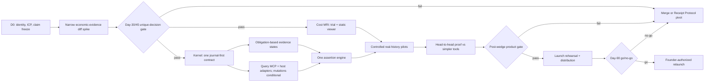
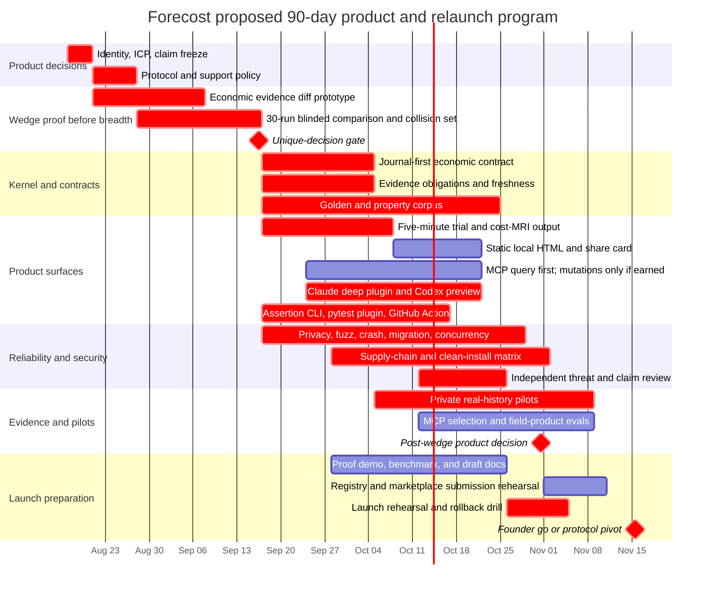

# Forecost master product and launch checklist

**Status:** working execution contract; no public release is authorized by this document  
**Snapshot:** 2026-08-13  
**Horizon:** 90 calendar days from founder-approved `T0`  
**Proposed product:** first a matched-run economic-evidence diff; a larger local debugger/circuit breaker is conditional on that wedge winning  
**Fallback:** Agent Receipt Protocol, verifier, fixtures, and assertion surfaces if the product gates fail

This is the one master checklist for the proposed startup-grade phase. It
supersedes strategic sequencing in older research notes, but it does not change
the shipped product contract by itself. A checked item means repository evidence
already exists. An unchecked item is required, experimental, staged, or a human
decision. Links in the evidence column are the acceptance artifact, not merely a
claim that work was attempted.

## Non-negotiable release rule

> **Do not publish, announce, retag, overwrite PyPI, or call this v1.0 until every
> current and selected-path P0 release gate in this file has an evidence link and
> the founder records an explicit go decision. Unselected conditional surfaces
> must be explicitly excluded from claims and packaging.**

The existing GitHub repository is already public and the `forecost` name on PyPI
currently represents legacy 0.1.1 behavior. The next launch is therefore a
relaunch, migration, or new-repository event—not an untouched first launch.

## Current-worktree remediation snapshot

**Implementation evidence date: 2026-08-13.** The original red-team findings
below were findings against an earlier state of this branch. The current
worktree has since closed the following narrow code-level defects. Before the
comparison prototype landed, a dated dependency-complete Python 3.12 audit run
reported **560 tests passed with one upstream MCP/Pydantic warning**. A fresh
post-integration Python 3.12 run on the current code reports **627 tests passed
with the same upstream MCP/Pydantic warning**. Both runs are regression evidence,
not an independent security review, a clean-machine support matrix, or field
validation.

| Narrow correction now implemented | Repository evidence | What remains open |
| --- | --- | --- |
| Trace-scoped `span_key`, schema-v10 fail-closed migration, explicit interval-union service/wait, elapsed-envelope timing, conservative critical-path abstention, and receipt v2 with all active valuation alternatives plus one non-additive canonical selection | [causal identity ADR](../adr/0001-causal-identity.md), [receipt ADR](../adr/0004-receipt-versioning.md), [kernel tests](../../tests/test_receipt_kernel.py), [schema migration tests](../../tests/test_ledger_schema.py) | Typed scheduling-dependency semantics for any non-trivial critical-path claim, published protocol schemas, a large adversarial corpus, live-source validation, and the matched-run product gate |
| Named `structural`, `economic-estimate`, `provider-billed`, `outcome`, and `ci` claim profiles with independent completeness/freshness/contradiction axes, denominators, unmet obligations, reason codes, source observation timestamps, and no-SLA freshness abstention | [profile engine](../../forecost/evidence_profiles.py), [profile tests](../../tests/test_evidence_profiles.py), [receipt tests](../../tests/test_receipt_kernel.py) | Every built-in currently has no freshness SLA and therefore reports freshness `unknown`; authenticated provider integration, predeclared real SLAs, independent injected-loss review, and release-corpus proof of zero false `complete` states remain open |
| Arbitrary local imports are `user_imported_claim`; schema v11 append/supersession corrects historical local-import projections without rewriting the journal | [economic-authority ADR](../adr/0003-economic-authority.md), [import tests](../../tests/test_reconciliation_imports.py) | No authenticated provider-billed profile or live provider validation exists |
| Claude cursor/error identifiers are keyed and opaque; file-identity/complete-prefix checkpoints detect rewriting, and accidental single-file key/ID loss or mismatch fails when dependent canonical-home cursor state is visible; privacy verification streams regular files and fails inconclusive on unreadable/skipped paths; recovery publishes a durable finite summary before removing raw input; known `FORECOST_HOME` purge surfaces are enumerated | [local identity](../../forecost/core/local_identity.py), [Claude adapter tests](../../tests/test_adapters_claude_code.py), [privacy tests](../../tests/test_privacy_cmd.py), [recovery tests](../../tests/test_recover_cmd.py), [purge tests](../../tests/test_purge_cmd.py) | Coordinated same-UID key+ID replacement is locally undetectable; legacy SDK/`costs.db` raw path or metadata persistence must be quarantined or removed; user-configured state outside `FORECOST_HOME` needs an explicit manifest/removal contract; independent review remains mandatory |
| Canonical SQLite uses WAL `synchronous=FULL`; migrations use SQLite Backup API snapshots with integrity and restore tests | [durability ADR](../adr/0008-sqlite-durability.md), [migration tests](../../tests/test_schema_migrate_command.py) | Power/kill/disk-full fault campaigns, multi-platform restore trials, and independent durability review |
| Interactive policy remains fail-open, while only explicit protected-CI configuration fails closed; the Claude launcher uses the exact plugin-owned executable and runtime bootstrap is disabled | [LiteLLM tests](../../tests/test_litellm_adapter.py), [launcher](../../plugin/scripts/run-hook.sh), [disabled bootstrap](../../plugin/scripts/bootstrap.sh), [plugin tests](../../tests/test_plugin_manifests.py) | The full locked install/update/uninstall matrix, protected-CI locked-state fault injection, and an approved distribution path |
| Strict comparison v1 separates always-abstaining two-run diagnostics from digest-bound matched cohorts under a predeclared observational USD list-rate policy, at least 30 pairs, fully valued final `delta` meters, and deterministic outcomes. It validates a WAL-consistent in-memory journal/projection rebuild, bounds global validation at 1,000,000 journal rows, abstains on non-journal reconciliation state, and excludes caller labels from bootstrap seeding. | [comparison contract](../comparison.md), `forecost/comparison.py`, `tests/test_comparison.py`, and `tests/test_compare_cmd.py` | No blinded 30-run head-to-head, Forecost-only finding-rate evidence, recurring decision classes, independent reproduction, or retention evidence exists; evaluator/source declarations are manifest-attested, not authenticated |

These corrections do **not** authorize release. The independent/external audit,
legacy-state quarantine, outside-home state contract, authenticated provider
profile and live validation, public identity/migration decision, 30-run blinded
wedge field test, live-control MCP/CI assertion products, user activation gates, and founder
go/no-go all remain open.

## Decision record

| Decision | Owner | Deadline | Status | Required evidence |
| --- | --- | --- | --- | --- |
| Keep the kernel and test a narrow economic-evidence diff before choosing a larger product surface | Founder | T0 | Proposed | Signed experiment brief and proof-stage README sentence |
| Choose existing repo relaunch vs clean repo with archived legacy repo | Founder + maintainer | T0+3 | Open | URL/package/redirect/migration plan |
| Keep `forecost` vs choose a clearer name | Founder | T0+3 | Open | Trademark/package/repository availability check and rationale |
| Define one deep release host (proposed Claude Code) and one preview host (Codex) | Founder + product | T0+3 | Proposed | Supported-host matrix and explicit exclusions |
| Accept at least 12 months of critical compatibility/security stewardship | Named maintainer | T0+7 | Open | Public support policy and escalation route |
| Stage four-tool MCP surface: check, reserve, record, receipt; mutations require wedge/user gate | Product + protocol | T0+45 | Proposed conditional | Versioned schemas, conformance fixtures, and evidence that hooks/native caps are insufficient |
| Use deterministic obligation states; do not learn completeness | Protocol + security | T0+7 | Proposed | Evidence contract and monotonicity tests |
| Call the learning feature `local calibration`, not autonomous self-learning | Product + research | T0+7 | Proposed | Vocabulary/claims review |
| Exclude hosted SaaS from the 90-day release | Founder | T0 | Proposed | Scope declaration |
| Define protocol-pivot trigger at day 60 and hard decision at day 90 | Founder + product | T0 | Proposed | Decision log with measured gate results |
| Staff the 90-day scope or narrow it | Founder | T0+3 | Open | Two-to-three engineer plan, or one-host/alpha scope for solo execution |

## Priority legend

- **P0:** required before any startup-grade public relaunch.
- **P1:** required for a convincing 30-day follow-through, but may ship after the
  first tagged candidate if it cannot compromise claims or compatibility.
- **P2:** only after field evidence identifies a recurring need.
- **Never:** deliberately excluded unless fundamentally new evidence changes the
  product contract.

A P0 inside a conditional post-wedge phase becomes release-blocking only if the
founder selects that product path. `check`/`receipt` can be P0 for a narrow
query-only product while `reserve`/`record`, a viewer, or a learner remain
unselected. Current privacy, correctness, and destructive-action P0s are never
waived by narrowing.

## 90-day dependency map

## Working Gantt

Dates below assume `T0 = 2026-08-17`. Shift every date together if approval
starts later. Research, documentation, and private trials are not a public
release.

The full proposed scope is estimated at roughly 20–29 engineer-weeks. The
90-day Gantt assumes a focused two-to-three engineer team with parallel product,
kernel, integration, and validation work. A solo maintainer should treat it as
an alpha schedule and either narrow to one host or extend production readiness
to roughly five to seven months; quality and security gates are not schedule
slack.

## Phase 0 — freeze the claim and identity (T0–T0+7)

### P0 decisions

- [ ] Write the proof-stage sentence: “Test whether this agent-workflow change
  has lower list-rate-equivalent cost without observed regression in
  predeclared deterministic test/build outcome evidence—and see exactly what
  is missing.” Do not promise speed, live intervention, or CI parity before
  those paths win their own gates.
- [ ] Test that sentence with 10 target users without explaining “receipt,”
  “observability,” “causal graph,” or “FinOps.”
- [ ] Choose a primary proof job: show whether a matched agent-workflow change
  has lower list-rate-equivalent cost without observed regression in
  predeclared deterministic test/build outcome evidence, reject invalid
  comparisons, and name missing evidence. Timing/speed is outside implemented
  comparison v1.
- [ ] Choose the primary release persona: agent builders, OSS maintainers, and
  applied researchers comparing graph-shaped Claude/Codex model+harness+policy
  runs; use API-billed power users as the first economic integration cohort.
- [ ] Explicitly say that flat subscription users with one trustworthy total
  may not need Forecost.
- [ ] Decide whether to retain the Forecost name.
- [ ] Decide whether the public repository remains the launch repository.
- [ ] Decide what happens to legacy GitHub releases v0.1.0/v0.1.1.
- [ ] Decide what happens to the legacy PyPI `forecost` 0.1.1 page and metadata.
- [ ] Preserve redirects, changelog history, and migration instructions; never
  rewrite history to simulate a fresh project.
- [ ] Record the supported host/OS/Python matrix and the end date of support.
- [ ] Remove Python 3.10 from the launch support matrix before the proposed
  November candidate, or publish an explicit October 2026 sunset and test only
  still-supported versions; the 90-day schedule crosses Python 3.10 EOL.
- [ ] Name the person or organization responsible for critical maintenance for
  at least 12 months.
- [ ] Write a public “what perfect means / what cannot be promised” contract.

### Acceptance evidence

- [ ] `docs/product-brief.md` approved by founder.
- [ ] `docs/support-policy.md` names versions, response scope, and sunset path.
- [ ] `docs/migration/legacy-identity.md` records GitHub/PyPI/name decisions.
- [ ] README, package metadata, changelog, status, security, and 101 agree.
- [ ] Claims inventory covers CLI root/command help, package metadata, changelog,
  plugin/marketplace docs, MCP docstrings/schemas, completion/QA reports,
  examples, and generated/static output—not only README prose.
- [ ] No page implies unreleased 0.3 is on PyPI.

## Phase 0B — prove the narrow wedge before product breadth (T0+4–T0+30/45)

- [x] Freeze one prototype command:
  `forecost compare BASELINE CANDIDATE --profile economic-outcome`.
- [x] Require matched case/outcome identity, compatible authority/currency,
  uncertainty, and explicit abstention on workload/evidence mismatch.
  The internal v1 contract is narrower: diagnostic run-ID comparison always
  abstains; full mode requires digest-bound arm manifests, exact predeclared
  rosters, observational USD list-rate valuations, predeclared deterministic test/build
  outcomes, at least 30 pairs, and deterministic confidence bounds. See the
  [comparison contract](../comparison.md). This check records implementation,
  not field validity or product demand.
- [x] Fix the minimum P0 span identity, timing, competing-valuation,
  obligation/freshness, cursor/log, and import-authority defects necessary for a
  factual comparison. Code-level evidence: [causal identity](../adr/0001-causal-identity.md),
  [receipt semantics](../adr/0004-receipt-versioning.md),
  [claim profiles](../../tests/test_evidence_profiles.py),
  [local identity/privacy](../../tests/test_local_identity.py), and
  [import authority](../../tests/test_reconciliation_imports.py). This does not
  clear the implemented comparison prototype's still-open field gate.
- [ ] Build authority-collision fixtures for list rate, gateway estimate, local
  import, authenticated provider settlement, cache/tier/discount differences,
  duplicates, late evidence, and alternative valuations of one fact.
- [ ] Build Simpson's-paradox/workload-mix fixtures; reject false aggregate
  “savings” and abstain on unmatched cases.
- [ ] Compare 30 identical graph-shaped runs using native tools, a simple viewer,
  `agentacct`, Arena/AgentAssay-style evaluation, a live-budget tool, and
  Forecost.
- [ ] Require a verified actionable Forecost-only result in ≥30%, zero false
  factual claims/double counts/false complete, exact authority/reason/denominator
  on all collision fixtures, and median diagnosis <3 minutes.
- [ ] If the gate fails, freeze Lab/viewer/mutable-MCP/learner work and pursue a
  merge with `agentacct`, Arena, or ASSERT, or the protocol fallback.

Every later product phase is conditional on this gate. P0 privacy/data-integrity
fixes remain required even if the product pivots or merges.

## Phase 1 — make one canonical economic observation plane (after wedge pass)

### Existing foundations

- [x] Local SQLite `ledger.db` exists with append-only journal observations and
  deterministic causal projections.
- [x] Receipts preserve meter facts separately from authority-labelled charges.
- [x] Graph receipts include branches, waits, retries, outcomes, conflicts, and
  blind spots when sources provide them.
- [x] Current documentation admits that usage/postings and receipt-journal lanes
  coexist and are not fully unified.

### P0 implementation

- [ ] Publish `AgentReceipt/1` and `Observation/1` JSON Schemas.
- [x] Replace raw transcript-path `ingest_state.cursor_key` values with
  installation-keyed opaque HMAC identities; migrate existing state without
  exposing or conflating paths; add direct SQL privacy tests. See
  [Claude adapter tests](../../tests/test_adapters_claude_code.py) and
  [local-identity tests](../../tests/test_local_identity.py).
- [x] Replace `causal_spans.span_id` as a global identity with composite
  `(trace_id, span_id)` or an internal hash of both, and migrate collisions
  without silent overwrite. Schema v10 uses trace-scoped `span_key`; see the
  [causal identity ADR](../adr/0001-causal-identity.md) and
  [migration tests](../../tests/test_ledger_schema.py).
- [ ] Define node types: run, span/attempt, tool call, branch, checkpoint,
  reservation, meter, charge, outcome, obligation, evidence, policy decision.
- [ ] Define edge types: parent, spawned, joined, retry-of, supersedes,
  resumed-from, funded-by, charged-to, supports, contradicts.
- [ ] Mark causal ancestry, `parent_of`, `spawned`, and `retry_of` lineage as
  acyclic. Represent legitimate repeated state-machine transitions as distinct
  attempt/transition nodes; do not encode a cycle in causal lineage.
- [ ] Record schema, recorder, adapter, harness, model, pricing, and policy
  versions on every receipt-affecting event.
- [ ] Make adapters append normalized observations to one journal-first boundary.
- [ ] Convert operational usage/postings to deterministic projections or document
  a bounded compatibility projection; eliminate dual canonical writes.
- [ ] Move LiteLLM ingestion onto the journal-first boundary.
- [ ] Make manual Claude ingestion and hook ingestion produce explicitly stated
  structural/economic coverage profiles.
- [ ] Keep OTel as a versioned translation layer; do not bind the protocol to an
  unstable external semantic convention.
- [ ] Preserve late evidence by append/supersession, never mutation.
- [ ] Refuse unsupported schema versions as `unknown`/error, never best-guess
  “complete.”
- [x] Encode same-fact/multi-authority selection so list, gateway, estimate, and
  billed valuations cannot be summed as separate work. See the
  [receipt-v2 kernel tests](../../tests/test_receipt_kernel.py).
- [x] Encode union-based wall-service and wall-wait plus an elapsed envelope,
  without nested/parallel double counting. See the
  [receipt-v2 kernel tests](../../tests/test_receipt_kernel.py).
- [x] Withhold non-trivial critical path because current parent/fan-in edges do
  not declare scheduling-dependency semantics; cycles explicitly invalidate the
  path claim. A one-span graph is the only currently populated critical path.
- [x] Stop interpreting `occurred_at → observed_at` as span duration. Require
  explicit start/end/duration facts with source/clock semantics or report timing
  unknown. See the [receipt ADR](../adr/0004-receipt-versioning.md) and
  [causal adapter tests](../../tests/test_causal_adapter.py).
- [ ] Encode parent/child resource conservation and idempotent settlement.
- [x] Receipt v2 emits all active competing valuations grouped by fact plus one
  canonical selection/reason; totals never sum alternatives. See the
  [receipt ADR](../adr/0004-receipt-versioning.md) and
  [receipt-v2 kernel tests](../../tests/test_receipt_kernel.py).
- [ ] Receipt v2 includes applicable reservations, policy decisions,
  reconciliation batches, safe model/tool labels, and comparison provenance.

### P0 correctness corpus

- [ ] At least 100 human-reviewed graph fixtures.
- [ ] At least 500 heterogeneous normalized run fixtures before release.
- [ ] At least 50 adversarial reconciliation/evidence cases.
- [ ] At least 10,000 generated malformed, truncated, reordered, duplicated, and
  late-event cases.
- [ ] For selected valid fixtures, replay 100 ingestion permutations and require
  byte-identical canonical receipts.
- [ ] Zero silent double counts.
- [ ] Zero unsupported evidence promotions.
- [ ] Zero receipt-verification false claims in the corpus.
- [ ] Disk-full, interrupted transaction, concurrent writer, replay, migration,
  downgrade refusal, and recovery fixtures pass.

## Phase 2 — evidence completeness becomes a claim contract (after wedge pass; target T0+31–T0+50)

### P0 semantics

- [x] Replace one global “complete” score with named claim profiles such as
  `structural`, `economic-estimate`, `provider-billed`, `outcome`, and `ci`.
  See the [profile engine](../../forecost/evidence_profiles.py) and
  [profile tests](../../tests/test_evidence_profiles.py).
- [x] For each built-in profile, declare required sources and obligations before
  observing the result. See the [profile engine](../../forecost/evidence_profiles.py).
- [x] Use categorical projected states `complete`, `partial`, `stale`,
  `contradictory`, and `unknown`, while retaining independent axes. See the
  [profile tests](../../tests/test_evidence_profiles.py).
- [x] Keep freshness independent from authority and finality. See the
  [profile tests](../../tests/test_evidence_profiles.py).
- [x] Treat `max_age_seconds = null` as freshness `unknown`, not `fresh`, and
  use actual journal observation times for structural signals. Receipt `as_of`
  is at least as late as every evaluated signal. See the [profile tests](../../tests/test_evidence_profiles.py)
  and [receipt tests](../../tests/test_receipt_kernel.py).
- [x] Surface a terminal-to-active lifecycle regression as structural
  contradiction even when projection ordering selects a terminal row. See the
  [receipt tests](../../tests/test_receipt_kernel.py).
- [x] Treat a parent/fan-in causal cycle as a structural-closure contradiction;
  a completed-looking projection cannot remain structurally complete/clear.
  See the [receipt tests](../../tests/test_receipt_kernel.py).
- [x] Block structural closure when a parent or fan-in target is unresolved;
  classify this as partial/missing evidence, not contradiction. See the
  [receipt tests](../../tests/test_receipt_kernel.py).
- [x] Block structural closure when any predeclared `sources_expected` source is
  absent; a narrower present set cannot close the declared scope. See the
  [receipt tests](../../tests/test_receipt_kernel.py).
- [x] Treat active `good` and `bad` statuses as outcome-profile contradiction
  across evidence roles (`partial` alone is not decisive); only a valid explicit
  supersession of an existing earlier same-role/same-run target removes the
  referenced outcome from the active assessment set while preserving history.
  A human mark cannot retire test/CI evidence. Forward, missing, cross-run,
  cross-role, and self references remain active and contradictory. See the
  [receipt tests](../../tests/test_receipt_kernel.py).
- [ ] Add case-attempt identity for deterministic test/build outcomes; until
  then those facts retain ranked selection because the receipt cannot distinguish
  a legitimate rerun progression from a same-case contradiction.
- [x] Apply the same earlier-same-run rule to charge supersession; invalid edges
  must also stay within economic fact/currency/line-item scope. Invalid edges
  cannot hide the target, remain visible in valuation groups, and contradict
  economic evidence. See the [receipt tests](../../tests/test_receipt_kernel.py).
- [x] Retain built-in profile version 1 for this evaluator correction because
  obligations, roles, closure/finality rules, and denominators are unchanged;
  bump the profile version when an SLA or obligation changes. Receipt field
  names/types remain schema-v2 compatible. See [ADR 0004](../adr/0004-receipt-versioning.md).
- [x] Include the denominator and every unmet obligation in machine and current
  human profile output. See the [profile tests](../../tests/test_evidence_profiles.py)
  and [receipt tests](../../tests/test_receipt_kernel.py).
- [x] Verify the narrow positive-evidence partial order: removing one positive
  required signal from an otherwise satisfied provider-billed profile reduces
  its satisfied count and completeness. This does not claim arbitrary removal
  monotonicity—removing a contradictory signal can legitimately improve the
  contradiction axis. See [the profile test](../../tests/test_evidence_profiles.py);
  the broader release-corpus property gate below remains open.
- [x] Require all observed branches/spans to close or be explicitly abandoned
  when the structural profile demands closure. The incomplete-lifecycle case is
  covered in [receipt tests](../../tests/test_receipt_kernel.py).
- [ ] Require reservations to settle/expire when the selected profile demands
  resource closure.
- [ ] Treat agent assertions as attributed advisory observations; they cannot
  upgrade trusted completeness, task success, or progress.
- [x] Treat absent provider billing as `unknown`/partial for a billed claim, not
  a cosmetic blind spot behind “complete.”
  See the `provider-billed` [profile tests](../../tests/test_evidence_profiles.py).
- [ ] Add reason codes stable enough for CLI, MCP, pytest, and Action parity.
  The profile engine now emits bounded deterministic reason codes, but parity
  cannot close before the real pytest plugin and Action exist.

### P0 validation

- [ ] Property test: drop each required observation and prove the state never
  improves.
- [ ] Property test: add a contradiction and prove `complete` cannot survive.
- [ ] Property test: advance beyond the freshness SLA and prove state becomes
  `stale` without rewriting history.
- [ ] Conduct an injected-loss review where independent operators predict the
  expected state before seeing Forecost output.
- [ ] Zero false `complete` states in the release corpus.

## Phase 3 — five-minute “cost MRI” (after wedge pass; target T0+31–T0+60)

### P0 user journey

- [ ] Provide one transient command (`uvx`/`pipx run` or a signed standalone
  binary) that does not require repository cloning.
- [ ] `forecost trial` auto-detects supported local agent histories but shows a
  privacy preview and obtains explicit consent before importing anything.
- [ ] If no supported history exists, use a pinned bundled fixture and label it
  unambiguously as a demonstration.
- [ ] Produce the first useful result within five minutes at p90 on clean
  supported machines.
- [ ] Lead with one decision, not architecture: biggest retry tax, duplicate
  branch, unresolved reservation, conflicting charge, or missing required source.
- [ ] Display the exact evidence profile and why it is partial/stale/conflicting.
- [ ] Offer a static self-contained HTML explorer after the terminal summary.
- [ ] Generate a sanitized Markdown/SVG “Agent Efficiency Diff” without network
  upload.
- [ ] Never say “saved $X” without randomized causal evidence; use “requested
  spend denied,” “estimated foregone spend,” or “observed difference.”
- [ ] Show install, enable, disable, and uninstall changes before applying them.
- [ ] Keep `forecost lab` as deterministic engineering proof, not the primary
  user aha.

### P0 legibility

- [ ] Terminal output fits an 80-column window and remains useful without color.
- [ ] The first screen contains: decision, amount/range, causal location,
  evidence state, and next action.
- [ ] Deep graph detail is progressive disclosure, not a wall of spans.
- [ ] JSON, Markdown, Rich text, and HTML are projections of one canonical
  receipt, not independently computed totals.
- [ ] Export removes raw/stable project identifiers by default and rotates
  per-workspace pseudonyms.
- [ ] Accessibility check covers contrast, keyboard navigation, headings, and
  reduced motion for HTML.

### P0 activation gates

- [ ] 30 target developers attempt onboarding without maintainer rescue.
- [ ] At least 24/30 create a valid receipt in five minutes; p90 ≤5 minutes.
- [ ] At least 15/30 find an actionable fact absent from their existing view.
- [ ] At least 8/30 change a retry, budget, CI, evidence, or instrumentation
  decision.
- [ ] At least 10 owners permit a sanitized artifact/quote to be used publicly.

## Phase 4 — query MCP and host-native integration; mutations conditional (after wedge pass; target T0+38–T0+73)

### P0 query contract

- [ ] Upgrade from the current three read-only, string-returning tools (the third
  is an always-abstaining comparison diagnostic) and old SDK
  pin to the current supported MCP SDK/specification after compatibility tests.
- [ ] Expose `forecost_check` and `forecost_receipt` for a query-only launch.
  Maintain the full four-tool target schema, but do not ship mutations merely to
  satisfy a surface-count goal.
- [ ] `check` returns budget headroom, loop state, evidence state, and a stable
  reason/action without mutation.
- [ ] **Conditional P1:** `reserve` atomically allocates a bounded scope and returns an opaque handle,
  expiry, fencing token, and scoped decision.
- [ ] **Conditional P1:** `record` accepts allowlisted lifecycle/meter/outcome observations and is
  idempotent by caller key.
- [ ] `receipt` returns or snapshots a canonical receipt in a requested safe
  projection.
- [ ] Use explicit opaque handles; do not hide state in prompt text.
- [ ] Use structured result/error objects; never parse human prose to enforce.
- [ ] Keep schemas short and progressive; measure their context/tool-selection
  tax.
- [ ] Require confirmation/host policy for mutating or denying behavior.
- [ ] Provide a no-mutation/read-only mode and a disable switch.
- [ ] Do not depend on the agent remembering to call; use host-attributed
  lifecycle checkpoints where supported. These are not independent against a
  same-user agent/tool.
- [ ] Detect silent MCP disconnection and downgrade claims to unavailable/partial.

### P0 host packaging

- [ ] Claude Code plugin bundles skill, hooks, MCP config, health check, and
  reversible uninstall.
- [ ] Codex universal plugin bundles `.codex-plugin/plugin.json`, a skill,
  bundled stdio MCP configuration, and reviewed lifecycle hooks.
- [ ] Declare the exact Codex hook events and tool classes observed; specialized
  or hosted tools that bypass hooks downgrade the relevant claim profile rather
  than being silently counted as complete.
- [ ] Provide exact config diff before install and exact restoration on uninstall.
- [ ] Host and protocol versions appear in doctor output and receipts.
- [ ] Negative-trigger tests prove Forecost is not called for irrelevant tasks.
- [ ] Skills/MCP descriptions are treated as untrusted input and cannot elevate
  policy or evidence authority.

### P0 agent eval

- [ ] At least 200 labeled direct, indirect, negative, retry, branch, and
  expensive-tool prompts across declared host/model snapshots.
- [ ] Tool-selection precision ≥98%; recall ≥95% on intended calls.
- [ ] Zero unauthorized mutations.
- [ ] Measure added tokens, latency, task success, and user overrides.
- [ ] Re-run after any host/model/schema change.

## Phase 5 — one assertion engine across CLI, pytest, and GitHub (after wedge pass; target T0+31–T0+65)

### P0 implementation

- [ ] Implement `forecost assert` as the sole policy evaluator.
- [ ] Replace the current one-line pytest entry-point placeholder with a real
  `pytest-forecost` plugin.
- [ ] Support session/test scope, setup/call/teardown, xdist workers, crashes,
  missing source, and empty runs explicitly.
- [ ] Emit JUnit/property-compatible facts without leaking prompts, paths, or
  tool payloads.
- [ ] Build a composite/container GitHub Action that invokes the same offline
  assertion engine.
- [ ] Do not run untrusted pull-request code in a privileged workflow.
- [ ] Pin every Action dependency to a reviewed full commit SHA.
- [ ] Use least-privilege tokens and no comment-spam permission by default.
- [ ] Produce check summary + downloadable canonical receipt bundle.
- [ ] Support rules for total canonical charge, retry tax, branch fan-out,
  evidence profile/state, source freshness, unresolved spans/reservations,
  contradiction, and tamper signal.
- [ ] Require 100% decision and reason-code parity across CLI, MCP, pytest, and
  Action on the conformance corpus.

### P0 field gate

- [ ] Run shadow-only in three real repositories first.
- [ ] Every fail/override has a labeled disposition.
- [ ] At least two repositories retain a required gate for four weeks.
- [ ] Reviewed false failures <5% across ≥200 pilot executions; target <2% across
  ≥1,000 executions before calling the gate stable.

## Phase 6 — loop detection and local calibration (conditional after wedge pass; target T0+38–T0+75)

### P0 deterministic loop signal

- [ ] Represent retry lineage, recorder-attributed operation class and trust role, bounded search intent,
  error class, state/evidence fingerprint change, cost/time growth, fan-out,
  checkpoint, and termination budget.
- [ ] Use states `unknown`, `advisory`, `warning`, `deny_eligible`.
- [ ] Agent-reported “no progress” cannot alone create `deny_eligible`.
- [ ] Planned bounded search/refinement is distinguished from pathological
  repetition.
- [ ] Hard denial is opt-in and off by default.
- [ ] Every warning/denial has deterministic reason codes and a replayable trace.
- [ ] Immediate override and rollback exist.

### P0 loop evaluation

- [ ] At least 50 adversarial golden loop/search scenarios.
- [ ] At least 200 independently reviewed field candidates across five repos and
  three harness/model configurations before accuracy claims.
- [ ] Warning precision 95% confidence lower bound ≥0.85.
- [ ] Recall point estimate ≥0.80 on confirmed pathological loops.
- [ ] At least 95% of cases without a non-agent recorder-observed progress/state witness remain
  unknown/advisory, not deny-eligible.
- [ ] Report by loop family; do not hide failure behind one aggregate score.
- [ ] Before opt-in hard denial, observe 3,000 diverse shadow decisions with zero
  false aborts and pass a task-success non-inferiority margin ≤2 percentage points.

### P1 local calibration

- [ ] Call this feature `local calibration` or `policy calibration`.
- [ ] Allow calibration only for cost residuals, cache/tier cohorts, source
  closure/freshness reliability, empirical cost/latency, overrun risk, and
  confirmed structural loop hazard.
- [ ] Completeness remains deterministic and is never learned.
- [ ] Runtime policies are immutable/versioned snapshots.
- [ ] Candidate policies record parent, dataset/schema digest, time window,
  features, cohorts, hyperparameters, baselines, confidence intervals,
  unsupported cohorts, approver, and rollback target.
- [ ] Promotion is: historical replay → time/repo-separated holdout → live shadow
  → human approval → limited opt-in → general availability.
- [ ] Cohorts with fewer than 30 settled samples abstain.
- [ ] Thirty is only an abstention floor. Enforcing/published cohorts also meet
  a predeclared effect-size and power/precision target, report uncertainty, and
  pass a time/repository-separated holdout.
- [ ] No policy silently changes enforcement thresholds online.
- [ ] Content-free structural records are never marketed as enough to learn task
  strategy, intent, correctness, or business value.
- [ ] Poisoning tests cover forged progress, success, closure, and cost.

## Phase 7 — security, privacy, and cryptographic truth (current P0s start at T0; full hardening conditional through T0+75)

### Existing foundations

- [x] Owner-only local paths, SQLite safety settings, allowlisted contracts, and
  privacy canaries exist.
- [x] Local journal/hash-chain mutation detection exists.
- [x] Documentation admits that same-user mutation and metadata side channels
  remain.

### P0 threat model

- [ ] Enumerate: malicious/compromised agent with user privileges, malicious
  plugin/adapter, poisoned project config, forged provider import, same-user DB
  rewrite, key theft, rollback/truncation, symlink/path attack, denial of service,
  untrusted PR, dependency compromise, and metadata linkage.
- [ ] State that a same-user attacker controlling recorder + database + signing
  key can forge a consistent local history.
- [ ] State that a digest proves neither authorship nor independent time nor
  semantic truth.
- [ ] Separate assurance profiles from mechanisms: local hash, software key,
  OS-keychain/user-presence key, CI identity/attestation, external witness.
- [ ] Prefer interoperating with established receipt/signing tools rather than
  inventing a weaker proprietary crypto envelope.
- [ ] Bind canonical payload, schema, disclosure profile, policy, run identity,
  predecessor/checkpoint, signer identity, and assurance profile into any
  signature.
- [ ] Prevent self-declared digest verification from being marketed as
  independent integrity.
- [ ] Include rollback/truncation detection only when a trusted external
  checkpoint exists.

### P0 privacy

- [ ] Replace globally linkable structural hashes with per-workspace keyed HMACs
  where identity correlation is unnecessary.
- [ ] Support rotation and retention.
- [ ] Ban raw prompts, completions, reasoning, file contents, paths, tool
  arguments/results, credentials, arbitrary baggage, and unbounded errors.
- [ ] Acknowledge that topology, model, timing, tool category, sequence, and
  pseudonymous continuity can still reveal sensitive behavior.
- [ ] Define local, CI, and share disclosure profiles.
- [ ] Extend privacy canaries through malformed paths, logs, exceptions, viewer,
  MCP, CI summaries, and support bundles.
- [x] Replace arbitrary exception/path persistence in `error.log` with finite
  error codes and bounded keyed fingerprints. See the
  [diagnostic-log implementation](../../forecost/core/errlog.py) and
  [direct tests](../../tests/test_errlog.py).
- [ ] Maintain a complete Forecost-owned-state manifest (DB/WAL/SHM, hooks,
  outbox, spools, backups, keys, caches, integration backups); purge tests leave
  it empty or explicitly enumerate user-chosen preserved state. The known
  `FORECOST_HOME` surfaces and nested hook/outbox markers now have
  [purge coverage](../../tests/test_purge_cmd.py), but this broad gate stays open
  until legacy raw state is quarantined and user-configured outside-home paths
  have an explicit inventory/removal contract.
- [ ] Require explicit export manifest and no telemetry/upload by default.
- [ ] Commission an independent security/privacy review before public claims.

### P0 supply chain

- [ ] Exact dependency lock/hashes for release build inputs.
- [ ] OIDC/Trusted Publishing; no long-lived package token.
- [ ] SBOM and provenance/attestation per artifact.
- [ ] Approve the public source-archive inventory explicitly. The current sdist
  intentionally includes `AGENTS.md`, tests, QA/research, experiments, `101/`,
  and root images, while the runtime wheel excludes those non-package trees.
- [ ] Make PyPI long-description images self-contained or use an immutable,
  reviewed HTTPS asset. The README's relative `assets/forecost-receipt-hero.png`
  renders in GitHub/source checkouts but is not a standalone wheel file.
- [ ] Immutable release after every asset is attached.
- [ ] Full-SHA Action pins and reviewed permissions.
- [ ] CodeQL, dependency review, secret scanning, `actionlint`, `zizmor`,
  `gitleaks`, `bandit`, and fresh advisory scan.
- [ ] Two-person approval for production publication if two trusted people are
  available; otherwise document the single-maintainer residual risk.
- [ ] Rollback/yank drill and compromised-release response procedure.

## Phase 8 — production-quality and maintenance-light boundaries (after wedge pass; target T0+45–T0+82)

### P0 quality definition

- [ ] Zero known P0/P1 defects at release candidate.
- [ ] No silent corruption, double counting, evidence promotion, adapter drift,
  or optimistic fallback.
- [ ] Deterministic canonical receipts for identical normalized inputs.
- [ ] Crash-safe replay and migration with tested downgrade refusal.
- [x] Migrations use SQLite's Backup API rather than copying only the main
  WAL-mode database file; integrity and automated restore tests prove the
  snapshot includes committed WAL pages.
  See the [durability ADR](../adr/0008-sqlite-durability.md) and
  [migration/restore tests](../../tests/test_schema_migrate_command.py).
- [ ] Quiesce incompatible writers across the complete migration, failure, and
  rollback lifecycle. SQLite supplies snapshot consistency, but that is not a
  complete multi-process upgrade/rollback protocol.
- [ ] Use/document WAL durability compatible with public claims (`FULL` or an
  equivalently fsynced append boundary) and pass power/kill/disk fault injection.
  The code-level `synchronous=FULL` correction and WAL snapshot tests are
  implemented, but the wider power/kill/disk campaign is not; see the
  [durability ADR](../adr/0008-sqlite-durability.md).
- [x] Arbitrary local JSON/CSV billing imports remain `user_imported_claim`.
  Schema v11 also append-corrects historical fixed-producer local imports; see
  the [economic-authority ADR](../adr/0003-economic-authority.md) and
  [migration/import tests](../../tests/test_reconciliation_imports.py).
- [ ] Admit `billed` authority only through an authenticated provider source
  profile and validate it live. No such profile exists in this worktree.
- [ ] Protected CI fail-closed behavior is fault-injected; missing/corrupt/locked
  state never falls back to allow.
  Explicit protected-CI mode now fails closed for covered missing/corrupt/internal
  failures while interactive mode remains fail-open; the locked-state and full
  integration matrix keep this broad gate open. See the
  [LiteLLM tests](../../tests/test_litellm_adapter.py).
- [x] Plugin launch uses an exact approved absolute executable; no `PATH`
  fallback or unhashed runtime package resolution.
  The launcher validates the plugin-owned executable and bootstrap is disabled;
  see [launcher tests](../../tests/test_plugin_manifests.py).
- [ ] Clean install, update, disable, uninstall, and rollback on the declared
  support matrix.
- [ ] 100 clean-machine install/update/uninstall trials with zero unexplained
  failures before release.
- [ ] All public claims point to reproducible fixtures or explicitly say they
  require/live-measured evidence.
- [ ] Unsupported host/schema/pricing becomes unavailable/unknown/stale—not a
  guessed success.
- [ ] Hook hot path p95 ≤50 ms on the declared host; warm MCP check p95 ≤75 ms;
  reserve/record p95 ≤100 ms under eight local clients.
- [ ] Assertion evaluation ≤25 ms after snapshot load; full supported 100k-span
  CI assertion ≤3 seconds.
- [ ] Static interactive HTML ≤2 seconds and ≤5 MB through 10,000 spans; larger
  runs use bounded summaries plus raw-bundle export.

### P0 maintenance-light architecture

- [ ] No hosted backend, account system, remote database, or default telemetry.
- [ ] Stable protocol/verifier separated from versioned host adapters and pricing
  packs.
- [ ] Frozen offline mode can always replay bundled fixtures and old schema
  versions within the published compatibility window.
- [ ] Scheduled compatibility tests run against declared host/SDK versions.
- [ ] Community adapters must pass conformance before receiving a compatibility
  badge.
- [ ] Publish end-of-life and deprecation windows; do not promise “never breaks.”
- [ ] Maintain a security contact and critical-release path for at least the
  promised support period.

## Phase 9 — post-wedge real-user proof and differentiation (target T0+45–T0+75)

### P0 research protocol

- [ ] Obtain explicit permission for sanitized real-history imports.
- [ ] Compare the same runs against native cost, one simple aggregator, the
  closest evidence competitor, and the closest live-budget competitor.
- [ ] Review at least 30 graph-shaped, multi-source runs.
- [ ] Record the existing answer, Forecost-only fact, user action, and later
  outcome for every candidate.
- [ ] Do not count prettier formatting or an already-known total as differentiated
  value.
- [ ] Independently reproduce competitor behaviors before public comparisons.
- [ ] Keep private usage/traffic data out of public repository docs.

### Post-wedge product gate (target day 60; no later than day 75 after a documented wedge extension)

- [ ] At least three recurring decision classes appear that a simpler tool misses.
- [ ] At least 15/30 users discover an actionable fact.
- [ ] At least 8/30 change a decision.
- [ ] At least three users leave live integration enabled in ordinary work.
- [ ] At least three repositories begin shadow CI use and every override is
  classified; the four-week retention gate is evaluated at day 90.
- [ ] Selection and evidence accuracy meet thresholds for the MCP tools actually
  selected; mutation/loop thresholds apply only if those conditional surfaces
  were earned.
- [ ] No unresolved P0 privacy/integrity claim defect exists.

If the first condition fails, or no receipt changes a real decision, stop product
expansion and execute the Agent Receipt Protocol pivot in Phase 12.

## Phase 10 — launch asset and distribution program (after wedge pass; target T0+50–T0+85)

### P0 product artifacts

- [ ] 15–30 second reproducible recording: matched change → qualified economic/
  outcome diff → exact missing evidence and next decision. If live control is a
  selected, earned surface, a warning or opt-in block may be shown separately.
- [ ] Pinned no-key fixture with published digest and expected output.
- [ ] Static sanitized run explorer and Markdown/SVG share card.
- [ ] PR check artifact showing budget regression, retry tax, and evidence gap in
  one compact table.
- [ ] Public adversarial benchmark against native/simple/closest competitors on
  permitted traces.
- [ ] Transparent “what this cannot prove” panel.
- [ ] Protocol/conformance badge usable by other projects.
- [ ] Ten permitted real-user artifacts/quotes.

### P0 distribution preparation

- [ ] Build a contactable launch audience before the tag; do not buy, exchange,
  coerce, or automate stars.
- [ ] Secure independent launch participation from respected agent-tool users or
  maintainers.
- [ ] Submit/schedule the Claude plugin, Codex plugin/skill, MCP registry entry,
  package indexes, and relevant curated lists only after the post-wedge product
  gate; before it, prepare drafts and local submission rehearsals only.
- [ ] Prepare launch post, technical deep dive, benchmark methods, threat model,
  demo, migration notice, and contributor guide.
- [ ] Create good-first adapter/fixture issues with conformance tests.
- [ ] Configure GitHub community health: code of conduct, security policy, issue
  forms, PR template, discussions, and release notes.
- [ ] Measure qualified views, install completion, first valid receipt, second
  receipt, MCP activations, CI gates, external adapters, and referrals separately
  from stars.
- [ ] Rehearse install from every intended channel and a total rollback/yank.

### Reach reality gate

- [ ] Define the funnel units. If 10K stars within 30 days remains the goal, a
  credible plan reaches roughly 50,000–100,000 qualified repository visitors at
  an assumed 20–10% visitor-to-star conversion, or roughly 1–2 million relevant
  social impressions at an assumed 5% visit rate. These are planning
  assumptions, not benchmarks.
- [ ] Leading indicators and launch partners justify the exposure assumption.
- [ ] If not, reset the public star target rather than treating product quality as
  a substitute for distribution.

## Phase 11 — founder go/no-go (T0+86–T0+90)

### Required evidence packet

- [ ] Every P0 line above has an artifact, owner, and date.
- [ ] Current-state truth table distinguishes shipped, candidate, and proposed.
- [ ] Independent security/privacy review has no open P0/P1.
- [ ] Supported clean-machine matrix is green.
- [ ] Golden/property/fuzz/replay corpus is green.
- [ ] Selected MCP surfaces, assertion parity, and applicable field gates are green.
- [ ] Name/repo/PyPI migration is rehearsed.
- [ ] Artifact provenance, SBOM, signatures/attestations, and verification are
  rehearsed.
- [ ] Launch assets are reproducible and claims have evidence.
- [ ] Rollback, yank, incident response, and stewardship are staffed.

### Go decision

- [ ] Founder records `GO FULL PRODUCT`, `GO NARROW DIFF`, `DELAY`,
  `MERGE/HANDOFF`, `PROTOCOL PIVOT`, or `ARCHIVE` with rationale.
- [ ] Only a recorded product `GO` authorizes product tag/package/announcement
  actions; a protocol publication needs its own explicit authorization and claim
  review.
- [ ] A star forecast is never allowed to override failed correctness, privacy,
  or differentiation gates.

## Phase 12 — protocol pivot if product differentiation fails

- [ ] Freeze broad product work.
- [ ] First offer the validated kernel to `agentacct` as the strongest product/
  distribution complement: authority-safe reconciliation, obligation profiles,
  fixtures, and assertions.
- [ ] Evaluate Arena or ASSERT as paired-evaluation hosts instead of cloning a
  runner/viewer; keep AgentAssay behind a protocol boundary until AGPL/legal
  compatibility is reviewed.
- [ ] Prefer AgentBudget/host-native controls for runtime caps unless Forecost's
  graph-aware control wins the false-abort/usefulness comparison.
- [ ] Prefer `obsigna`/established receipt envelopes and Sigstore-style CI
  identity for signing rather than a new proprietary crypto stack.
- [ ] Extract the smallest versioned Agent Receipt Protocol.
- [ ] Publish canonical JSON Schema and deterministic canonicalization rules.
- [ ] Publish authority, finality, freshness, obligation, contradiction, and
  supersession vocabulary.
- [ ] Publish golden/chaos/privacy/adversarial fixtures.
- [ ] Publish an offline verifier and conformance runner.
- [ ] Keep the assertion CLI, pytest helper, GitHub Action, and four narrow agent
  tools only if they pass selection/usefulness gates.
- [ ] Offer adapters/interop to stronger receipt-signing or observability tools.
- [ ] Position Forecost as one reference implementation, not the mandatory
  database/UI.
- [ ] Archive or sunset unsupported experimental product surfaces honestly.

## Upstream repository use register

No linked repository is a default runtime dependency. Every code reuse requires
an exact commit, license review, attribution, security review, and a written
reason it is safer than a small clean-room implementation.

### Use now as methods or patterns

- [ ] `mattpocock/skills`: study progressive disclosure, portable skill packaging,
  and marketplace ergonomics; copy code only under verified MIT terms.
- [ ] `AgriciDaniel/claude-obsidian`: adapt deterministic, self-auditing artifact
  and reversible release patterns with attribution.
- [ ] `usestrix/strix`: use staged root/subagent budget state-machine ideas and
  adversarial presentation patterns; keep the implementation clean-room.
- [ ] `JuliusBrussee/caveman`: copy benchmark honesty, instant payoff, and visual
  communication methods; do not copy BSL-covered code.
- [ ] `zhaoxuya520/reverse-skill`: adapt config-routing regression and evidence
  review patterns; exclude GPL/offensive subtrees and runtime installation.
- [ ] `ruvnet/ruflo`: treat cost/budget/loop features as commodity evidence and
  use swarm histories only as permitted stress fixtures.

### Revisit later only after a measured need

- [ ] `karpathy/llm-council`: concept-only comparative review; no code reuse while
  licensing is absent/unclear.
- [ ] `ar9av/obsidian-wiki`: incremental graph/file ownership patterns for a
  local viewer or fixture knowledge base.
- [ ] `alirezarezvani/claude-skills`: community contribution schema and cross-host
  packaging after the first supported host is stable.
- [ ] `open-jarvis/OpenJarvis`: clean-room structural calibration methodology only
  if field data justifies a learner.
- [ ] `trimstray/the-book-of-secret-knowledge`: discovery only; validate against
  canonical sources before adopting any command.
- [ ] GitHub `code-quality` topic: discovery only; depend on canonical tools, not
  the topic list.

### Never use

- [ ] Do not ingest, train on, benchmark with, or redistribute leaked system
  prompts from `asgeirtj/system_prompts_leaks`.
- [ ] Do not vendor BSL, GPL, offensive, or ambiguously licensed code into the
  core without explicit legal/product approval.
- [ ] Do not add a high-churn orchestrator, scraper, social account rotator, or
  agent framework as a Forecost runtime dependency.
- [ ] Do not use third-party skills/MCP descriptions as trusted policy or evidence.

## P2 backlog — only after field evidence

- [ ] More live framework adapters beyond one Claude/Codex vertical.
- [ ] Network OTel receiver/collector mode.
- [ ] Static unbounded-loop analysis paired with runtime evidence.
- [ ] Cross-run local economic memory partitioned by workspace and complete
  model/harness/config identity.
- [ ] Multi-resource budgets: money, tokens, calls, wall time, compute, human
  intervention.
- [ ] Hardware/user-presence signing or external witness integration.
- [ ] Organization collaboration or hosted sharing.
- [ ] Counterfactual revaluation and marginal verified outcome-per-dollar.

## Permanent exclusions without new evidence

- [ ] No hosted dashboard/control plane for the initial product.
- [ ] No universal “supports every agent” claim.
- [ ] No autonomous online mutation of hard policies.
- [ ] No model fine-tuning from receipt-only data.
- [ ] No prompts, chain of thought, source code, or tool payloads as a hidden
  shortcut to “learning.”
- [ ] No learned evidence-completeness score.
- [ ] No GNN, vector database, GraphRAG, or graph database for fashion.
- [ ] No claim of task correctness from structural metadata.
- [ ] No claim of causal money saved without a randomized experiment.
- [ ] No “tamper-proof against the local user/agent” claim.
- [ ] No “perfect forever,” “zero maintenance,” or “never breaks” promise.
- [ ] No publish/announce action inferred from this checklist.

## Weekly evidence review template

Copy this table into each weekly decision note.

| Field | Value |
| --- | --- |
| Week / dates | |
| Supported build and host versions | |
| P0 items closed with links | |
| P0/P1 defects opened / closed | |
| Clean installs attempted / passed | |
| Valid real receipts | |
| Actionable Forecost-only findings | |
| User decisions changed | |
| MCP precision / recall / unauthorized mutations | |
| CI executions / reviewed false failures | |
| Loop warnings / confirmed / false | |
| Privacy or integrity incidents | |
| Maintenance time this week | |
| Distribution qualified views / installs / activations / stars | |
| Claim changes required | |
| Continue, narrow, delay, or protocol-pivot decision | |

## Final definition of done

This phase is done only when one of these terminal outcomes is explicitly
recorded and its obligations are completed:

1. **Product go:** the economic-debugger/control loop passes correctness,
   usefulness, security, host, assertion, launch, and stewardship gates, and the
   founder explicitly authorizes a relaunch; or
2. **Narrow diff go:** the matched economic-evidence operation passes its factual,
   usefulness, security, and stewardship gates; unearned Lab/mutable-MCP/learner
   surfaces remain excluded; or
3. **Merge/handoff:** a named upstream accepts the useful kernel pieces under a
   reviewed license/interface, migration and maintenance ownership are recorded,
   and unsupported Forecost surfaces are sunset; or
4. **Protocol pivot:** product gates fail, broad work stops, and the stable
   receipt protocol/conformance artifacts are extracted and documented; or
5. **Archive:** neither product nor protocol/merge adoption is earned; the
   repository is made read-only or clearly unsupported with truthful migration,
   security, and data-removal guidance.

Completing code without real-history proof is not done. Reaching a test count is
not done. Receiving stars without activation is not done. Producing a compelling
demo while hiding unsupported claims is not done.
