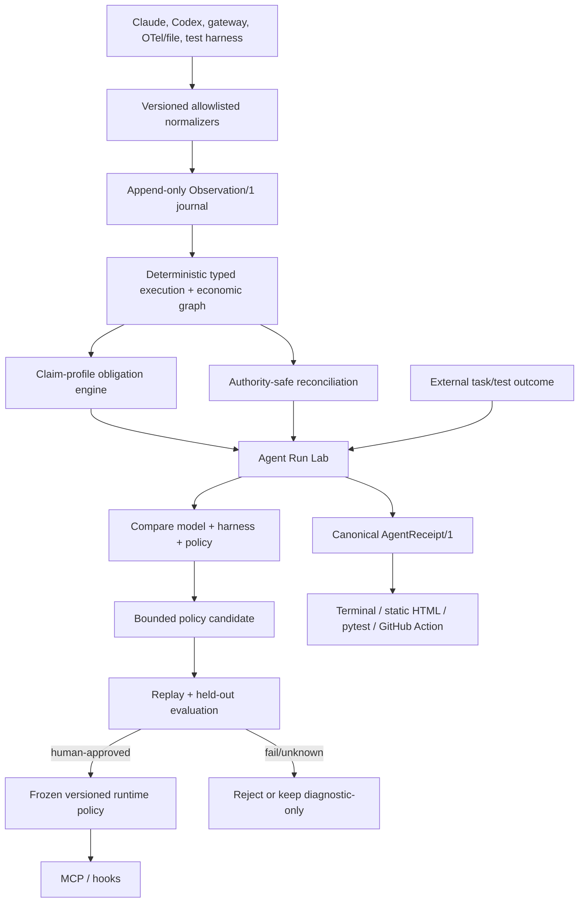
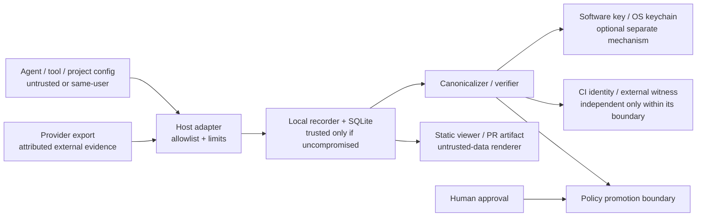
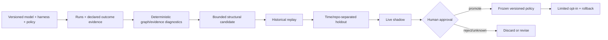
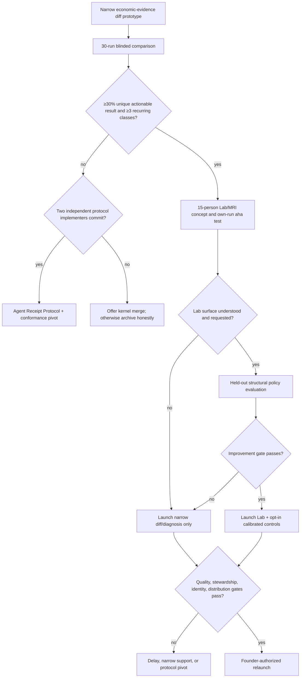

# Forecost startup-grade red team and narrow-product proof

**Evidence date:** 2026-08-13  
**Repository baseline:** source version 0.3.0, unreleased  
**Decision:** preserve the receipt kernel; prove a narrow economic-evidence diff before any Agent Run Lab / “cost MRI” expansion  
**Release status:** research proposal only; no publication, package update, or announcement is authorized

This report re-audits the earlier
[eight-deliverable deep-research report](2026-08-13-deep-research-roadmap.md)
against a harder objective: an exceptional, short-horizon open-source launch,
not merely a technically sound CLI or a slow enterprise adoption plan. It uses
three labels throughout:

- **Observed:** verified in the repository or a cited primary/upstream source.
- **Proposed:** a target design; it is not shipped 0.3.0 behavior.
- **Measure:** a hypothesis that only a technical spike or real users can settle.

The associated
[master product and launch checklist](2026-08-13-master-product-launch-checklist.md)
is the execution contract. The previous report remains the detailed source for
the original MCP schemas, cryptographic analysis, and CI implementation sketches;
where this report conflicts strategically, this report takes precedence.

## 1. Executive Verdict

**Improve the kernel and test a narrower product surface; do not abandon it.** Forecost
already has valuable machinery: append-only observations, deterministic causal
graphs, authority-separated meters and charges, reconciliation, privacy
allowlists, receipts, and single-host resource conservation. Rebuilding those
foundations elsewhere would waste the strongest part of the repository.

The current product is not a breakout product. At the initial audit snapshot it
was an unreleased experimental CLI with more than twenty top-level commands, two
read-only MCP tools, an empty pytest plugin, two partially parallel economic
evidence lanes, no current-product
interactive visualization, and no live proof for several adapters. A close
competitor, `agentacct`, already documents local work graphs, multi-source
evidence, outcomes, OTLP, budgets, and a larger MCP surface. “Local cost receipts
with MCP” is not sharp enough.

**Post-audit implementation update:** the worktree now includes the narrow
comparison prototype and a third read-only MCP tool for always-abstaining
two-run diagnostics. Full CLI mode requires digest-bound matched-cohort
manifests and a predeclared observational USD list-rate policy with at least 30
pairs, fully valued final `delta` meters, predeclared deterministic test/build
outcome evidence, and confidence bounds. It validates a WAL-consistent in-memory
journal/projection rebuild; reconciliation batches remain outside that derived
boundary and force abstention. This does not
satisfy the blinded field/demand gate or create the proposed live four-tool MCP.

The best broader candidate shape, only if the first gate passes, is **Forecost
Agent Run Lab**; that category is also crowded. Spend the first 30 days testing
one narrower operation: **show whether a matched agent-workflow change has lower
list-rate-equivalent cost without observed regression in predeclared
deterministic test/build outcome evidence, while naming missing evidence and
refusing false savings**. Timing/speed is outside comparison v1. Only if that
economic-evidence diff wins a blinded comparison should
Forecost add the visual Lab, live controls, MCP mutations, and policy calibration.
The receipt is the proof artifact; graph reconciliation is the engine.

Keep “learning” constrained to offline local calibration. Production policy is
frozen; candidates require replay, held-out evaluation, explicit approval, and
rollback. Content-free traces cannot establish semantic progress, task
correctness, intent, or business value.

No engineering plan can guarantee 10,000 stars at release. Judgment ranges:
**<1% on day one**, **3–7% within 30 days** with an exceptional reproducible demo,
credible benchmark, and major distribution; below 1% without that reach.
On the best path at 12 months: **3–10% for 10K stars**, **15–30% for recurring
organic MCP use by at least 25 active teams**, and **2–5% for both**. These are
judgment ranges, not measured forecasts.
“Perfect forever with no maintenance” is impossible for evolving agent hosts.
Startup-grade release requires a narrow support matrix and at least 12 months of
critical security/compatibility stewardship.

If the unique diff/diagnosis gate fails by day 30–45, prefer merging the kernel
into `agentacct`, Arena, or ASSERT, or narrow to an Agent Receipt Protocol and
conformance suite. If neither product decisions nor independent adopters emerge,
archive honestly.

## 2. Competitive Positioning One-Pager

### The README sentence

> **Crash-test your AI agent: find the branch that burned time and money, test a bounded candidate harness rule, and prove the result in CI.**

That is a proposed promise, not current 0.3.0 behavior.

The proof-stage sentence is narrower and should be used until the gate passes:

> **Test whether this agent-workflow change has lower list-rate-equivalent cost without observed regression in predeclared deterministic test/build outcome evidence—and see exactly what is missing.**

### Product category

If the narrow gate passes, call the larger experience an **Agent Run Lab** or
**economic debugger for agent runs**. “Receipt” describes the durable artifact, not the first thing a new user
must understand. “Observability platform” is too broad; “cost tracker” is
commoditized; “self-learning agent” is unsupported.

### Primary launch users

| Priority | User | Immediate job | Why this cohort launches better |
| ---: | --- | --- | --- |
| 1 | Agent builders, OSS maintainers, and applied researchers comparing model/harness/policy configurations | “Show why this run failed or became wasteful, and prove whether a bounded harness change helped.” | Public artifacts, reproducible benchmarks, and shareable technical work create distribution. |
| 2 | Claude Code/Codex power users running long, branching, API-billed work | “Tell me where the retry/branch budget went and warn before the same failure repeats.” | Fast personal pain and a five-minute local experience; strong plugin/skill distribution. |
| 3 | Platform/FinOps teams | “Use one evidence and cost policy across run, test, and merge, then reconcile it.” | Strong eventual economic value, but slower/private buying and weaker launch amplification. |

Users with one trustworthy provider total, flat subscription pricing, or a
simple atomic run may be better served by native usage or a small viewer.

### The moat, stated honestly

The intended moat is not a graph, SQLite, MCP, a signature, or token counting.
Those are available elsewhere. It is a **conformance-tested causal-economic
harness evaluation contract** that:

1. preserves runtime, gateway, price-table, and billed authorities without
   double counting;
2. explains overlap-safe wall-service/wall-wait, elapsed envelopes, fan-out,
   retry lineage, and unsettled work, while abstaining from non-trivial critical
   path until scheduling dependencies are typed;
3. declares claim-specific evidence obligations, freshness, conflicts, and
   unknowns before scoring;
4. compares model + harness + policy configurations against predeclared outcome
   evidence, whose evaluator/source declarations remain manifest-attested unless
   a separate authentication mechanism is proven;
5. makes one decision engine behave identically in a local report, agent tool,
   test, and pull request; and
6. yields a content-minimized artifact that another implementation can verify.

The code is copyable. Durability must come from audited adapters, a difficult
golden/adversarial corpus, independently reproduced case studies, and adoption
of the protocol/assertion semantics by other tools.

### First-principles option decision

| Product shape | Differentiation | Launch spectacle | Maintenance fit | Decision |
| --- | --- | --- | --- | --- |
| Current receipt-focused CLI | Moderate kernel, weak product wedge | Low | Medium | Do not launch as the hero product. |
| Live budget/controller | Useful, but many runtime/native controls exist | Low/mostly invisible | Low because every host changes | Keep as a scoped integration. |
| **Narrow economic-evidence diff, then conditional Agent Run Lab** | **Graph economics + predeclared evidence + matched harness comparison** | **Potentially high only after a real reproduced result** | **Medium with one deep host, one preview, and no backend** | **Recommended proof sequence; broad Lab is not yet earned.** |
| Protocol only | Credible and maintenance-light | Low | High | Fallback if product gates fail. |
| Merge into a close project | Ecosystem value, no independent Forecost launch | Low | High | Rational after failed differentiation. |
| Scrap everything | Throws away a strong kernel | Unknown | Unknown | Not justified now. |

### What to double down on

- Graph-aware cost/retry/wait/fan-out reconciliation.
- Claim-profile evidence obligations and visible unknown/stale/conflicting states.
- A four-tool MCP surface for check/reserve/record/receipt.
- One assertion engine behind CLI, pytest, and GitHub Action.
- A startling five-minute local graph diagnosis and static share artifact.
- Threat claims that remain true when an agent has the user's privileges.
- A model+harness+policy evaluation record rather than model-only comparisons.

### What to stop leading with

- A catalog of CLI commands.
- Generic local cost totals.
- An enterprise/audit persona before live billed evidence is proven.
- Cryptography as a substitute for a useful decision.
- “Daily habit” or organic MCP calls as the only success model.
- Universal runtime support.
- Any suggestion that content-free data can learn semantic task strategy.

### Crowding around the proposed Lab

The 2026 floor is higher than the first research pass implied:

| Existing surface | Upstream-documented capability | Forecost consequence |
| --- | --- | --- |
| OpenAI agent evals | Traces, datasets, graders, and repeatable evaluations | Do not make generic trace/eval orchestration the wedge. |
| GitHub Agentic Workflows | Usage/AIC accounting, lineage/logs/audit, caps, forecast, OTLP, and externally observed outcomes | Integrate as evidence; do not claim basic workflow cost/outcome accounting is empty territory. |
| Claude Code/Agent SDK | Usage/OTel/tool/retry signals, deterministic hooks, turn and budget caps | MCP self-regulation is not stronger than host-native enforcement. |
| Arena | Matched tasks/models/budgets, statistical paired comparisons, receipts, and CI gates | Reuse/complement its evaluation machinery rather than cloning a runner. |
| AgentAssay / ASSERT / VeRO | Trace regression, stochastic verdicts, deployment gates, versioned/budget-controlled harness evaluation | The broad harness-Lab category is occupied. |
| `agentacct` | Local discovery, graph/evidence/outcomes/MCP/TUI | Best merge/product-distribution complement if Forecost's economic invariants win. |

The remaining hypothesis is the intersection of multi-authority
no-double-counting, graph/resource conservation, predeclared claim obligations,
and identical receipt/CI semantics. It must win a head-to-head before broader
surface investment.

A separate audit specialist executed a narrow code-backed comparison during the
initial audit: 19 selected Forecost receipt/MCP/reconciliation/benchmark tests
passed, and that baseline dependency-complete Forecost run passed 430 with one
skip. Before the comparison prototype landed, a dated dependency-complete
Python 3.12 audit run after the Section 4.1a remediations passed **560 tests with
one upstream MCP/Pydantic warning**. A fresh post-integration Python 3.12 run on
the current code passed **627 tests with the same upstream MCP/Pydantic
warning**. This is not an independent audit. The dated
competitor smoke runs remain: Arena passed 55
tests plus TypeScript typecheck; AgentAssay passed 75 selected
regression/gate/verdict tests; AgentBudget passed 45 selected
budget/circuit-breaker tests; and `agentacct` passed three selected local MCP
workflow tests. These smoke results establish implemented paths, not live
accuracy, security, demand, or the projects' headline claims. Arena's
paired statistical/CI surface is especially relevant
([Arena](https://github.com/macanderson/arena)); AgentAssay's code-level reuse
also requires AGPL review
([AgentAssay paper](https://arxiv.org/abs/2603.02601)).

The pain is still real in repeated API-billed automation. GitHub reports
heterogeneous workflow logs and material token-efficiency changes, while
explicitly warning that workload mix confounds aggregate savings and process
metrics do not prove output quality
([GitHub production report](https://github.blog/ai-and-ml/github-copilot/improving-token-efficiency-in-github-agentic-workflows/)).
That supports Forecost's narrow rejection/qualification job; it does not prove
Forecost has a product.

## 3. Agent Run Lab and `forecost-mcp` Full Spec

### 3.1 Current-to-target truth table

| Surface | Observed current worktree (unreleased 0.3.0) | Proposed target |
| --- | --- | --- |
| Storage | Schema v11 `ledger.db` contains usage/posting and journal/projection lanes that overlap but are not unified; migration backups use SQLite Backup API and canonical connections use WAL `synchronous=FULL` | One journal-first observation contract with compatibility projections plus full lifecycle/fault validation |
| Lab | Deterministic demo/chaos fixtures | Import, diagnose, controlled replay, compare, and static local explorer |
| Receipt | Receipt v2 uses trace-scoped `span_key`, explicit timing semantics, all active valuation groups, one reasoned non-additive canonical view, and named claim profiles | Published protocol bundle/schema, comparison provenance, and adversarial/live validation |
| Evidence | Built-in `structural`, `economic-estimate`, `provider-billed`, `outcome`, and `ci` profiles expose independent axes, denominators, unmet obligations, and reason codes | Authenticated provider adapter plus independent loss/contradiction and release-corpus validation |
| Local imports | New arbitrary local imports are `user_imported_claim`; schema v11 append/supersession corrects historical fixed-producer rows | Authenticated provider-billed profile and live reconciliation validation |
| Privacy | Current Claude cursors/errors use keyed opaque identities; complete-prefix rewrite checkpoints, accidental single-file key/ID mismatch checks for dependent canonical-home state, streaming verification, and known-home purge coverage exist | Coordinated same-UID replacement remains locally undetectable; quarantine/remove legacy raw SDK state, inventory user-configured outside-home paths, and pass independent review |
| Comparison | Strict canonical-ledger-read v1 exists: two-run diagnostics always abstain; full mode requires digest-bound exact cohorts, at least 30 pairs, fully valued final `delta` meters, and predeclared deterministic outcomes. It validates one WAL-consistent in-memory journal/projection rebuild; invalid evidence exits 4, >1,000,000 journal rows or any reconciliation batch abstains, and quantitative-only bootstrap seeding prevents label grinding. | Pass the adversarial corpus, blinded 30-run differentiation gate, independent reproduction, and real-user decision/retention gates |
| MCP | Optional stdio, three logically read-only string-return tools; comparison is diagnostic-only. SQLite `mode=ro` may create/update WAL/SHM sidecars; `immutable=1` is not used because it may miss committed WAL state. | Four typed tools: check, reserve, record, receipt |
| pytest | Registered module is a one-line placeholder | Real plugin using the same assertion engine as CLI/Action |
| CI | Internal project CI exists; no user-facing Forecost assertion Action | Offline receipt assertion Action and reproducible artifact |
| Claude | Experimental reversible hooks; exact plugin-owned launcher, disabled runtime bootstrap, and best-effort/partial capture | Approved locked install path, one declared live profile plus skill/MCP/doctor/uninstall |
| Codex | No live integration exists in this repository | Universal plugin with skill, bundled MCP, and reviewed lifecycle hooks; claim only exact event/tool coverage |
| Viewer | No current-product interactive visualization | Self-contained sanitized HTML; no hosted service |
| Learning | Shadow estimator/calibration is not validated for enforcement | Optional local policy calibration with held-out gates and manual promotion |

### 3.2 System architecture



The existing SQLite/journal/projection architecture is adequate. A graph
database, vector database, GraphRAG stack, or GNN is not required.

### 3.3 Minimum typed graph

Minimum node classes:

```text
run, span_or_attempt, tool_call, branch, checkpoint, reservation,
meter_observation, charge, outcome, evidence_obligation,
evidence_observation, policy_decision
```

Minimum explicit relationships:

```text
parent_of, spawned, joined, retry_of, supersedes, resumed_from,
funded_by, charged_to, supports, contradicts
```

Each relation declares whether it must be acyclic. Causal ancestry,
`parent_of`, `spawned`, and `retry_of` lineage are acyclic; repeated
state-machine behavior uses distinct attempt/transition nodes rather than a
cyclic lineage. Timestamps can order observations; they do not by themselves
prove causation. Each receipt-affecting
observation records schema, recorder, adapter, host/harness, model, pricing, and
policy versions; source role/trust class; monotonic sequence; wall-clock source;
stable scoped identity; closure/finality; and a provenance digest.

### 3.4 Lab operations

The proof stage implements only `compare` plus the minimum import/receipt path.
The other operations are conditional on the unique-decision gate. A validated
Lab candidate eventually needs five operations, whether exposed through
subcommands or a small library:

| Operation | Input | Output | Honest boundary |
| --- | --- | --- | --- |
| `trial` | supported latest local history or pinned fixture | one prioritized diagnosis + receipt + HTML | Importing history diagnoses; it does not prove a proposed fix. |
| `run` | task fixture, harness profile, budget, termination rule | normalized observations + predeclared outcome evidence | Only deterministic test/build evidence qualifies in v1; evaluator/source declarations are manifest-attested. |
| `compare` | ≥2 compatible run cohorts | Implemented v1: observational list-rate cost plus deterministic test/build outcomes; latency/loops are gated future possibilities | A before/after difference is not causal unless assignment supports it. |
| `propose` | confirmed structural failure family | bounded retry/budget/checkpoint/tool-policy candidate | No semantic prompt rewriting from content-free data. |
| `validate` | candidate + time/repo-separated held-out tasks | accept/reject/unknown report | Promotion remains explicit and reversible. |

Supported structural candidates can include retry caps, fan-out budgets,
reservation splits, checkpoint cadence, timeout/termination rules, evidence
requirements, and tool-class admission. Prompt rewriting, task strategy, and
semantic “progress” inference require a separate opt-in contentful evaluation
mode and are not part of the default product.

### 3.5 Four MCP tools

This is the full target contract requested by the research directive, not an
instruction to build all mutations before the narrow wedge wins. Start with
read-only `check`/`receipt`; add `reserve`/`record` only when field evidence shows
host hooks/native caps cannot provide the decision reliably. At that point the
MCP server should expose exactly four model-facing tools. Historical
discovery belongs in resources, and automatic host hooks should record
host-attributed, best-effort lifecycle evidence without relying on prospective
agent memory.

| Tool | Job | Mutation |
| --- | --- | --- |
| `forecost_check` | Return budget headroom, loop state, evidence state, and the next scoped action for an explicit run/scope. | None |
| `forecost_reserve` | Atomically create/fund a bounded scope and reserve capacity before fan-out or expensive work. | Local reservation only |
| `forecost_record` | Append one bounded lifecycle/meter/outcome observation and optionally settle/release a reservation. | Append/settle |
| `forecost_receipt` | Build/snapshot a canonical compact receipt and return a safe local artifact reference. | Snapshot only |

#### Run-handle bootstrap

"Zero-config" means one plugin install plus the host's explicit hook trust review;
it cannot mean bypassing that review. A host-attributed `SessionStart` hook calls an
internal (non-MCP) `open_or_bind_run` service, stores only the HMAC-scoped host
session binding, and injects the opaque `run_handle` into host context. The agent
then passes that handle to every tool. On compaction/resume, a host-attributed hook
re-injects the same binding. MCP never guesses "latest run."

For MCP-only/manual use, `forecost run begin --json` is the explicit bootstrap.
If neither path supplied a handle, tools return `RUN_HANDLE_REQUIRED` with no
ambient history. That is a safe degraded path, not zero-config success.

#### Shared output schema

This v2 schema replaces the compact result in the earlier report. Each tool has
a closed input schema below and uses this closed result envelope; the per-tool
requirements table follows it.

```json
{
  "$schema": "https://json-schema.org/draft/2020-12/schema",
  "$id": "urn:forecost:proposed:mcp-result:1",
  "type": "object",
  "required": ["protocol", "tool", "ok", "decision", "reason_codes", "snapshot_version", "next_action"],
  "properties": {
    "protocol": {"const": "forecost.mcp/1"},
    "tool": {
      "enum": ["forecost_check", "forecost_reserve", "forecost_record", "forecost_receipt"]
    },
    "ok": {"type": "boolean"},
    "decision": {"enum": ["allow", "ask", "deny", "unknown", "recorded", "error"]},
    "reason_codes": {
      "type": "array",
      "items": {"type": "string", "pattern": "^[A-Z0-9_]{1,64}$"},
      "maxItems": 32
    },
    "run_handle": {
      "type": "string",
      "pattern": "^run_[A-Za-z0-9_-]{16,128}$"
    },
    "snapshot_version": {"type": "integer", "minimum": 0},
    "next_action": {
      "enum": ["proceed", "ask_user", "stop_scope", "collect_evidence", "retry_later", "none"]
    },
    "proposal_evaluated": {"type": "boolean"},
    "evidence": {
      "type": "object",
      "required": ["profile", "completeness", "freshness", "contradiction", "missing_obligations", "reason_codes"],
      "properties": {
        "profile": {"type": "string", "pattern": "^[a-z][a-z0-9._-]{0,63}$"},
        "completeness": {"enum": ["complete", "partial", "unknown"]},
        "freshness": {"enum": ["fresh", "stale", "unknown"]},
        "contradiction": {"enum": ["none", "present", "unknown"]},
        "missing_obligations": {
          "type": "array",
          "items": {"type": "string", "pattern": "^[A-Z0-9_]{1,64}$"},
          "maxItems": 128
        },
        "reason_codes": {
          "type": "array",
          "items": {"type": "string", "pattern": "^[A-Z0-9_]{1,64}$"},
          "maxItems": 128
        },
        "freshness_as_of": {"type": "string", "format": "date-time"}
      },
      "additionalProperties": false
    },
    "headroom": {
      "type": "object",
      "required": ["dimension", "available_micros", "proposed_micros", "basis", "finality", "as_of"],
      "properties": {
        "dimension": {
          "enum": ["money_usd", "input_tokens", "output_tokens", "calls", "wall_time_ms"]
        },
        "available_micros": {"type": "integer", "minimum": 0},
        "proposed_micros": {"type": "integer", "minimum": 0},
        "basis": {
          "enum": ["policy_capacity", "provider_billed", "gateway_estimate", "list_rate_equivalent", "subscription_quota", "unknown"]
        },
        "finality": {"enum": ["final", "provisional", "unknown"]},
        "as_of": {"type": "string", "format": "date-time"}
      },
      "additionalProperties": false
    },
    "loop": {
      "type": "object",
      "required": ["state", "reason_codes"],
      "properties": {
        "state": {"enum": ["unknown", "advisory", "warning", "deny_eligible"]},
        "lineage_handle": {"type": "string", "pattern": "^lin_[A-Za-z0-9_-]{16,128}$"},
        "reason_codes": {
          "type": "array",
          "items": {"type": "string", "pattern": "^[A-Z0-9_]{1,64}$"},
          "maxItems": 32
        }
      },
      "additionalProperties": false
    },
    "reservation": {
      "type": "object",
      "required": ["reservation_handle", "dimension", "granted_micros", "expires_at", "fencing_token"],
      "properties": {
        "reservation_handle": {"type": "string", "pattern": "^res_[A-Za-z0-9_-]{16,128}$"},
        "dimension": {
          "enum": ["money_usd", "input_tokens", "output_tokens", "calls", "wall_time_ms"]
        },
        "granted_micros": {"type": "integer", "minimum": 0},
        "expires_at": {"type": "string", "format": "date-time"},
        "fencing_token": {"type": "integer", "minimum": 1}
      },
      "additionalProperties": false
    },
    "record": {
      "type": "object",
      "required": ["observation_handle", "source_role"],
      "properties": {
        "observation_handle": {"type": "string", "pattern": "^obs_[A-Za-z0-9_-]{16,128}$"},
        "source_role": {"const": "agent_assertion"}
      },
      "additionalProperties": false
    },
    "receipt": {
      "type": "object",
      "required": ["receipt_handle", "payload_digest", "format", "resource_uri"],
      "properties": {
        "receipt_handle": {"type": "string", "pattern": "^rcpt_[A-Za-z0-9_-]{16,128}$"},
        "payload_digest": {"type": "string", "pattern": "^sha256:[0-9a-f]{64}$"},
        "format": {"enum": ["json", "markdown", "text", "html"]},
        "resource_uri": {"type": "string", "pattern": "^forecost://receipts/"}
      },
      "additionalProperties": false
    },
    "error": {
      "type": "object",
      "required": ["code", "retryable"],
      "properties": {
        "code": {"type": "string", "pattern": "^[A-Z0-9_]{1,64}$"},
        "retryable": {"type": "boolean"},
        "field": {"type": "string", "pattern": "^[a-z][a-z0-9_.-]{0,63}$"}
      },
      "additionalProperties": false
    },
    "human_summary": {"type": "string", "maxLength": 1000}
  },
  "allOf": [
    {
      "if": {"properties": {"decision": {"const": "error"}}, "required": ["decision"]},
      "then": {"properties": {"ok": {"const": false}}, "required": ["error"]},
      "else": {"properties": {"ok": {"const": true}}}
    },
    {
      "if": {
        "properties": {"tool": {"const": "forecost_check"}, "ok": {"const": true}},
        "required": ["tool", "ok"]
      },
      "then": {
        "required": ["run_handle", "evidence", "loop", "proposal_evaluated"],
        "properties": {"decision": {"enum": ["allow", "ask", "deny", "unknown"]}},
        "allOf": [
          {
            "if": {"properties": {"proposal_evaluated": {"const": true}}, "required": ["proposal_evaluated"]},
            "then": {"required": ["headroom"]},
            "else": {"not": {"required": ["headroom"]}}
          }
        ]
      }
    },
    {
      "if": {
        "properties": {"tool": {"const": "forecost_reserve"}, "ok": {"const": true}},
        "required": ["tool", "ok"]
      },
      "then": {
        "required": ["run_handle"],
        "properties": {"decision": {"enum": ["allow", "ask", "deny", "unknown"]}},
        "allOf": [
          {
            "if": {"properties": {"decision": {"const": "allow"}}, "required": ["decision"]},
            "then": {"required": ["reservation"]},
            "else": {"not": {"required": ["reservation"]}}
          }
        ]
      }
    },
    {
      "if": {
        "properties": {"tool": {"const": "forecost_record"}, "ok": {"const": true}},
        "required": ["tool", "ok"]
      },
      "then": {
        "required": ["run_handle", "record"],
        "properties": {"decision": {"const": "recorded"}}
      }
    },
    {
      "if": {
        "properties": {"tool": {"const": "forecost_receipt"}, "ok": {"const": true}},
        "required": ["tool", "ok"]
      },
      "then": {
        "required": ["run_handle", "evidence", "receipt"],
        "properties": {"decision": {"const": "recorded"}}
      }
    }
  ],
  "additionalProperties": false
}
```

Per-tool success requirements:

| Tool | Required result fields beyond the shared core |
| --- | --- |
| `forecost_check` | `run_handle`, `evidence`, `loop`, `proposal_evaluated`; `headroom` exactly when `proposal_evaluated=true` |
| `forecost_reserve` | `run_handle`; `reservation` exactly when `decision=allow` |
| `forecost_record` | `run_handle`, `record` |
| `forecost_receipt` | `run_handle`, `evidence`, `receipt` |
| Any error | `error`; `run_handle` is absent only for bootstrap/binding failure |

#### Closed input schemas

All integers are bounded micro-units of their named dimension; money is never a
meter unit. Inputs contain no arbitrary metadata, prompt, path, code, tool
payload, or caller-selected authority.

```json
{
  "forecost_check": {
    "type": "object",
    "required": ["run_handle", "scope", "claim_profile"],
    "properties": {
      "run_handle": {"type": "string", "pattern": "^run_[A-Za-z0-9_-]{16,128}$"},
      "scope": {"enum": ["run", "branch", "attempt", "tool_call"]},
      "scope_handle": {"type": "string", "pattern": "^[a-z]+_[A-Za-z0-9_-]{16,128}$"},
      "claim_profile": {"type": "string", "pattern": "^[a-z][a-z0-9._-]{0,63}$"},
      "proposed_dimension": {
        "enum": ["money_usd", "input_tokens", "output_tokens", "calls", "wall_time_ms"]
      },
      "proposed_micros": {"type": "integer", "minimum": 0, "maximum": 9007199254740991}
    },
    "allOf": [
      {
        "if": {"properties": {"scope": {"enum": ["branch", "attempt", "tool_call"]}}, "required": ["scope"]},
        "then": {"required": ["scope_handle"]},
        "else": {"not": {"required": ["scope_handle"]}}
      },
      {"if": {"required": ["proposed_dimension"]}, "then": {"required": ["proposed_micros"]}},
      {"if": {"required": ["proposed_micros"]}, "then": {"required": ["proposed_dimension"]}}
    ],
    "additionalProperties": false
  },
  "forecost_reserve": {
    "type": "object",
    "required": ["run_handle", "idempotency_key", "scope", "scope_handle", "dimension", "amount_micros", "ttl_seconds"],
    "properties": {
      "run_handle": {"type": "string", "pattern": "^run_[A-Za-z0-9_-]{16,128}$"},
      "idempotency_key": {"type": "string", "pattern": "^[A-Za-z0-9._:-]{8,160}$"},
      "scope": {"enum": ["branch", "attempt", "tool_call"]},
      "scope_handle": {"type": "string", "pattern": "^[a-z]+_[A-Za-z0-9_-]{16,128}$"},
      "parent_reservation_handle": {"type": "string", "pattern": "^res_[A-Za-z0-9_-]{16,128}$"},
      "dimension": {
        "enum": ["money_usd", "input_tokens", "output_tokens", "calls", "wall_time_ms"]
      },
      "amount_micros": {"type": "integer", "minimum": 0, "maximum": 9007199254740991},
      "ttl_seconds": {"type": "integer", "minimum": 1, "maximum": 86400}
    },
    "additionalProperties": false
  },
  "forecost_record": {
    "type": "object",
    "required": ["run_handle", "idempotency_key", "record_type", "occurred_at"],
    "properties": {
      "run_handle": {"type": "string", "pattern": "^run_[A-Za-z0-9_-]{16,128}$"},
      "idempotency_key": {"type": "string", "pattern": "^[A-Za-z0-9._:-]{8,160}$"},
      "record_type": {"enum": ["lifecycle", "meter", "outcome", "reservation_settlement"]},
      "occurred_at": {"type": "string", "format": "date-time"},
      "span_handle": {"type": "string", "pattern": "^span_[A-Za-z0-9_-]{16,128}$"},
      "parent_span_handle": {"type": "string", "pattern": "^span_[A-Za-z0-9_-]{16,128}$"},
      "attempt_of_span_handle": {"type": "string", "pattern": "^span_[A-Za-z0-9_-]{16,128}$"},
      "operation_class": {"enum": ["model", "tool", "subagent", "wait", "checkpoint", "other"]},
      "lifecycle": {"enum": ["start", "finish", "retry", "wait", "abandon", "checkpoint"]},
      "meter_name": {"enum": ["input_tokens", "output_tokens", "cached_tokens", "calls", "wall_time_ms"]},
      "quantity_micros": {"type": "integer", "minimum": 0, "maximum": 9007199254740991},
      "outcome_status": {"enum": ["good", "bad", "partial", "unknown"]},
      "outcome_reason_code": {"type": "string", "pattern": "^[A-Z0-9_]{1,64}$"},
      "reservation_handle": {"type": "string", "pattern": "^res_[A-Za-z0-9_-]{16,128}$"},
      "fencing_token": {"type": "integer", "minimum": 1},
      "settled_micros": {"type": "integer", "minimum": 0, "maximum": 9007199254740991}
    },
    "allOf": [
      {"if": {"properties": {"record_type": {"const": "lifecycle"}}}, "then": {"required": ["span_handle", "operation_class", "lifecycle"]}},
      {"if": {"properties": {"record_type": {"const": "meter"}}}, "then": {"required": ["span_handle", "meter_name", "quantity_micros"]}},
      {"if": {"properties": {"record_type": {"const": "outcome"}}}, "then": {"required": ["outcome_status", "outcome_reason_code"]}},
      {"if": {"properties": {"record_type": {"const": "reservation_settlement"}}}, "then": {"required": ["reservation_handle", "fencing_token", "settled_micros"]}}
    ],
    "additionalProperties": false
  },
  "forecost_receipt": {
    "type": "object",
    "required": ["run_handle", "claim_profile", "format", "snapshot"],
    "properties": {
      "run_handle": {"type": "string", "pattern": "^run_[A-Za-z0-9_-]{16,128}$"},
      "claim_profile": {"type": "string", "pattern": "^[a-z][a-z0-9._-]{0,63}$"},
      "format": {"enum": ["json", "markdown", "text", "html"]},
      "snapshot": {"type": "boolean"},
      "idempotency_key": {"type": "string", "pattern": "^[A-Za-z0-9._:-]{8,160}$"}
    },
    "allOf": [
      {
        "if": {"properties": {"snapshot": {"const": true}}, "required": ["snapshot"]},
        "then": {"required": ["idempotency_key"]},
        "else": {"not": {"required": ["idempotency_key"]}}
      }
    ],
    "additionalProperties": false
  }
}
```

The four property blocks are the `inputSchema` values registered with the MCP
SDK; the shared conditional envelope is each tool's `outputSchema`. Conformance
tests validate both request and result examples. Every write is idempotent.
Settlement requires a fencing token. The server assigns `observed_at`; the
caller supplies only bounded `occurred_at`. Agent-supplied meters/outcomes remain
`agent_assertion`. The public MCP record tool cannot submit a monetary charge or
self-upgrade to runtime, gateway, provider, billed, human, or CI authority.

Completeness, freshness, and contradiction are separate axes: evidence may be
both `partial` and `stale`, for example. `ok` reports protocol/business-operation execution, not permission: it is `false`
exactly for `decision=error`; a valid `unknown`, `ask`, or `deny` result is still
`ok=true`. For `check`, evidence is evaluated before control: invalid/tampered or
internal state is an error; contradictory, stale, partial, or unknown obligations
cannot become `allow`; only a profile-complete snapshot proceeds to budget and
loop policy. The chosen policy maps that bounded result to `decision` and
`next_action`. No renderer may invent a more permissive action.

#### Error and transport model

- Invalid JSON, unknown properties, size/rate limit, or schema failure returns an
  MCP protocol/tool error with a finite public code; raw parser/exception text is
  never persisted or returned.
- A valid request with insufficient evidence returns `decision="unknown"`, an
  `evidence` object, and stable reason codes. Unknown evidence is not a server
  failure and never silently becomes allow.
- Idempotency collision with different material, stale fencing token, expired
  reservation, unsupported host/schema, and policy-profile mismatch are
  structured business errors with `retryable=false` unless explicitly safe.
- Internal failure returns `decision="error"`, `error.code="INTERNAL"`, and a
  correlation fingerprint. Interactive hooks retain their declared fail-open
  host behavior; protected CI maps internal/unknown according to an explicit
  fail-closed policy. Those are different trust boundaries, not inconsistent
  error handling.
- Stdio is the first local transport. No port, account, ambient-history query,
  or network listener is required. Bound input/output size, request rate, and
  execution time.

#### Python service/transport sketch

```python
from dataclasses import dataclass
from typing import Any, Mapping


@dataclass(frozen=True)
class McpContext:
    install_id: str
    now_iso: str


class ForecostMcpService:
    """Business layer; contains no MCP SDK types and never renders prose."""

    def check(self, request: Mapping[str, Any], context: McpContext) -> dict[str, Any]:
        parsed = CheckInput.validate(request)  # closed schema + bounded integers
        snapshot = snapshot_store.load(parsed.run_handle, as_of=context.now_iso)
        report = assertion_engine.evaluate(snapshot, parsed.claim_profile)
        return CheckResult.from_report(report).to_dict()

    def reserve(self, request: Mapping[str, Any], context: McpContext) -> dict[str, Any]:
        parsed = ReserveInput.validate(request)
        return reservation_service.reserve_atomic(parsed, context).to_dict()

    def record(self, request: Mapping[str, Any], context: McpContext) -> dict[str, Any]:
        parsed = RecordInput.validate(request)
        observation = parsed.as_agent_assertion(observed_at=context.now_iso)
        return observation_service.append_idempotent(observation).to_dict()

    def receipt(self, request: Mapping[str, Any], context: McpContext) -> dict[str, Any]:
        parsed = ReceiptInput.validate(request)
        snapshot = snapshot_store.load(parsed.run_handle, as_of=context.now_iso)
        return receipt_service.safe_projection(snapshot, parsed).to_dict()


# The thin SDK adapter registers the four input/output schemas, calls one method,
# validates the returned envelope again, and maps finite public exceptions to MCP
# tool errors. Pin the current SDK; all SDK churn stays in this adapter module.
```

The real implementation must use the current supported MCP Python SDK rather
than copying this pseudocode's placeholder validators/services. Unit tests call
`ForecostMcpService` directly; protocol conformance tests exercise the stdio
adapter separately.

#### TypeScript client sketch

```typescript
import { Client } from "@modelcontextprotocol/sdk/client/index.js";
import { StdioClientTransport } from "@modelcontextprotocol/sdk/client/stdio.js";

const transport = new StdioClientTransport({
  command: absoluteApprovedForecostMcpPath,
  args: [],
});
const client = new Client({ name: "forecost-conformance", version: "1.0.0" });
await client.connect(transport);

const result = await client.callTool({
  name: "forecost_check",
  arguments: {
    run_handle: injectedRunHandle,
    scope: "run",
    claim_profile: "structural-ci-v1",
    proposed_dimension: "money_usd",
    proposed_micros: 450_000,
  },
});

const parsed = McpResultSchema.parse(result.structuredContent);
if (parsed.decision === "unknown" || parsed.decision === "error") {
  throw new Error(`Forecost did not establish a pass: ${parsed.reason_codes.join(",")}`);
}
```

Generate client types/validators from the committed JSON Schemas; do not maintain
hand-written Python/TypeScript semantics independently. The current
[MCP TypeScript SDK](https://github.com/modelcontextprotocol/typescript-sdk) and
[Python SDK](https://github.com/modelcontextprotocol/python-sdk) are volatile
dependencies behind the transport boundary, not part of the receipt protocol.

### 3.6 Agent instructions

Recommended host instruction, after tool-selection evaluation:

```text
Use Forecost only for a run that has an explicit Forecost handle.
Before expensive fan-out, repeated retry, or a user-declared budget boundary,
call forecost_check. Reserve only the amount needed for the next bounded scope.
Treat allow/ask/deny/unknown and reason_codes as authoritative for the local
Forecost boundary; do not claim provider-side enforcement.
Record only the allowlisted structural fact. Never send prompts, code, paths,
tool arguments, tool results, credentials, or reasoning.
On completion or when asked, request a receipt with the required claim profile.
If Forecost is unavailable, report that the control/evidence state is unknown;
do not invent a pass.
```

Example user instruction:

```text
Use Forecost and keep this refactor under a $3 list-rate-equivalent local policy
cap. Ask if failure class TEST_ASSERTION_MISMATCH repeats without a
recorder-observed state change.
```

The agent first sends a schema-valid `forecost_reserve` request:

```json
{"run_handle":"run_7K4M2P9Q6R8T1V3X","idempotency_key":"reserve:refactor:0001","scope":"branch","scope_handle":"branch_A1B2C3D4E5F6G7H8","dimension":"money_usd","amount_micros":3000000,"ttl_seconds":1800}
```

The service returns a schema-valid scoped result:

```json
{"protocol":"forecost.mcp/1","tool":"forecost_reserve","ok":true,"decision":"allow","reason_codes":["WITHIN_LOCAL_POLICY"],"run_handle":"run_7K4M2P9Q6R8T1V3X","snapshot_version":14,"next_action":"proceed","reservation":{"reservation_handle":"res_9Q8W7E6R5T4Y3U2I","dimension":"money_usd","granted_micros":3000000,"expires_at":"2026-08-13T18:45:00Z","fencing_token":4}}
```

After two bounded attempts, the next proposed attempt is checked:

```json
{"run_handle":"run_7K4M2P9Q6R8T1V3X","scope":"attempt","scope_handle":"attempt_Z9Y8X7W6V5U4T3S2","claim_profile":"structural-ci-v1","proposed_dimension":"money_usd","proposed_micros":450000}
```

```json
{"protocol":"forecost.mcp/1","tool":"forecost_check","ok":true,"decision":"ask","reason_codes":["LOOP_WARNING","SAME_ERROR_CLASS","NO_RECORDER_STATE_CHANGE"],"run_handle":"run_7K4M2P9Q6R8T1V3X","snapshot_version":18,"next_action":"ask_user","proposal_evaluated":true,"evidence":{"profile":"structural-ci-v1","completeness":"complete","freshness":"fresh","contradiction":"none","missing_obligations":[],"reason_codes":[],"freshness_as_of":"2026-08-13T18:20:00Z"},"headroom":{"dimension":"money_usd","available_micros":1180000,"proposed_micros":450000,"basis":"list_rate_equivalent","finality":"provisional","as_of":"2026-08-13T18:20:00Z"},"loop":{"state":"warning","lineage_handle":"lin_L1M2N3P4Q5R6S7T8","reason_codes":["SAME_ERROR_CLASS","NO_RECORDER_STATE_CHANGE"]}}
```

The agent reports: “Forecost found a repeated failure class with no
recorder-observed state change. The local boundary asks before another
provisional $0.45 list-rate-equivalent attempt. Continue?”

The tool decision is scoped. It does not mean the provider, a distributed
worker, or a compromised same-user process has been contained.

Current OpenAI plugin packaging uses a `.codex-plugin/plugin.json` manifest and
can bundle `skills/`, `.mcp.json`, assets, and lifecycle hooks. Codex hooks cover
multiple session, prompt, tool, subagent, and stop events, so the target should
use them as a host-attributed automatic observation path—not treat Codex as
MCP-only. They are not independent evidence against another same-user process.
Coverage remains event/tool specific: transcript formats are not a stable API,
and any specialized or hosted tool that bypasses a configured hook makes the
corresponding receipt obligation partial/unknown rather than complete
([plugin packaging](https://developers.openai.com/plugins/build/plugins),
[Codex hooks](https://learn.chatgpt.com/docs/hooks)).

### 3.7 Conformance and performance gates

- One canonical decision engine produces identical decision/reason codes through
  CLI, MCP, pytest, and Action.
- At least 200 labeled direct, indirect, negative, and adversarial tool-selection
  prompts; target precision ≥98%, recall ≥95%, zero unauthorized mutation.
- Record schema-token, latency, and task-success deltas for each supported host
  and model snapshot.
- 100 reviewed graph fixtures, 500 heterogeneous runs, 50 adversarial economic
  cases, and 10,000 generated malformed/reordered/truncated cases.
- Selected fixtures remain byte-identical across 100 valid ingestion
  permutations and the supported OS/Python matrix.
- Unsupported/stale adapter or pricing data yields `unknown`/`stale`, never an
  optimistic fallback.

OpenAI's current agent guidance treats traces and evals as an iterative loop,
not a substitute for task-specific evaluation
([Agents](https://developers.openai.com/api/docs/guides/agents),
[agent evals](https://developers.openai.com/api/docs/guides/agent-evals)). MCP
tool descriptions and schemas also consume agent context and influence tool
selection, so the four-tool limit is an eval hypothesis, not a universal law
([Codex MCP](https://learn.chatgpt.com/docs/extend/mcp?surface=cli)).

## 4. Security and Cryptographic Threat Model

### 4.1 The claim that survives a same-user agent

> Forecost can minimize content, validate and reconcile observations at declared
> boundaries, detect selected accidental/local mutations, and produce a signed
> statement from an identified signer. It cannot prove an unmodified runtime
> history when an attacker controls the recorder, database, process, and signing
> key under the same OS user.

**Observed:** the current SHA-256 journal chain and receipt digest are useful for
accidental mutation detection and local consistency checks. The chain head lives
in the same SQLite database; the receipt verifier recomputes a digest asserted by
the receipt itself. A coordinated rewrite can construct a new internally
consistent history. Do not call this tamper-proof, independently attested, or
cryptographic proof of semantic truth.

### 4.1a Original findings and current-worktree disposition

The red-team table originally recorded release-blocking behavior. It is retained
as an audit trail, but the disposition below reflects the 2026-08-13 worktree
after remediation. “Implemented” means a narrow code path and its repository
tests now exist; it does not mean independently reviewed, field-proven, or
release-ready.

| Original P0 finding | Current-worktree disposition and evidence | Release work that remains open |
| --- | --- | --- |
| Claude cursor keys persisted raw transcript paths. | **Implemented for new/lazily migrated rows:** installation-keyed opaque cursor identities, conservative legacy migration, file-identity/complete-prefix rewrite checkpoints, and accidental single-file key/ID mismatch detection when dependent canonical-home cursor state is visible. See [local identity](../../forecost/core/local_identity.py), [Claude adapter tests](../../tests/test_adapters_claude_code.py), and [key tests](../../tests/test_local_identity.py). | Coordinated same-UID key+ID replacement is locally undetectable; independent privacy review, legacy SDK raw-state quarantine, upgrade-state inventory, and a documented key rotation/retention policy remain required. |
| Error and recovery paths could persist arbitrary paths or exception text. | **Implemented for current paths:** finite codes plus keyed bounded fingerprints; durable finite recovery summaries that leave the raw queue for retry if publication fails; and streaming privacy verification that reports unreadable, symlinked, or non-regular paths as inconclusive. See [error-log tests](../../tests/test_errlog.py), [privacy tests](../../tests/test_privacy_cmd.py), and [recovery tests](../../tests/test_recover_cmd.py). | The legacy SDK/`costs.db` path and arbitrary metadata boundary must be quarantined or removed before an end-to-end content-minimization claim. |
| Purge omitted Forecost-created hook, outbox, backup, or crash state. | **Implemented for known `FORECOST_HOME` surfaces:** nested owned markers, key files, schema backups, and recovery temporaries are in the purge tests. See [purge tests](../../tests/test_purge_cmd.py). | A complete contract for user-configured outbox/ledger/integration state outside `FORECOST_HOME`; no claim that one-root purge erases unknown external paths. |
| WAL migration copied only the main SQLite file. | **Implemented:** SQLite Backup API snapshot, pre/post integrity checks, failed-partial cleanup, committed-WAL coverage, and restore tests. See the [durability ADR](../adr/0008-sqlite-durability.md) and [migration tests](../../tests/test_schema_migrate_command.py). | Complete incompatible-writer quiescence/rollback protocol, clean-machine restore matrix, and destructive fault campaigns. |
| Canonical WAL connections used `synchronous=NORMAL`. | **Implemented:** canonical ledger and migration snapshot connections use `synchronous=FULL`; the boundary and residuals are documented in the [durability ADR](../adr/0008-sqlite-durability.md). | Power/kill/disk-full testing and independent validation; `FULL` is not protection from lying storage or same-user replacement. |
| Arbitrary local JSON/CSV could be promoted to `billed`. | **Implemented:** new local imports are `user_imported_claim`; schema v11 append/supersession corrects fixed-producer historical projections without rewriting the journal. See the [authority ADR](../adr/0003-economic-authority.md) and [import tests](../../tests/test_reconciliation_imports.py). | An authenticated provider profile and live settlement/reconciliation validation do not exist. |
| `span_id` was globally keyed although W3C identity is trace-scoped. | **Implemented:** schema v10 uses `span_key = H(trace_id, span_id)` throughout projections and fails closed on ambiguous migration. See the [causal identity ADR](../adr/0001-causal-identity.md), [schema tests](../../tests/test_ledger_schema.py), and [receipt tests](../../tests/test_receipt_kernel.py). | Larger collision/replay/fuzz corpus, published schema, and live multi-trace validation. |
| Receipt duration incorrectly used occurrence-to-observation delay. | **Implemented:** only explicit interval/duration evidence populates timing. Wall-service and wall-wait are classified interval unions, elapsed is an envelope, and service/wait are explicitly non-additive. Non-trivial critical path is withheld because current structural edges do not prove scheduling dependencies; causal cycles invalidate the path claim. See the [receipt ADR](../adr/0004-receipt-versioning.md), [adapter tests](../../tests/test_causal_adapter.py), and [receipt tests](../../tests/test_receipt_kernel.py). | Typed scheduling-edge semantics before any non-trivial critical-path claim, real-host clock/source validation, and the release-scale adversarial timing corpus. |
| One global evidence state could look complete without a declared billed/outcome denominator. | **Implemented:** named built-in profiles expose independent completeness, freshness, and contradiction axes, exact denominators, unmet obligations, `as_of`, and deterministic reason codes. No current built-in declares a freshness SLA, so freshness is honestly `unknown`, never implicitly `fresh`; structural signals retain journal observation time, lifecycle regressions or causal cycles contradict closure, and missing topology/predeclared sources leave closure partial. Active `good`/`bad` outcome evidence contradicts across roles; a human cannot supersede test/CI evidence, and invalid outcome forward/missing/cross-run/cross-role/self references remain active. Charge supersession additionally requires the same economic line; invalid edges remain active and contradictory. Deterministic test/build facts still need case-attempt identity. Provider-billed completeness remains partial without authenticated settlement. See [profile implementation](../../forecost/evidence_profiles.py), [profile tests](../../tests/test_evidence_profiles.py), and [receipt tests](../../tests/test_receipt_kernel.py). | Predeclared empirical SLAs (which require profile-version bumps), case-attempt identity, independent injected-loss/operator review, authenticated-provider integration, and zero-false-complete proof over the release corpus. |
| Receipt serialization dropped competing valuations. | **Implemented:** receipt v2 retains every active valuation group, selects exactly one reasoned canonical value per fact, and marks alternatives non-additive. See the [receipt ADR](../adr/0004-receipt-versioning.md) and [receipt tests](../../tests/test_receipt_kernel.py). | Authority-collision corpus at release scale and live multi-source validation. |
| Receipt v1 lacked the broader live-control/comparison provenance needed by the proposed product. | **Partially implemented:** receipt v2 now covers trace identity, explicit timing, competing valuations, canonical selection, and claim profiles. | Reservation/policy/reconciliation display provenance, published bundle/schema, matched comparison, assertion parity, and field usefulness remain open. |
| CI failures could allow, plugin launch could use `PATH`, and bootstrap could resolve runtime packages. | **Implemented for the narrow boundary:** interactive behavior is fail-open; only explicit protected-CI configuration is fail-closed; launcher uses the exact plugin-owned executable with ownership/mode/symlink checks; runtime bootstrap is disabled. See [LiteLLM tests](../../tests/test_litellm_adapter.py), [launcher](../../plugin/scripts/run-hook.sh), [disabled bootstrap](../../plugin/scripts/bootstrap.sh), and [plugin tests](../../tests/test_plugin_manifests.py). | Locked install/update/uninstall distribution, protected-CI locked-state fault injection, multi-platform trials, and external supply-chain review. |

A pre-comparison, dated dependency-complete Python 3.12 audit suite after these
changes reported **560 tests passed with one upstream MCP/Pydantic warning**.
A fresh post-integration run on the current code reports **627 tests passed with
the same upstream MCP/Pydantic warning**. This table is still not proof that no
other defects exist. Release remains blocked by the residuals above and, separately,
the independent/external audit, public identity and legacy migration decisions,
authenticated provider/live validation, 30-run wedge test, proposed MCP and CI
products, real-user gates, and founder go/no-go.

### 4.2 Assets and trust boundaries

Assets:

- normalized observations and economic authority labels;
- run/branch/reservation identity and policy state;
- canonical receipt and comparison artifacts;
- optional signing key or CI identity;
- adapter, pricing, schema, and policy bundles;
- static HTML/Markdown/CI exports;
- benchmark/eval tasks, outcomes, and promotion decisions.

Trust boundaries:



### 4.3 Threat matrix

| Threat | Attack | Required mitigation | Residual truth |
| --- | --- | --- | --- |
| Same-user database rewrite | Agent/tool rewrites observations, projections, and hash head | Owner-only path, append API, verification, optional checkpoint outside DB | If attacker also controls recorder/key/checkpoint channel, forgery remains possible. |
| Recorder bypass | Provider work happens outside supported hook/gateway | Declared source obligations, heartbeats/watermarks, explicit `partial/unknown` | Absence cannot prove nothing happened. |
| Poisoned agent assertion | Agent declares progress/success/closure or cheap cost | Fixed trust lattice; agent claims cannot upgrade completeness/outcome/economic authority | Agent assertions remain useful only as attributed hints. |
| Project policy injection | Cloned repo requests permissive/hostile rules | Home policy trusted by default; explicit opt-in for project policy; show diff | An opted-in malicious policy can still influence the local boundary. |
| Forged provider import | Local file pretends to be billed authority | Source manifest, signature/transport checks when available, account/window identity, quarantine | Offline CSV/JSON without provider authentication is an attributed import, not proven billing truth. |
| Replay/rollback/truncation | Old valid history replaces current state | Monotonic checkpoint anchored outside DB; CI/witness profile | Local-only digest cannot establish latest state. |
| Key theft | Same-user tool reads software key | OS keychain, non-exportable/user-presence key for higher profile, least privilege | Same-user malware may invoke an unlocked key; signature proves key use, not honest observation. |
| Static report XSS/path leak | Crafted trace fields execute script or expose identifiers | Strict allowlist, escaping, CSP, no remote assets, property/fuzz tests, safe filename generation | Browser/plugin vulnerabilities remain. |
| Parser/resource attack | Huge/deep/cyclic/malformed trace causes crash or disk exhaustion | Size/depth/count/time limits, streaming parser, explicit partial state, fuzz/property tests | Intentional local DoS cannot be fully prevented under same user. |
| Benchmark poisoning | Candidate overfits leaked/duplicate tasks or forged outcomes | Immutable manifests, repo/time split, duplicate detection, and predeclared deterministic test/build evidence from a separately operated source when one actually exists | A compromised evaluator can still manufacture a result. |
| Optimizer/policy injection | Content or tool label smuggles instructions into candidate builder | Default content-free features, non-LLM deterministic candidates, typed candidate schema | Opt-in contentful proposal mode needs a separate sandbox/threat model. |
| Promotion compromise | Candidate silently becomes enforcement policy | Separate candidate/runtime stores, explicit approval, signed/versioned promotion, rollback | Compromised approver or key can promote a bad policy. |
| Untrusted pull request | PR code steals token or tampers with release | No privileged `pull_request_target` execution; least privilege; two-stage artifact verification | Maintainer approval and Actions platform remain trust dependencies. |
| Dependency/release compromise | Package/Action is replaced or poisoned | Exact locks, full-SHA pins, OIDC publishing, SBOM, provenance, immutable release, review | Provenance establishes origin/build inputs, not absence of malicious code. |
| Metadata side channel | Topology/model/timing/tool class identifies project or behavior | Per-workspace HMAC, rotation, coarse share profile, suppression, retention | “Content-free” is data minimization, not anonymity. |

### 4.4 Evidence states, privacy, and sanitization

Evidence completeness is deterministic. It is a function of a predeclared claim
profile's obligations, source identity, closure, freshness, contradiction, and
finality. It is never an ML score.

Required categories:

```text
complete       combined state only when completeness is complete, freshness is fresh, and contradiction is clear
partial        at least one required obligation is missing/open
stale          required evidence exists but exceeded its declared freshness SLA
contradictory  incompatible required evidence remains unresolved
unknown        the profile/source/schema cannot support a determination, including no declared freshness SLA
```

If a display score exists, it is a deterministic projection with the full
denominator and missing-obligation list. Removing trusted evidence must never
increase it.

These are combined display states, not replacements for the independent axes.
For current built-ins, `max_age_seconds = null` means freshness `unknown`; it
does not mean infinitely fresh. Their profile version remains 1 because this
fix does not change obligations or denominators. Any future SLA changes the
profile contract and requires a new version.

Default-deny fields for the current receipt-v2 path and proposed exports are
listed below. This is not yet an end-to-end package claim: the legacy SDK can
still create raw `costs.db` path/metadata state and must be quarantined or
removed before release.

- prompts, completions, reasoning, source/file contents;
- raw paths, environment variables, credentials;
- tool arguments/results and arbitrary baggage;
- unbounded errors, labels, or model-generated text;
- globally stable operation/project identifiers.

Allowed fields still require bounds and disclosure: scoped HMAC identifiers,
node/edge types, model/version, tool category, timestamps/durations, token/call
quantities, authority/finality, bounded error/outcome codes, policy decisions,
and obligation states. Local, CI, and share profiles must disclose their exact
fields.

### 4.5 Assurance profiles and mechanisms

Do not use a linear “level 1/2/3 = more secure” label that hides different trust
assumptions. Publish named profiles:

| Profile | Mechanism | Can support | Cannot support |
| --- | --- | --- | --- |
| `local-consistency` | canonical receipt digest + journal chain | accidental mutation/replay consistency within current local state | authorship, independent time, coordinated same-user rewrite |
| `software-signed` | Ed25519 signature over canonical DSSE-style envelope; key in protected local store | possession/use of that software key; post-signing payload mutation | honest recorder, uncompromised same-user host/key |
| `user-presence` | non-exportable OS/hardware key requiring approval | stronger separation from unattended agent | truth of input; compromised user session/hardware stack |
| `ci-attested` | CI workload identity + provenance/attestation | artifact produced by declared workflow/commit/environment | trustworthy untrusted test code or semantic correctness |
| `witness-checkpointed` | digest/checkpoint submitted to independent service/log | rollback/truncation after accepted checkpoint | truth before checkpoint; compromised witness policy |

Sign a canonical envelope containing payload digest, schema, disclosure profile,
policy ID, run identity, predecessor/checkpoint, signer identity, and assurance
profile. Prefer interoperability with established DSSE/Sigstore/Agent Receipt
work rather than proprietary cryptographic claims. RFC 8785 canonical JSON and
RFC 8032 Ed25519 are mechanisms, not a threat model
([RFC 8785](https://www.rfc-editor.org/rfc/rfc8785.html),
[RFC 8032](https://www.rfc-editor.org/rfc/rfc8032.html),
[Sigstore threat model](https://docs.sigstore.dev/about/threat-model/)).

### 4.6 Security release gates

- Zero open P0/P1 findings in an independent threat/privacy review.
- Privacy canaries absent from ledger, logs, exceptions, recovery bundles,
  malformed-input paths, MCP, static viewer, pytest, and CI artifacts.
- Static report passes escaping/CSP/browser security review and adversarial fuzz.
- Every integrity claim names attacker, boundary, mechanism, and residual risk.
- Same-user limitation appears wherever receipt integrity is marketed.
- Release artifacts use OIDC/Trusted Publishing, SBOM, provenance/attestations,
  immutable assets, full-SHA Actions, and a practiced rollback/yank procedure
  ([PyPI Trusted Publishing](https://docs.pypi.org/trusted-publishers/),
  [GitHub artifact attestations](https://docs.github.com/en/actions/how-tos/secure-your-work/use-artifact-attestations)).

Before adding stronger signing, compare local digest, software key,
user-presence key, protected-CI identity, and external witness integration with
real trust decisions. Adopt only the lowest-friction boundary that changes one;
prefer interoperability over a Forecost-owned crypto stack.

## 5. CI/CD and Assertion Layer

### 5.1 One evaluator, four surfaces

The product contract is:

```text
canonical receipt + named policy profile
                    │
                    ▼
            deterministic assertion engine
             │       │       │       │
            CLI     MCP     pytest   GitHub Action
```

No surface is allowed to reimplement totals, evidence states, or threshold
semantics. The same fixture must produce identical decision and reason codes.

### 5.2 Example policy

```toml
schema = "forecost.policy/1"
profile = "structural-ci-v1"
currency = "USD"

[assert]
max_canonical_micro_usd = 3_000_000
max_retry_micro_usd = 500_000
max_retry_attempts_per_lineage = 3
max_branch_fanout = 8
max_unresolved_required_spans = 0
max_unsettled_required_reservations = 0
required_evidence_state = "complete"
fail_on_contradiction = true
fail_on_tamper_signal = true

[freshness]
runtime_seconds = 300
gateway_seconds = 900
provider_billed_seconds = 604800

[behavior]
unknown = "fail"
stale = "fail"
partial = "fail"
```

Example offline invocation:

```bash
forecost assert \
  --receipt .forecost/receipt.json \
  --policy .forecost/ci-policy.toml \
  --json-out .forecost/assertion.json \
  --markdown-out .forecost/summary.md
```

Stable exit contract:

| Exit | Meaning |
| ---: | --- |
| 0 | All selected assertions pass. |
| 2 | Policy assertion failed. |
| 3 | Required evidence is unknown/partial/stale/contradictory under fail behavior. |
| 4 | Receipt/schema/integrity validation failed. |
| 5 | Tool/internal error; never reinterpret as pass. |

### 5.3 Proposed `action.yml` contract — intentionally non-executable today

The repository has no `forecost assert` implementation or published verifier
image. Therefore a runnable “complete Action” would be fictional. The block below
is the closed target metadata contract, deliberately non-publishable until Phase
5 supplies the verifier, image, identity, immutable digest, and end-to-end tests.
`<IMAGE_DIGEST>` is a release-time placeholder, not something users should copy.

```yaml
name: Forecost Assertions
description: Verify a local Agent Receipt and enforce cost, retry, and evidence policy
author: Forecost contributors
inputs:
  receipt:
    description: Path to canonical AgentReceipt JSON
    required: true
  policy:
    description: Path to versioned Forecost policy TOML
    required: true
  policy-sha256:
    description: SHA-256 of the protected policy, supplied by the trusted workflow
    required: true
  expected-head-sha:
    description: Expected producer head commit bound into the receipt manifest
    required: true
  expected-workflow:
    description: Expected producer workflow identity bound into the manifest
    required: true
  valuation-basis:
    description: Required economic basis, such as list_rate_equivalent
    required: true
  disclosure-profile:
    description: Committed profile used to derive a CI-safe receipt projection
    required: true
  proof-directory:
    description: Workspace-relative directory for disclosure-profile outputs
    required: false
    default: .forecost/proof
outputs:
  decision:
    description: pass, fail, unknown, or error
  reason-codes:
    description: JSON array of stable reason codes
runs:
  using: docker
  image: docker://ghcr.io/OWNER/forecost-action@sha256:<IMAGE_DIGEST>
  args:
    - assert
    - --receipt
    - ${{ inputs.receipt }}
    - --policy
    - ${{ inputs.policy }}
    - --policy-sha256
    - ${{ inputs.policy-sha256 }}
    - --expected-head-sha
    - ${{ inputs.expected-head-sha }}
    - --expected-workflow
    - ${{ inputs.expected-workflow }}
    - --valuation-basis
    - ${{ inputs.valuation-basis }}
    - --disclosure-profile
    - ${{ inputs.disclosure-profile }}
    - --proof-directory
    - ${{ inputs.proof-directory }}
    - --github-output
branding:
  icon: activity
  color: purple
```

The eventual image must contain only the verifier/assertion path, run as a
non-root user, have no default network need, expose no shell interpolation of
untrusted values, and be built from the tagged source with SBOM/provenance. A
composite action that dynamically installs the latest package would weaken
reproducibility and enlarge the supply-chain surface.

### 5.4 Protected two-stage caller design

A same-PR workflow cannot be the authority for both evidence and policy: an
attacker could modify both. Use two workflows:

1. an untrusted `pull_request` producer runs without secrets/OIDC and uploads
   only a bounded disclosure-profile bundle; and
2. a `workflow_run` verifier defined on the protected default branch downloads
   that bundle as hostile data, never executes/checks out PR code, and invokes a
   full-SHA verifier with a protected policy and pinned policy digest.

The verifier must bind the bundle to the expected PR head SHA, repository,
producer workflow identity, claim/disclosure profile, policy digest, valuation
basis, receipt digest, journal watermark, and predeclared outcome identity. Missing
or mismatched binding fails closed. Branch protection requires only the trusted
consumer check; never use `pull_request_target` to execute untrusted code.

Minimal protected-consumer shape (still non-runnable until placeholders and the
verifier implementation are resolved):

```yaml
name: Forecost trusted verifier
on:
  workflow_run:
    workflows: ["Agent tests"]
    types: [completed]
permissions:
  actions: read
  checks: write
  contents: read
jobs:
  verify:
    if: github.event.workflow_run.event == 'pull_request'
    runs-on: ubuntu-latest
    steps:
      - uses: actions/checkout@<CHECKOUT_FULL_SHA>
        with:
          ref: ${{ github.event.repository.default_branch }}
          path: trusted-policy
          persist-credentials: false
      - name: Download untrusted disclosure-profile bundle as data only
        env:
          GH_TOKEN: ${{ github.token }}
          RUN_ID: ${{ github.event.workflow_run.id }}
        run: gh run download "$RUN_ID" --repo "$GITHUB_REPOSITORY" --name forecost-proof --dir untrusted-proof
      - name: Verify with protected policy and identity bindings
        id: verify
        uses: OWNER/forecost-action@<FORECOST_ACTION_FULL_SHA>
        with:
          receipt: untrusted-proof/receipt.ci-minimal.json
          policy: trusted-policy/.forecost/ci-policy.toml
          policy-sha256: <APPROVED_POLICY_SHA256>
          expected-head-sha: ${{ github.event.workflow_run.head_sha }}
          expected-workflow: Agent tests
          valuation-basis: list_rate_equivalent
          disclosure-profile: ci-minimal-v1
          proof-directory: .forecost/verified-proof
      - name: Publish required result on the exact PR head
        if: always()
        env:
          GH_TOKEN: ${{ github.token }}
          HEAD_SHA: ${{ github.event.workflow_run.head_sha }}
          VERIFY_OUTCOME: ${{ steps.verify.outcome }}
        run: |
          test "$VERIFY_OUTCOME" = success && conclusion=success || conclusion=failure
          gh api --method POST \
            "repos/$GITHUB_REPOSITORY/check-runs" \
            -f name='Forecost trusted verifier' \
            -f head_sha="$HEAD_SHA" \
            -f status=completed \
            -f conclusion="$conclusion" \
            -f 'output[title]=Forecost protected verification' \
            -f 'output[summary]=See the protected workflow_run for bounded verification details.'
```

The producer must not upload a raw ledger or unrestricted receipt. The verifier
fails if the disclosure profile is unknown or cannot prove forbidden fields are
absent. The earlier report contains a fuller proposed producer/consumer scaffold;
neither document authorizes publication before adversarial end-to-end tests.

The `workflow_run` job itself is associated with protected/default-branch
workflow state, so it must explicitly publish the dedicated required Check Run
on `workflow_run.head_sha` after validating every binding. Branch protection
requires that exact check name. A merge queue needs an equivalent protected
`merge_group` producer/verifier binding and a check attached to the merge-group
head SHA; do not assume a PR-head result covers the synthetic merge commit.
Treat `checks: write` as sensitive: keep it only on this protected consumer, or
replace it with a narrowly scoped GitHub App that can publish the same check.

Never use `pull_request_target` to execute untrusted PR code with privileged
credentials. GitHub recommends least-privilege permissions and full commit SHA
pinning for third-party Actions
([secure use reference](https://docs.github.com/en/actions/reference/security/secure-use)).

### 5.5 Proposed pytest interface

```python
def test_agent_run(forecost_run):
    result = run_agent_fixture("refactor-cancel-path", harness="claude-v1")
    forecost_run.attach_receipt(result.receipt_path)
    forecost_run.mark_outcome(
        kind="test_exit",
        passed=result.tests_passed,
        source="deterministic_test_runner",
    )


def test_harness_regression(forecost_compare):
    comparison = forecost_compare(
        baseline="artifacts/baseline/*.json",
        candidate="artifacts/candidate/*.json",
        policy=".forecost/ci-policy.toml",
    )
    comparison.assert_no_success_regression(margin_basis_points=200)
    comparison.assert_retry_cost_reduction(min_basis_points=2000)
    comparison.assert_evidence(profile="structural-ci-v1", state="complete")
```

Plugin requirements:

- attach to setup/call/teardown and retain crash/timeout evidence;
- merge xdist worker receipts deterministically without double counting;
- make “no receipt,” unsupported schema, and missing source explicit;
- never infer task success from test duration or spend;
- expose stable CLI options/markers and a machine-readable session summary;
- use the canonical assertion library rather than plugin-local rules.

### 5.6 CI release gates

- 100% policy parity across CLI/MCP/pytest/Action corpus.
- Shadow use in three real repositories; every override classified.
- Two repositories retain a required gate for four weeks.
- Reviewed false failures below 5% across ≥200 pilot executions and below 2%
  across ≥1,000 before a stable claim.
- xdist, crash, cancellation, empty-run, partial-source, malicious artifact, and
  untrusted-PR fixtures pass.

## 6. Five-Minute Onboarding and Delight Plan

### 6.1 The product moment

The first value is not “Forecost stored a receipt.” It is:

> “This retry subtree consumed 41% of the run after the last recorder-observed state
> change; billed evidence is still missing, so the amount is a list-rate range,
> not an invoice. Here is the bounded rule to test before repeating it.”

A synthetic fixture proves installation and rendering. It does not prove the
user has this problem. The journey should prefer a consented supported local run
and fall back to a clearly labeled fixture.

### 6.2 Exact terminal journey

```bash
# Proposed after package identity is frozen; this is not runnable today.
<approved-transient-launcher> trial

Forecost found 3 supported Claude Code runs.
To analyze one, it must open the local transcript file. Parsing stays local;
only allowlisted topology, model, timing, token/call meters, and bounded
lifecycle codes may be persisted or exported. It must not persist prompts,
tool arguments/results, source content, or raw paths.
[Preview fields] [Use latest] [Use demo instead] [Quit]

Analyzing run claude:2026-08-13:2 ...

╭─ Agent Run MRI ──────────────────────────────────────────────╮
│ Decision       TEST A RETRY CAP                              │
│ Primary fact   4 attempts repeated one failure lineage       │
│ Retry tax      $0.84 list-rate equivalent (41% of total)     │
│ State change   none observed after attempt 1                 │
│ Evidence       structural: PARTIAL — subagent close missing  │
│ Billing        provider-billed: UNKNOWN — no authenticated   │
│                provider source/profile                       │
│ Claim limit    not an invoice; not proof the retries failed  │
╰──────────────────────────────────────────────────────────────╯

  root ── build ── test ─┬─ retry 1  $0.31  ✕
                         ├─ retry 2  $0.27  ✕  same failure class
                         ├─ retry 3  $0.26  ✕  no recorder-observed state change
                         └─ subagent  ?      open / source missing

Next: forecost validate --candidate retry-cap=2 --task-set ./agent-evals
View: file:///.../forecost-run-7k.html
Share safely: forecost receipt run_7k --profile share --format markdown
Enable live checks: forecost setup claude --dry-run
```

The command may suggest a validation rule only when its prerequisites exist. If
there is no reproducible task/outcome set, say “diagnosis only” and do not fake a
before/after result.

### 6.3 Static local viewer

After the narrow wedge passes, the viewer is a Lab launch requirement, not a
proof-stage prerequisite or hosted dashboard. It is one sanitized,
self-contained HTML file with:

- a compact DAG with expandable retry subtrees and an explicit critical-path
  abstention unless the displayed edges prove scheduling dependencies;
- cost/time/evidence overlays sharing one canonical calculation;
- authority/finality/source filters;
- missing/stale/conflicting obligation panel;
- baseline/candidate Pareto comparison when a valid evaluation exists;
- a visible claim-limit panel;
- keyboard access, screen-reader headings, no remote assets, and strict CSP;
- escaped/bounded content and no raw project path in filename or page.

### 6.4 Shareable Markdown result

```markdown
## Agent Run MRI — `fc_7K4M`

**Action:** test a 2-attempt cap for retry lineage `r_03`.

| Fact | Result |
| --- | ---: |
| Canonical list-rate equivalent | $2.03 |
| Retry lineage | $0.84 · 41% |
| Recorder-observed state changes after first failure | 0 |
| Structural evidence | partial |
| Provider-billed evidence | unknown |

`root → build → test → retry × 3`; one descendant was still open.

This receipt stores no prompt, code, tool payload, or raw path. It does not prove
that the retries were semantically useless and it is not a provider invoice.
```

### 6.5 Delight and activation gates

- Synthetic payoff p50 <60 seconds; supported own-run result p50 <3 minutes and
  p90 ≤5 minutes.
- 24/30 uncoached target users produce a valid receipt within five minutes.
- 80% can explain the failure/diagnosis and evidentiary limitation correctly.
- 15/30 find an actionable fact their current view missed; 8 change a decision.
- Ten owners permit a sanitized result/quote for launch.
- Install, enable, disable, and uninstall are tested on every supported platform.

### 6.6 The three post-trial questions

1. “What decision, if any, would you change because of this result?”
2. “What existing tool or manual check would you use instead, and what did this
   show that it did not?”
3. “Would you give Forecost another real run or put this rule in CI today? If
   not, what exact risk or friction stops you?”

Avoid “Would you use this?” and star requests; stated enthusiasm is weaker than
a volunteered trace, enabled integration, kept gate, or changed decision.

## 7. 90-Day Execution and Relaunch Roadmap

The detailed dependencies, owners, P0/P1/P2 boundaries, dates, and Gantt are in
the [master checklist](2026-08-13-master-product-launch-checklist.md). This
section is the executive sequence.

A separate architecture sizing pass estimates roughly **20–29 engineer-weeks** for
receipt-v2 foundations, dual-host packaging, product/viewer/assertions, hardening,
and field validation. A focused team of two to three engineers can plausibly
reach a candidate in 90 days; a solo engineer should plan a strong alpha in 90
days and roughly five to seven months for the same production-grade scope. This
is an estimate, not a commitment. Reduce scope to one host before compressing
correctness or security gates.

### Days 0–7 — identity and narrow proof contract

1. Choose Agent Run Lab versus receipt-only product based on a 15-person concept
   test; do not let the current name decide the product.
2. Decide whether to rename/transfer the existing public repository, retain it,
   or create a separate protocol repository. Preserve history and redirects.
3. Resolve the legacy PyPI 0.1.1 migration; do not delete the project to fake a
   fresh launch. PyPI warns deletion is permanent, breaks installs, and releases
   the name; yanking is for broken/incompatible releases, not cosmetic
   repositioning
   ([PyPI help](https://pypi.org/help/),
   [yanking](https://docs.pypi.org/project-management/yanking/)).
4. Freeze one promise, primary launch cohort, one deeply supported host
   (proposed Claude Code), one explicitly preview/experimental host (Codex), and
   a narrow compatibility/support window.
5. Name a maintainer for at least 12 months of critical compatibility/security
   work. Without this, publish a research-grade protocol/demo, not
   production-grade agent infrastructure.
6. Freeze the single prototype operation:
   `forecost compare BASELINE CANDIDATE --profile economic-outcome`. Predeclare
   tasks, outcomes, pairing, economic authority, comparison tools, privacy
   profile, and abstention gates before optimizing.
7. Plan to drop Python 3.10 before the proposed November candidate (or publish an
   explicit October 2026 sunset); the schedule crosses its official EOL
   ([Python version status](https://devguide.python.org/versions/)).

**Exit:** public identity surfaces can be made consistent; 10/15 concept testers
correctly explain the promise, seven request their own run, and three volunteer a
safe trace/task fixture.

### Days 8–30 — prove the economic-evidence diff before the Lab

- The current worktree has implemented the narrow P0 identity, timing,
  valuation-preservation, claim-profile, cursor/error, durability, and local
  import-authority corrections listed in Section 4.1a. Keep their wider
  external-review and legacy-state residuals open.
- Harden the implemented matched baseline/candidate prototype against the full
  authority/workload collision corpus, then validate its predeclared outcome IDs,
  authority compatibility, uncertainty, workload-mix rejection, and abstention
  behavior independently and with real users.
- Compare the same 30 graph-shaped runs with native tools, a simple viewer,
  `agentacct`, Arena/AgentAssay-style comparison, and a budget control.
- Stress an authority-collision corpus: list/gateway/local/provider claims,
  cache/discount/tier differences, duplicates, late evidence, and mismatched
  workloads.
- Emit one content-minimized JSON/Markdown receipt and one deterministic CI exit
  decision. Use a minimal static proof only if it aids comprehension; do not
  build a general viewer, learner, multi-host controller, or mutable MCP yet.

**Day-30/45 gate:** verified actionable Forecost-only result in ≥30% of the
blinded runs; zero false factual claims/double counts/false `complete`; exact
authority/reason/denominator on every collision fixture; median diagnosis under
three minutes. If this fails, pursue merge/protocol work before product breadth.

Performance targets for the focused profile: hook hot path p95 ≤50 ms; warm MCP
check p95 ≤75 ms; reserve/record p95 ≤100 ms under eight local clients;
assertion evaluation ≤25 ms after snapshot load; complete 100k-span CI assertion
≤3 seconds; and deterministic ≤5 MB static HTML in ≤2 seconds for up to 10,000
interactive spans. Larger runs use bounded summaries and raw bundle export. These
are target gates, not current measurements.

### Days 31–60 — only after the gate: receipt v2 and product experience

- Extend the implemented receipt-v2 identity/timing/valuation/profile foundation
  into a published journal-first bundle/schema, complete migration boundary,
  comparison provenance, and one pure assertion engine. Receipt version alone
  does not check this broader item.
- Build consented `trial`, progressive terminal diagnosis, and bounded static
  HTML/Agent Efficiency Diff around the winning decision class.
- Implement read-only/query MCP first; mutable reserve/record earns inclusion
  only if head-to-head users request live intervention and host hooks cannot
  satisfy it more reliably.
- Add one deep host integration and one preview host; run shadow/advisory mode,
  never default hard denial.
- Mine only confirmed structural failure families and evaluate bounded
  candidates on time/repository-separated held-out tasks.
- Conduct malicious-input, same-user, XSS, privacy, crash, migration, and
  supply-chain red teams.
- Recruit the closed 25–30-user cohort and measure activation, understood
  diagnosis, changed decisions, MCP selection, and false warnings.

**Day-60 gate:** at least three recurring decision classes survive field use and
the concept/aha/privacy gates pass. If held-out policy improvement fails, retain
a diagnostic/diff product and remove optimizer/self-learning language.

### Days 61–75 — production candidate and independent reproduction

- Close all P0/P1 correctness and security defects.
- Reach the clean-install/update/uninstall matrix, deterministic replay, xdist,
  fuzz, disk-full, rollback, and migration gates.
- Obtain three external reproductions of the headline comparison within declared
  tolerance.
- Commission independent security/privacy and claim review.
- Produce exact support/capability matrix, known issues, incident/yank process,
  SBOM, provenance, signatures/attestations, and reproducible artifacts.
- Test 30 days of upstream host updates; require compatibility work below the
  agreed maintenance budget (proposed: one engineer-day per week).

**Exit:** no open P0/P1; independent reproductions exist; compatibility remains
inside the budget. If it does not, drop fragile live integrations and preserve
generic JSON/OTLP/community adapter boundaries.

### Days 76–90 — launch rehearsal, distribution, and founder decision

- Reconcile local/public README, name, repository, package metadata, changelog,
  version, releases, Action namespace, and legacy migration.
- Rehearse package publishing, immutable release assembly, install, update,
  uninstall, rollback, and yank from unrelated clean machines/accounts.
- Finish the 15–30 second reproducible demo, technical benchmark, threat-model
  page, Agent Efficiency Diff, social preview, case studies, contributor
  fixtures, and marketplace/registry submissions.
- Secure launch participation from credible practitioners/tool maintainers. Do
  not request exchanged, purchased, coerced, or automated stars.
- Estimate qualified reach separately from product quality. Ten thousand stars
  at plausible single-digit conversion requires hundreds of thousands of
  qualified repository views; this is a planning hypothesis, not a GitHub
  benchmark.
- Founder records `GO FULL PRODUCT`, `GO NARROW DIFF`, `DELAY`,
  `MERGE/HANDOFF`, `PROTOCOL PIVOT`, or `ARCHIVE`. No checklist or research
  report authorizes publishing on its own; merge, protocol publication, and
  archival each require their own scoped decision.

### Success and kill criteria

Product go requires all of the following:

- 24/30 users produce a valid receipt within five minutes;
- 15/30 find an actionable fact their current view missed;
- 8/30 change a real decision;
- a blinded 30-run comparison finds unique actionable diagnoses in ≥30%;
- three recurring decision classes and three independent headline reproductions;
- MCP precision ≥98%, recall ≥95%, zero unauthorized mutation on the labeled set;
- loop-warning precision lower confidence bound ≥0.85 and recall point estimate
  ≥0.80 on the declared dataset before publishing an accuracy claim;
- two repositories retain a CI gate for four weeks;
- zero false `complete`, silent double counts, or unsupported evidence promotions
  in the release corpus;
- zero open P0/P1 security/privacy/installation defects;
- a named 12-month critical maintainer and compatibility work inside budget.

Optimizer/self-calibration language additionally requires accepted structural
candidates across at least three configurations and 50 held-out tasks to improve
success by at least five absolute percentage points **or** reduce median cost/time
by at least 20% without meaningful success regression. Otherwise ship
diagnosis-only.

Protocol pivot triggers if no receipt changes a decision, unique diagnosis falls
below the gate, or independent users prefer the receipt contract but not the Lab.
Merge/archive triggers if diagnosis fails and two independent implementers do
not commit to a protocol/conformance integration.

### Biggest risk

The biggest product risk is not data structure, signing, or performance. It is
that developers find the graph intellectually impressive but would make the
same decision using a native total, test failure, or simple retry counter. The
head-to-head decision gate must be resolved before ecosystem breadth.

## 8. Open Questions and Next Experiments

| # | Question only evidence can answer | Experiment | Decision signal |
| ---: | --- | --- | --- |
| 1 | Does the Agent Run Lab explanation beat a receipt/control explanation? | Show randomized one-minute prototypes to 15 agent builders without category jargon. | ≥10 explain the chosen value, ≥7 request own-run analysis, ≥3 volunteer a safe fixture. |
| 2 | Which diagnosis is uniquely valuable? | Blindly review 30 identical runs with native usage, simple viewer, closest evidence competitor, budget tool, and Forecost. | Forecost-only actionable diagnosis in ≥30%; ≥3 recurring decision classes. |
| 3 | Can content-free structure support a useful policy change? | Predeclare retry/fan-out/checkpoint candidates; evaluate across three harness configurations and ≥50 held-out tasks. | ≥5-point success gain or ≥20% cost/time reduction without significant success/safety regression. Otherwise diagnosis-only. |
| 4 | Can deliberate search be separated from a pathological loop? | Build 50 adversarial search/loop scenarios and review ≥200 field candidates by family. | Warning precision/recall gates pass; cases without a non-agent, recorder-observed state witness abstain. Same-user independence is not claimed. |
| 5 | Are four MCP tools selected correctly without excessive context tax? | ≥200 direct/indirect/negative prompts across supported model/host snapshots, with schemas on/off. | Precision ≥98%, recall ≥95%, zero unauthorized mutation, acceptable task/token/latency delta. |
| 6 | Does a predeclared evidence obligation model match operator expectations? | Inject loss, delay, contradiction, open branches, and forged assertions; ask operators to predict states first. | Zero false complete; high reason-code agreement; users act on the result. |
| 7 | Can the supported integrations stay inside a maintenance budget? | Run a 30-day upstream-update soak and log every compatibility intervention. | ≤1 engineer-day/week; otherwise reduce live adapters/support scope. |

The highest-leverage experiment is #2. More integrations, a learner, a viewer,
or cryptography do not rescue a diagnosis that a simpler tool already supplies.

## 9. Bare-Minimum 2026 Product Standard

A correct CLI remains necessary, but it is not sufficient for this project.
Successful CLI products such as `uv` prove that a drop-in command can break out
when it delivers a dramatic speed/reliability advantage. Forecost's simple cost
totals do not have that magnitude; the value must appear inside the run, in a
visual diagnosis, and at merge time.

| Layer | Release floor | Why it is now minimum |
| --- | --- | --- |
| Causal-economic kernel | Deterministic graph; retry/wait/fan-out attribution; authority-safe reconciliation; obligation/freshness states | This is the actual technical differentiation. |
| Instant result | No-key fixture or consented own run; p90 ≤5 minutes | Users must see the decision before setup fatigue. |
| Static visual proof | One sanitized self-contained HTML + Markdown/SVG card | Deep graphs need progressive, shareable legibility without SaaS. |
| Host-native capture | Reviewed Claude and Codex plugin/hook profiles, doctor, disable, uninstall | Agents should not depend on remembering MCP calls. |
| Live agent control | Four typed MCP tools with explicit handles, errors, and bounded authority | The product must affect the run, not only explain afterward. |
| Merge enforcement | One assertion evaluator projected to CLI, real pytest plugin, and GitHub Action | Value persists in tests/PRs and becomes reproducible. |
| Evaluation harness | Versioned task/outcome/harness/model/policy manifests and compare operation | A proposed rule needs held-out proof. |
| Portable protocol | Versioned JSON receipt/schema, canonicalization, conformance fixtures | Other tools can verify/adopt the artifact; provides fallback. |
| Adapter boundary | Versioned compatibility packs that fail explicitly to unknown/partial/stale | Evolving hosts must not corrupt the stable core. |
| Supply chain | Locks, clean matrix, SBOM, provenance, OIDC, immutable release, rollback | Hooks/MCP/Actions execute in sensitive developer workflows. |
| Community/distribution | Compatibility badge, fixture/adapter contributions, marketplace/catalog entries, measured launch artifact | Product quality alone cannot manufacture reach. |

Not required for the first launch: hosted dashboard, accounts, remote telemetry,
universal framework support, live provider billing APIs, hardware signing,
distributed enforcement, semantic task learning, or a generic graph database.

“Perfect at release” can mean zero known P0/P1, no silent corruption or optimistic
fallback, deterministic receipts, crash-safe replay, supported-matrix install and
uninstall, privacy canaries across every export path, and evidence-backed public
claims. It cannot mean permanent compatibility with future Claude/Codex/MCP/OS
changes, complete evidence when a source emitted nothing, or security against a
same-user attacker controlling every trusted component.

## 10. Graph Harness and Local Calibration

### What is scientifically legitimate

Structural records can support:

- exact/reconciled cost and timing attribution;
- adapter closure/freshness reliability;
- cache/tier/pricing residual calibration by declared cohort;
- repeated error/no-state-change anomaly detection;
- budget-overrun or confirmed-loop risk estimates;
- comparisons of model + harness + policy configurations when an external task
  outcome exists.

They cannot establish semantic progress, intent, task correctness, prompt
quality, business value, or causal savings on their own. Evidence completeness
must never be learned. A graph relationship is explicit lineage/attribution, not
proof of philosophical or counterfactual causality.

### Safe calibration loop



Every candidate artifact records parent policy, training window, dataset/schema
digest, feature definitions, host/model/harness/adapter cohorts, hyperparameters,
baseline, metrics/confidence intervals, unsupported cohorts, approver, signature
or digest, and rollback target. Fewer than 30 settled examples in a calibration
cohort is an automatic abstention floor, not evidence of adequacy at 30. Each
published/enforcing cohort also needs a predeclared effect, power or precision
target, confidence/calibration interval, and time/repository-separated holdout;
otherwise it remains descriptive. Runtime may update descriptive counters but
must never silently alter deny thresholds.

No “saved money” claim is allowed from an observed before/after or blocked
reservation. A causal claim requires preassigned control/policy, logged
assignment probability, intention-to-treat analysis, task-success
non-inferiority, and adequate power. Otherwise say “requested spend denied,”
“estimated foregone spend,” or “observed difference.”

Research supports evaluating the model and harness together rather than treating
model identity as the experimental unit. A recent coding-agent study reports up
to 40× token variation across scaffolds; that is a paper result requiring
independent replication, not a Forecost claim
([The Scaffold Effect in Coding Agents](https://arxiv.org/abs/2607.22585)).
Versioned snapshots, structured traces, and budget-aware evaluation are also
consistent with [VeRO](https://arxiv.org/abs/2602.22480). Recent harness papers
emphasize operational rules and component/decision observability
([Harness-IF](https://arxiv.org/abs/2608.11727),
[Agentic Harness Engineering](https://arxiv.org/abs/2604.25850)). These papers
are design evidence, not production validation of Forecost.

Do not add autonomous online policy mutation, fine-tuning from receipts, an LLM
council as truth, GNNs, GraphRAG, a vector/graph database, contentful reflection
memory, or federated telemetry merely to use “self-learning” language.

## 11. 2026–2028 Agent-System Forecast

These are design bets with explicit confidence, not certain predictions.

| Bet | Confidence | Consequence for Forecost |
| --- | --- | --- |
| Harness, tool, memory, and policy configuration materially affect cost/reliability independently of model name. | High | Make model+harness+policy identity first class; build reproducible comparison, not a model price table as the hero. |
| Longer-lived work uses checkpoints, resumable tasks, subagents, and parallel search. | High | Preserve checkpoint/resume/join/retry/reservation lineage and reconcile fan-out. |
| Basic token/cost telemetry continues to commoditize through native clients, gateways, and OTel GenAI. | High | Moat must be evidence obligations, cross-authority reconciliation, structural diagnosis, assertions, and protocol adoption. |
| Agents call tools more proactively, but schemas and tool choice remain a context/reliability problem. | High | Keep four focused tools, automatic lifecycle capture, explicit handles, and recurring tool-selection evals. |
| Dollar spend becomes less visible for subscription/bundled users, while tokens, latency, retries, compute, calls, and human intervention still matter. | Medium-high | Evolve toward multi-resource efficiency without relabeling every resource as money. |
| Trajectory/harness optimization becomes common, but useful training requires semantic outcomes/rewards beyond content-free receipts. | Medium-high | Keep the content-minimizing default; accept declared outcome labels without authenticating them by implication; do not pretend receipts train better agents. |
| Static unbounded-loop analysis and runtime loop evidence converge. | Medium | Keep compatible graph semantics; defer static analysis until field loop families justify it. |
| One universal agent graph ontology wins. | Low | Version the Forecost protocol and translators; avoid binding the core to one evolving host/OTel schema. |
| Cryptographically signed receipts become a primary mass-user hook. | Low-medium | Interoperate and keep assurance honest; prioritize useful decisions first. |

OpenAI's current product direction packages skills, MCP servers, assets, and
lifecycle hooks into universal plugins, while its Agents guidance treats traces
and evals as a development loop. Claude Code similarly exposes rich lifecycle
hooks, skills, subagents, and MCP; its own documentation warns that integrations
and context/tool schemas have cost and coverage boundaries
([OpenAI plugin packaging](https://developers.openai.com/plugins/build/plugins),
[OpenAI Agents](https://developers.openai.com/api/docs/guides/agents),
[Claude Code hooks](https://code.claude.com/docs/en/hooks),
[Claude Code costs](https://code.claude.com/docs/en/costs)). Forecost should be a
portable invariant/evidence layer inside those systems, not a competing
orchestrator.

## 12. Audit of the Previous Eight Deliverables

| Previous deliverable | Keep | Change now | Why |
| --- | --- | --- | --- |
| 1. Executive verdict | Preserve-kernel conclusion, current gaps, protocol fallback | Recommend an immediate **product-surface pivot**, change ICP and short-horizon probability | A technically good receipt/controller is not the user's revised breakout product. |
| 2. Positioning | Causal-economic/evidence conformance moat | Lead with crash-test/economic debugger and model+harness comparison; platform/FinOps becomes later | Public/reproducible users create faster feedback and distribution. |
| 3. MCP spec | Four tools, explicit handles, structured errors, bounded input, conformance | Demote MCP from hero; add automatic Codex/Claude hooks and Lab compare flow | Tool availability is commodity and agents may fail to call it. |
| 4. Security/crypto | Same-user honesty, assurance profiles/mechanisms, sanitization | Add static-report XSS, benchmark poisoning, candidate/promotion compromise | Harness/eval artifacts introduce new attack boundaries. |
| 5. CI/assertions | One engine, protected Action, real pytest plugin, unknown/stale behavior | Make harness A/B regression and reproducibility the primary story; keep cost gates scoped | Generic budget assertions are useful but not a breakout hook. |
| 6. Onboarding | Five-minute limit, no key, local privacy, progressive output | Proof stage leads with a matched economic-evidence diff; own-run MRI follows only after the wedge gate | “Receipt created” is not a surprising result. |
| 7. 90-day roadmap | Correctness/security gates and protocol pivot | Put a 30–45 day unique-diff gate before Lab/viewer/mutable-MCP breadth, then parallelize earned product and distribution work | Building an occupied Lab before proving unique decisions wastes the window. |
| 8. Experiments | Head-to-head comparison, evidence contract, MCP selection | Add concept, unique-diagnosis, held-out optimizer, maintenance-budget, and rebrand gates | Revised objective depends on spectacle, reproducibility, and bounded upkeep. |

### Previous assumptions that no longer hold

- Regular daily habit is not the only success path; a high-value run/PR/eval
  event can be periodic and still matter.
- Organic MCP invocation is an integration metric, not the headline product.
- Platform/FinOps teams are not the best first public launch cohort.
- Growth/distribution work cannot wait for the end of engineering.
- Provider-billed reconciliation and stronger signing are not required for the
  first visual diagnosis, though evidence claims must stay scoped.
- Markdown alone is insufficient for deep graph legibility.
- Fifteen users and 200 runs cannot justify “perfect” or general accuracy claims.
- A protocol pivot is maintenance-light but not naturally viral.
- “Never breaks” is not an achievable claim for live host integrations.

### Previous foundations that remain right

- the intended content-free persistence contract and explicit
  metadata-side-channel warning; the current worktree remediates keyed
  Claude-cursor/error/recovery paths and known-home verification/purge surfaces,
  while legacy raw SDK state and custom outside-home paths remain release P0s;
- append-only observations, deterministic projections, and late supersession;
- meter-versus-money and multi-authority separation;
- claim-specific evidence obligations/freshness;
- one canonical journal and one assertion engine;
- honest same-user threat boundary;
- deterministic Run Lab/conformance fixtures;
- no generic orchestrator, hosted dashboard, or learned completeness score.

## 13. Relaunch, Brand, and 10K-Star Reality

### Observed identity debt

At this snapshot, the public
[`ArivunidhiA/forecost`](https://github.com/ArivunidhiA/forecost) repository
already exists with legacy releases, and
[`forecost` on PyPI](https://pypi.org/project/forecost/) serves 0.1.1 with the old
local LLM forecasting promise. The local checkout declares unreleased 0.3.0.
Therefore this is a relaunch/migration, not a virgin launch. Do not erase that
history or imply the current product was on PyPI.

The word “Forecost” is also used by unrelated cost products online. That is a
search/positioning warning, not a trademark conclusion. Screen repository,
package, Action, domain, search, and legal availability before selecting a new
name. Test shortlisted names and the migration explanation with target users;
freeze identity before publishing an Action because its references do not
redirect after a repository rename.

| Identity option | Best use | Primary risk | Recommendation |
| --- | --- | --- | --- |
| Keep name/repo/package | Product remains causal cost receipt/control | Old forecasting/search baggage | Acceptable only with explicit migration and aligned metadata. |
| Rename/transfer existing repo; new package | Agent Run Lab direction wins | Migration work and old PyPI remains visible | Preferred starting option; preserves history/redirects. Decide before publishing a GitHub Action. |
| New Lab repo; archive Forecost as protocol/kernel | Two artifacts have independent adopters/maintainers | Doubles support burden | Only if both are genuinely maintained. |
| Delete old identity | Cosmetic freshness | Broken users/history; package-name loss | Do not do this. |

GitHub redirects most repository references after a rename but not Action uses,
so identity must freeze before publishing `uses: owner/repo@...`
([renaming a repository](https://docs.github.com/en/repositories/creating-and-managing-repositories/renaming-a-repository)).

### Probability and funnel

These are judgment ranges, not empirical forecasts:

| Scenario | 10K in 24 hours | 10K in 30 days | 10K in 12 months |
| --- | ---: | ---: | ---: |
| Current public identity + CLI/receipt emphasis + founder-only post | <0.1% | <1% | 2–5% |
| Polished receipt/controller, no striking proof/partner | 0.1–0.5% | 1–3% | 2–6% |
| Narrow diff wins first; conditional Lab has external reproduction, closed beta, viral diff, credible partners | 0.2–0.8% | 3–7% | 3–10% |
| Same work but no post-launch maintainer commitment | <0.1% | <1% | <3% retained relevance |

At an assumed 10% repository-view-to-star conversion, 10K needs 100K qualified
repository visitors; at 20%, 50K. If 5% of relevant social impressions become
repository views, that means roughly 1–2 million impressions. These are planning
assumptions, not GitHub benchmarks. They illustrate why engineering quality and
five existing profile followers cannot guarantee the goal.

Stars are bookmarks/appreciation, not usage. Track qualified visitors, clean
install completion, own-run activation/time-to-value, changed decisions, second
run, enabled MCP/hooks, persistent CI gates, shared/reproduced diffs, external
adapters, false warnings, privacy incidents, and uninstall success separately
([GitHub glossary](https://docs.github.com/en/get-started/learning-about-github/github-glossary)).

### Viral artifact

The share unit should be an **Agent Efficiency Diff**:

> Same model. Same 12 tasks. Same outcome checks. This harness used 38% less
> list-rate-equivalent spend and removed seven retry-associated branches.
> Reproduce locally.

It must include task/verifier version, model/harness/policy versions,
baseline/candidate commits, pass rate, median/p95 tokens/cost/time, retry/fan-out
facts, evidence profile, run count/uncertainty, digest, reproduction command, and
limitations. Say “retry-associated,” not “waste,” unless external evidence
supports disposability. Accept community comparisons by conformance-checked PR,
not a gamable hosted leaderboard.

Test shareability without prompting public posting: offer a local disclosure-
profile export after real runs, verify that users can explain its caveats, and
measure voluntary shares plus downstream reproduction rather than impressions
alone.

### Launch/no-launch gates

Do not run the 10K push if identity surfaces disagree, the brand/Action namespace
is unresolved, the headline lacks independent reproduction, own-run p50 exceeds
five minutes, closed-beta activation/repeat gates fail, warnings are noisy or
confused with facts, MCP/hooks can fail silently without doctor detection,
uninstall is not exact, a P0 security/privacy/supply-chain issue is open, no
maintainer can cover launch plus at least 90 days, or the distribution plan is
merely “post everywhere.”

YC's own guidance emphasizes launching, talking to users, iterating, and building
something people want—not polishing in isolation forever
([YC essential startup advice](https://www.ycombinator.com/blog/ycs-essential-startup-advice/)).
The user's desired short horizon is compatible with a focused launch; it is not
compatible with claiming a live integration is perfect and then abandoning it.

## 14. Supplied Repository and Upstream-Reuse Decisions

The supplied DOCX was rendered and inspected as a discovery seed. Its current
version contains 14 hyperlinks: 12 unique repositories, one duplicate important
link, and a GitHub code-quality topic. No linked project was installed, executed,
or given access to Forecost. Repository README claims are not independent proof.

| Upstream | Decision now | Possible later use | Caution |
| --- | --- | --- | --- |
| [`karpathy/llm-council`](https://github.com/karpathy/llm-council) | Study comparison UX only | Multi-evaluator review experiment | No clear license in reviewed snapshot; do not copy code. An LLM council is not truth. |
| [`ar9av/obsidian-wiki`](https://github.com/ar9av/obsidian-wiki) | No dependency | Incremental local graph/file ownership ideas | Adapt only a measured need under verified MIT terms. |
| [`JuliusBrussee/caveman`](https://github.com/JuliusBrussee/caveman) | Copy benchmark honesty, instant payoff, memorable visuals as methods | Counterfactual/held-out presentation | Repository licensing is mixed; do not copy BSL-covered code. |
| [`usestrix/strix`](https://github.com/usestrix/strix) | Clean-room staged root/subagent budget state-machine patterns | Graph security UI stress cases | Apache-licensed source still needs review/attribution; do not make it a dependency. |
| [`asgeirtj/system_prompts_leaks`](https://github.com/asgeirtj/system_prompts_leaks) | **Exclude** | None | Do not ingest, train on, benchmark with, copy, or redistribute leaked prompts. |
| [`mattpocock/skills`](https://github.com/mattpocock/skills) | Study progressive disclosure and skill/marketplace packaging | Contribution templates | Verify exact commit/license; do not wholesale install. |
| [`alirezarezvani/claude-skills`](https://github.com/alirezarezvani/claude-skills) | No runtime dependency | Cross-agent contribution schema after first host stabilizes | Broad skill packs enlarge trust and maintenance surface. |
| [`ruvnet/ruflo`](https://github.com/ruvnet/ruflo) | Treat budget/cost/loop capabilities as commodity evidence | Permitted swarm/graph stress fixtures | High-churn orchestrator; never core dependency. |
| [`AgriciDaniel/claude-obsidian`](https://github.com/AgriciDaniel/claude-obsidian) | Adapt deterministic, self-auditing, reversible artifact methods with attribution | Release/evidence review workflow | Avoid product-surface expansion into knowledge management. |
| [`open-jarvis/OpenJarvis`](https://github.com/open-jarvis/OpenJarvis) | No learner dependency | Clean-room structural calibration methodology if field data justifies it | Contentful training is incompatible with Forecost's default boundary. |
| [`trimstray/the-book-of-secret-knowledge`](https://github.com/trimstray/the-book-of-secret-knowledge) | Discovery only | Find canonical quality/security tools | Validate every command against primary sources; don't copy one-liners. |
| [`zhaoxuya520/reverse-skill`](https://github.com/zhaoxuya520/reverse-skill) | Clean-room config routing regression/evidence-review methods | Harness routing tests | Root/license/subtree obligations differ; exclude GPL/offensive surfaces. |
| [GitHub `code-quality` topic](https://github.com/topics/code-quality) | Discovery only | Find canonical tool projects | A topic is not a vetted dependency list. |

Recommended no-paid-key quality baseline: Ruff, Pyright, pytest, pytest-cov,
Hypothesis, diff-cover, Bandit, pip-audit; deeper gates using mutmut, vulture,
radon/xenon, build/twine/check-wheel-contents, cyclonedx-bom; standalone
`actionlint`, `zizmor`, and `gitleaks`. Pin exact versions/hashes and all Actions
to reviewed full SHAs. Add tools because a concrete gate needs them, not because
the `code-quality` topic lists them.

## 15. Final Decision Tree



The recommendation today is **D: run the narrow economic-evidence diff proof;
only then earn the broader Agent Run Lab/economic-debugger build, while
preserving the protocol-quality receipt kernel**. It is not a
recommendation to publish now, silently rebrand, delete legacy releases, build a
hosted service, or promise a self-improving agent.

## 16. Multi-Agent Audit Method and Disagreements

Nine specialist subagents were run in waves because the workspace permits four
concurrent agents including the coordinator:

1. supplied-DOCX repository/license/clean-room forensics;
2. 2026 breakout OSS and bare-minimum product baseline;
3. graph/harness/local-calibration and academic future analysis;
4. product-surface pivot red team;
5. same-user security, durability, deletion, and maintenance red team;
6. launch, rebrand, public GitHub/PyPI, and distribution audit;
7. receipt-v2/Run-Lab implementation feasibility audit;
8. native controls, FinOps/customer pain, and executed competitor smoke audit;
9. final documentation/claim/schema/coherence adversarial review.

The agents did not vote. Their disagreements changed the result:

- early agents favored building the full Agent Run Lab in 60–90 days;
- at the initial snapshot, architecture/security agents found receipt-v1 P0
  defects that made a viewer unsafe to market before a v2 foundation;
- the competitor specialist showed that generic paired evaluation/Lab
  functionality is already occupied and smoke-tested selected paths in several alternatives;
- the final sequence therefore validates one narrow economic-evidence diff in
  30–45 days before product breadth;
- growth agents disagreed on the exact breakout probability, so the report uses
  the narrower consistent range and labels it judgment rather than forecast;
- maintenance agents agreed that “never breaks with no maintenance” is false,
  but differed on the sustainable floor. The decision gate therefore requires a
  measured 30-day upkeep budget and named 12-month critical steward.

No external repository, GitHub setting, package registry, release, account, or
production user data was mutated. Third-party repositories were read or, for the
explicit smoke audit, executed in isolated research checkouts; their tests do
not prove product claims. Forecost changes in this research branch document
current truth and the proposed plan, add explicit caveats to user-facing
doctor/privacy/receipt/run output, and clear scoped CI lint drift. Subsequent
current-worktree changes also implement the narrow receipt-v2, trace identity,
timing, claim-profile, cursor/error privacy, known-home purge, SQLite durability,
local-import authority, explicit-CI policy, and exact-launcher corrections
itemized in Section 4.1a. They do **not** close the legacy raw-state or
outside-home privacy boundaries, independent/external review, authenticated
provider/live validation, product differentiation, MCP/CI product, user,
identity/migration, supply-chain, or founder release gates.

## Sources and Interpretation Boundaries

Repository truth comes from current code, tests, schema, product contract,
status, QA, history, and the existing research audit. External product behavior
is described as “documents,” “reports,” or “claims” until independently
reproduced. Star counts and public metadata are volatile 2026-08-13 snapshots,
not evidence of active usage.

Primary/reference pack:

- Forecost: [`status.md`](../status.md),
  [`capabilities.json`](../capabilities.json),
  [`architecture.md`](../architecture.md),
  [`product-contract.md`](../product-contract.md),
  [`qa/final-report.md`](../qa/final-report.md).
- Landscape and supplied-repo screen:
  [50-repository landscape](2026-08-13-github-landscape.md).
- OpenAI: [plugin packaging](https://developers.openai.com/plugins/build/plugins),
  [Codex hooks](https://learn.chatgpt.com/docs/hooks),
  [Codex MCP](https://learn.chatgpt.com/docs/extend/mcp?surface=cli),
  [Agents](https://developers.openai.com/api/docs/guides/agents),
  [agent evals](https://developers.openai.com/api/docs/guides/agent-evals).
- Anthropic: [Claude Code hooks](https://code.claude.com/docs/en/hooks),
  [feature overview](https://code.claude.com/docs/en/features-overview),
  [costs](https://code.claude.com/docs/en/costs),
  [agent loop](https://code.claude.com/docs/en/agent-sdk/agent-loop).
- MCP: [tools specification](https://modelcontextprotocol.io/specification/2026-07-28/server/tools),
  [registry](https://modelcontextprotocol.io/registry/about).
- Telemetry: [OTel trace API](https://opentelemetry.io/docs/specs/otel/trace/api/),
  [GenAI conventions](https://github.com/open-telemetry/semantic-conventions-genai).
- Integrity/release: [RFC 8785](https://www.rfc-editor.org/rfc/rfc8785.html),
  [RFC 8032](https://www.rfc-editor.org/rfc/rfc8032.html),
  [Sigstore threat model](https://docs.sigstore.dev/about/threat-model/),
  [PyPI Trusted Publishing](https://docs.pypi.org/trusted-publishers/),
  [GitHub secure-use reference](https://docs.github.com/en/actions/reference/security/secure-use).
- Academic design evidence:
  [Scaffold Effect](https://arxiv.org/abs/2607.22585),
  [VeRO](https://arxiv.org/abs/2602.22480),
  [Agentic Harness Engineering](https://arxiv.org/abs/2604.25850),
  [Harness-IF](https://arxiv.org/abs/2608.11727),
  [TRIM](https://arxiv.org/abs/2607.18161),
  [Reward Hacking Benchmark](https://arxiv.org/abs/2605.02964),
  [SpecBench](https://arxiv.org/abs/2605.21384).
- Startup/community: [YC essential startup advice](https://www.ycombinator.com/blog/ycs-essential-startup-advice/),
  [GitHub community profile](https://docs.github.com/en/communities/setting-up-your-project-for-healthy-contributions/about-community-profiles-for-public-repositories),
  [repository rename rules](https://docs.github.com/en/repositories/creating-and-managing-repositories/renaming-a-repository).

All probabilities, conversion rates, thresholds, and future bets in this report
are decision hypotheses. They must not be published as measured product results.
